# Lab 0: Introduction to Google Colab for Data Science

## Lab Objectives

**🎯 IMPORTANT NOTE:** This lab is designed to introduce you to the FULL CAPABILITIES of Google Colab! We'll be touching on everything from basic operations to advanced features. Don't worry if some concepts feel advanced - we'll cover each topic in depth throughout the course. Think of this as a "tour" of what's possible!

By the end of this lab, you will be able to:

1. **Access and navigate Google Colab** - Understand how to open, create, and manage notebooks
2. **Master the Colab interface** - Navigate between code cells, text cells, and understand the layout
3. **Execute Python code effectively** - Run individual cells, run all cells, and manage execution order
4. **Utilize essential Colab features** - Install packages, mount Google Drive, upload/download files
5. **Apply keyboard shortcuts** - Increase productivity with essential shortcuts
6. **Access computing resources** - Understand GPU/TPU options and how to enable them
7. **Share and collaborate** - Learn sharing options and collaboration features
8. **Load external datasets** - Practice loading data from URLs using pandas
9. **Troubleshoot common issues** - Identify and solve typical Colab problems
10. **Work independently** - Apply your learning to explore new datasets without step-by-step guidance

## 📚 Course Learning Philosophy

Throughout this course, you'll encounter two types of learning:
- **📖 Guided Learning**: Following detailed lab instructions to build foundational skills
- **🚀 Independent Exploration**: Stretching beyond the instructions to discover solutions on your own

Both approaches are essential for becoming a confident data scientist!

---

## What is Google Colab?

Google Colaboratory (Colab) is a cloud-based Jupyter notebook environment that allows you to write and execute Python code in your browser. It's free, requires no setup, and provides access to GPUs and TPUs for machine learning tasks.

### Key Benefits:
- **Free access** to powerful computing resources
- **No installation required** - runs entirely in the browser
- **Easy sharing** and collaboration
- **Pre-installed libraries** for data science and machine learning
- **Integration** with Google Drive for file storage

---

## Step 1: Accessing Google Colab

### 1.1 Direct Access
1. Go to [https://colab.research.google.com](https://colab.research.google.com)
2. Sign in with your Google account
3. You'll see the Colab welcome screen

### 1.2 Access from Google Drive
1. Go to [Google Drive](https://drive.google.com)
2. Click "New" → "More" → "Connect more apps"
3. Search for "Colaboratory" and install it
4. Now you can create Colab notebooks directly from Drive

```mermaid
flowchart TD
    A[Go to colab.research.google.com] --> B[Sign in with Google Account]
    B --> C[Colab Welcome Screen]
    C --> D[Choose: New Notebook or Open Existing]
    D --> E[Start Coding!]
    
    F[Alternative: Google Drive] --> G[New → More → Colaboratory]
    G --> E
```



---

## Step 2: Creating Your First Notebook

### 2.1 Create a New Notebook
1. Click "New notebook" on the welcome screen
2. Your notebook will open with a default name like "Untitled0.ipynb"
3. Click on the title to rename it to "Lab0_Colab_Introduction"

### 2.2 Understanding the Interface


---

## Step 3: Working with Cells

### 3.1 Code Cells
Code cells contain Python code that can be executed.

**Try this:** Click on the code cell below and press `Shift + Enter` to run it:

```python
# This is a code cell
print("Hello, Google Colab!")
print("Python version:", end=" ")
import sys
print(sys.version)
```

### 3.2 Text Cells (Markdown)
Text cells use Markdown formatting for documentation.

**Practice:** 
1. Click `+ Text` in the toolbar to add a text cell
2. Type the following markdown:

```markdown
# My First Colab Notebook
This is **bold text** and this is *italic text*.

## List Example:
- Item 1
- Item 2
- Item 3

Here's some `inline code` and a [link](https://www.google.com).
```

3. Press `Shift + Enter` to render the markdown

### 3.3 Cell Management
- **Add cell above:** Click the `+ Code` or `+ Text` button
- **Delete cell:** Click the trash icon that appears when hovering over a cell
- **Move cells:** Use the up/down arrows in the cell toolbar
- **Change cell type:** Use the dropdown in the toolbar (Code/Text)

---

## Step 4: Essential Keyboard Shortcuts

Memorizing these shortcuts will significantly speed up your workflow:

| Action | Shortcut | Description |
|--------|----------|-------------|
| **Run cell** | `Shift + Enter` | Execute current cell and move to next |
| **Run cell (stay)** | `Ctrl + Enter` | Execute current cell and stay |
| **Add code cell** | `Ctrl + M, B` | Add cell below current cell |
| **Add text cell** | `Ctrl + M, M` | Convert to markdown/add markdown cell |
| **Delete cell** | `Ctrl + M, D` | Delete current cell |
| **Copy cell** | `Ctrl + M, C` | Copy current cell |
| **Paste cell** | `Ctrl + M, V` | Paste cell below |
| **Undo** | `Ctrl + Z` | Undo last action |
| **Comment code** | `Ctrl + /` | Comment/uncomment selected lines |

**Practice:** Try using these shortcuts to create, run, and manage cells.

---

## Step 5: Installing and Managing Packages

### 5.1 Pre-installed Packages
Colab comes with many packages pre-installed. Let's check what's available:

```python
# Check pre-installed packages
import pandas as pd
import numpy as np
import matplotlib.pyplot as plt
import seaborn as sns

print("✅ pandas version:", pd.__version__)
print("✅ numpy version:", np.__version__)
print("✅ matplotlib version:", plt.matplotlib.__version__)
print("✅ seaborn version:", sns.__version__)
```

### 5.2 Installing Additional Packages
Use `!pip install` to install packages not already available:

```python
# Install a package (example)
!pip install plotly

# Import and verify
import plotly
print("✅ plotly version:", plotly.__version__)
```

### 5.3 System Commands
Use `!` to run system commands:

```python
# Check Python version
!python --version

# List files in current directory
!ls

# Check available disk space
!df -h

# Check memory usage
!free -h

# Check GPU availability
!nvidia-smi
```

---

## Step 6: File Management

### 6.1 Understanding the File System


### 6.2 Uploading Files
```python
# Method 1: Using Colab's file upload widget
from google.colab import files
uploaded = files.upload()
# This will open a file picker dialog

# Method 2: Drag and drop files into the Files panel (left sidebar)
```

### 6.3 Downloading Files
```python
# Download a file to your computer
from google.colab import files
files.download('filename.csv')
```

### 6.4 Mounting Google Drive
This allows access to your Google Drive files:

```python
from google.colab import drive
drive.mount('/content/drive')

# After mounting, you can access files like:
# /content/drive/MyDrive/your_file.csv
```

**Practice:** Mount your Google Drive and explore the file structure.

---

## Step 7: Working with GPU and TPU

### 7.1 Checking Available Hardware
```python
# Check if GPU is available
import torch
print("CUDA available:", torch.cuda.is_available())
if torch.cuda.is_available():
    print("GPU device:", torch.cuda.get_device_name(0))
else:
    print("Using CPU")
```

### 7.2 Enabling GPU/TPU
1. Go to **Runtime** → **Change runtime type**
2. Select **Hardware accelerator**: 
   - None (CPU only)
   - GPU (for deep learning)
   - TPU (for specific TensorFlow operations)
3. Click **Save**
4. The runtime will restart

**Note:** GPU/TPU access is limited and may not always be available on the free tier.

---

## Step 8: Collaboration and Sharing

### 8.1 Sharing Your Notebook
1. Click the **Share** button (top right)
2. Choose sharing options:
   - **Restricted** - Only people you invite
   - **Anyone with the link** - Anyone with the URL can view
   - **Public** - Discoverable by search engines

### 8.2 Real-time Collaboration
- Multiple people can edit the same notebook simultaneously
- Changes are shown in real-time
- Each collaborator has a different colored cursor

### 8.3 Saving and Version Control
- Notebooks auto-save to Google Drive
- Access revision history: **File** → **Revision history**
- Save a copy: **File** → **Save a copy in Drive**

---

## Step 9: Best Practices and Tips

### 9.1 Code Organization
```python
# Use clear variable names
good_variable_name = "meaningful_data"

# Add comments for complex operations
# This function calculates the mean squared error
def calculate_mse(actual, predicted):
    return np.mean((actual - predicted) ** 2)

# Break long operations into readable chunks
data_cleaned = (data
                .dropna()
                .reset_index(drop=True)
                .sort_values('date'))
```

### 9.2 Memory Management
```python
# Check memory usage
!cat /proc/meminfo | grep MemAvailable

# Delete large variables when done
del large_dataset
import gc
gc.collect()
```

### 9.3 Useful Magic Commands
```python
# Time execution of a cell
%%time
import time
time.sleep(1)
print("This took about 1 second")

# Time a single line
%timeit sum(range(100))

# List all variables
%who

# Clear all variables
%reset -f

# Run external Python files
%run my_script.py
```

---

## Step 10: Common Issues and Troubleshooting

### 10.1 Runtime Issues

```mermaid
flowchart TD
    A[Runtime Problem] --> B{Type of Issue?}
    B --> C[Session Timeout]
    B --> D[Out of Memory]
    B --> E[Package Error]
    B --> F[GPU Not Available]
    
    C --> C1[Runtime → Restart runtime]
    D --> D1[Delete large variables<br/>Use smaller datasets<br/>Process in chunks]
    E --> E1[!pip install package<br/>Restart runtime<br/>Check compatibility]
    F --> F1[Runtime → Change runtime type<br/>Select GPU<br/>Try again later]
```



### 10.2 Common Error Solutions

| Error | Solution |
|-------|----------|
| `ModuleNotFoundError` | Install the package with `!pip install package_name` |
| `Runtime disconnected` | Reconnect via **Runtime** → **Reconnect** |
| `Out of disk space` | Delete unnecessary files or restart runtime |
| `CUDA out of memory` | Use smaller batch sizes or restart runtime |

---

## Step 11: Practice Exercise - Loading NBA Dataset

Now let's put everything together by loading and exploring a real dataset!

### 11.1 Load the NBA Dataset
```python
# Import pandas
import pandas as pd

# Load the NBA dataset from GitHub
url = "https://raw.githubusercontent.com/fenago/datasets/refs/heads/main/2018NBA.csv"
nba_data = pd.read_csv(url)

print("✅ Dataset loaded successfully!")
print(f"Dataset shape: {nba_data.shape}")
print(f"Columns: {len(nba_data.columns)}")
```

### 11.2 Explore the Dataset
```python
# Display basic information
print("Dataset Info:")
print("=" * 50)
nba_data.info()

print("\nFirst 5 rows:")
print("=" * 50)
nba_data.head()
```

### 11.3 Basic Analysis
```python
# Some basic statistics
print("Dataset Statistics:")
print("=" * 50)
print(f"Total players: {len(nba_data)}")
print(f"Unique teams: {nba_data['team_abbreviation'].nunique()}")
print(f"Average points per game: {nba_data['pts'].mean():.2f}")

# Top 5 scorers
print("\nTop 5 Scorers:")
print("=" * 50)
top_scorers = nba_data.nlargest(5, 'pts')[['first_name', 'last_name', 'pts', 'team_abbreviation']]
print(top_scorers)
```

### 11.4 Create a Simple Visualization
```python
import matplotlib.pyplot as plt

# Create a histogram of points per game
plt.figure(figsize=(10, 6))
plt.hist(nba_data['pts'], bins=30, alpha=0.7, color='blue', edgecolor='black')
plt.title('Distribution of Points Per Game - 2018 NBA Season')
plt.xlabel('Points Per Game')
plt.ylabel('Number of Players')
plt.grid(True, alpha=0.3)
plt.show()

print("✅ Congratulations! You've successfully loaded and analyzed NBA data in Google Colab!")
```

---

## Step 12: 🚀 Independent Challenge - Movies Dataset

**Time to stretch your wings!** 🦋 

Now that you've learned the basics, it's time to apply your skills independently. This is how you'll grow as a data scientist - by figuring things out on your own!

### Your Challenge:
Load and explore the movies dataset from this URL:
```
https://raw.githubusercontent.com/fenago/datasets/refs/heads/main/movies.csv
```

**Sample of what the data looks like:**
```
Rank,Title,Studio,Gross,Year
1,Avengers: Endgame,Buena Vista,"$2,796.30 ",2019
2,Avatar,Fox,"$2,789.70 ",2009
3,Titanic,Paramount,"$2,187.50 ",1997
4,Star Wars: The Force Awakens,Buena Vista,"$2,068.20 ",2015
5,Avengers: Infinity War,Buena Vista,"$2,048.40 ",2018
```

### What to explore (figure it out yourself! 💪):
1. Load the dataset using pandas
2. Examine the structure and shape of the data
3. Find the top 10 highest-grossing movies
4. Identify which studios appear most frequently
5. Create at least one visualization
6. Ask yourself: "What interesting patterns can I discover?"

### Rules for this challenge:
- ❌ **No step-by-step code provided** - use what you learned from the NBA example!
- ✅ **Use previous examples as reference** - adapt the NBA code for movies
- ✅ **Google is your friend** - real data scientists look things up constantly
- ✅ **Experiment and make mistakes** - that's how learning happens!
- ✅ **Be creative** - there's no single "right" answer

**Hint:** The structure is very similar to what you did with the NBA dataset. You've got this! 🎯

---

## Step 13: Checkpoint - What You've Accomplished

```mermaid
graph LR
    A[Started] --> B[Accessed Colab]
    B --> C[Created Notebook]
    C --> D[Used Code & Text Cells]
    D --> E[Learned Shortcuts]
    E --> F[Managed Files]
    F --> G[Loaded Real Data]
    G --> H[Created Visualization]
    H --> I[Colab Expert! 🎉]
```



**Congratulations!** You have now mastered the basics of Google Colab. You can:
- ✅ Navigate the Colab interface confidently
- ✅ Create and manage different types of cells
- ✅ Use keyboard shortcuts for efficiency
- ✅ Install packages and manage the environment
- ✅ Upload, download, and manage files
- ✅ Load datasets from external URLs
- ✅ Create basic visualizations
- ✅ Troubleshoot common issues

---

## 🎉 Addendums: Easter Eggs & Pro Tips

### 🥚 Easter Eggs - Fun Colab Features!

These hidden gems will make your Colab experience more enjoyable:

#### 1. Animal Modes 🐾
Go to **Settings** → **Misc** and enable:
- **🐕 Corgi Mode**: Adds adorable corgis to your interface
- **🐱 Kitty Mode**: Cute cats will appear in your notebook
- **🦀 Crab Mode**: For when you want some crustacean companions

#### 2. The Konami Code 🎮
Try typing this classic cheat code in any Colab notebook:
```
↑ ↑ ↓ ↓ ← → ← → B A
```
Watch what happens! 

#### 3. Snake Game 🐍
Press `Ctrl + Shift + ;` (or look in **Tools** → **Command palette** and search "snake")
Play a quick game when you need a mental break!

#### 4. Random Cat Facts 🐱
In a code cell, try:
```python
# This won't work in regular Python, but try it in Colab!
%cat_facts
```

### ⚙️ Pro Settings to Customize Your Experience

Navigate to **Settings** (gear icon in top right) and try these:

#### Editor Settings
- **Settings** → **Editor** → **Show line numbers**: Essential for debugging!
- **Settings** → **Editor** → **Font size**: Adjust for comfort (try 14px)
- **Settings** → **Editor** → **Indentation width**: Set to 4 spaces (Python standard)
- **Settings** → **Editor** → **Word wrap**: Enable for long lines
- **Settings** → **Editor** → **Code completion**: Enable for helpful suggestions

#### Theme & Appearance
- **Settings** → **Site** → **Theme**: Try Dark mode for late-night coding sessions
- **Settings** → **Site** → **Corgi mode**: Because everything is better with corgis! 🐕

#### Notebook Settings
- **Settings** → **Notebook** → **Show cell toolbar**: Makes cell management easier
- **Settings** → **Notebook** → **Automatically trigger code completion**: Speeds up coding
- **Settings** → **Notebook** → **Show line numbers in code cells**: Helps with debugging

#### Power User Settings
- **Settings** → **Misc** → **Kitty mode**: For cat lovers! 🐱
- **Settings** → **Misc** → **Crab mode**: Unique and fun! 🦀
- **Settings** → **Misc** → **Power level**: Set to maximum for enhanced features

### 🎨 Fun Markdown Tricks

Try these in text cells:

```markdown
<!-- Hidden comments that won't show in rendered output -->

🎯 **Tip**: Use emojis to make your notebooks more engaging!

<details>
<summary>Click me for a surprise!</summary>
This is a collapsible section! Perfect for hiding long explanations.
</details>

> **Note**: Blockquotes are great for important information

| Left | Center | Right |
|:-----|:------:|------:|
| Text | Text   | Text  |

$E = mc^2$
```

### 🎵 Sound Effects
Add some fun to your code completion:
```python
# In any code cell, try this:
import IPython.display as display
display.Audio(url="https://www.soundjay.com/misc/sounds/bell-ringing-05.wav", autoplay=True)
```

### 🎭 Custom CSS Styling
For advanced users, you can customize the appearance:
```python
from IPython.core.display import HTML
HTML("""
<style>
    .output_area {
        background-color: #f0f8ff;
        border-radius: 10px;
        padding: 10px;
    }
</style>
""")
```

### 🎪 Interactive Widgets
Make your notebooks interactive:
```python
import ipywidgets as widgets
from IPython.display import display

# Create a fun slider
style = {'description_width': 'initial'}
slider = widgets.IntSlider(
    value=50,
    min=0,
    max=100,
    step=1,
    description='Awesomeness Level:',
    style=style
)
display(slider)
```

---

## Next Steps

In the upcoming labs, you'll use these Colab skills to:
- **Lab 1:** Dive deeper into pandas for data manipulation
- **Lab 2:** Master NumPy for numerical computing
- **Lab 3:** Explore advanced DataFrame operations
- **Lab 4:** Work with real-world messy datasets
- **Lab 5:** Create sophisticated visualizations
- **Lab 6:** Build your first machine learning models

---

## Additional Resources

- **Colab Official Documentation:** [https://colab.research.google.com/notebooks/intro.ipynb](https://colab.research.google.com/notebooks/intro.ipynb)
- **Colab FAQ:** [https://research.google.com/colaboratory/faq.html](https://research.google.com/colaboratory/faq.html)
- **Keyboard Shortcuts:** **Tools** → **Keyboard shortcuts** in Colab
- **Example Notebooks:** Browse the "Examples" tab in the Colab welcome screen

---

## Assignment Submission

1. **Save your notebook** with the name "Lab0_YourLastName_Colab_Introduction"
2. **Share the notebook** with view access
3. **Submit the sharing link** through the course management system
4. **Include a brief reflection** (2-3 sentences) on what you found most useful about Google Colab

**Due Date:** [Insert due date]

---

*Happy coding in the cloud! 🚀*
