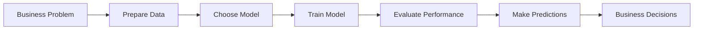

# Lab 11: Machine Learning with Scikit-Learn

## Lab Objectives

**🎯 IMPORTANT NOTE:** Machine Learning helps us predict future outcomes and find patterns too complex for traditional analysis. Instead of just describing what happened, we'll build models that predict what will happen. We'll focus on practical business applications using real data to solve actual problems.

By the end of this lab, you will be able to:

1. **Understand when to use machine learning** - Recognize problems where prediction adds business value
2. **Build regression models** - Predict numerical outcomes like prices or revenue
3. **Create classification models** - Predict categories like success/failure or customer types
4. **Evaluate model performance** - Know if your predictions are reliable enough for business decisions
5. **Apply ML to business problems** - Use models to support strategic decisions

## 📚 Machine Learning in Business Context

**🤖 What is Machine Learning Really?**
- **Traditional analysis**: "Manhattan properties cost more than Brooklyn" (descriptive)
- **Machine learning**: "This new property will likely cost $180 based on its features" (predictive)

**💼 Business Applications:**
- **Price prediction**: What should we charge for a new property?
- **Customer classification**: Which customers are likely to book premium properties?
- **Risk assessment**: Which properties are likely to have low occupancy?

**🎯 Our Approach:** Build simple, interpretable models that solve real business problems.

---

## Step 1: Understanding Machine Learning Problems

### 1.1 Types of Business Problems

```python
import pandas as pd
import numpy as np
from sklearn.model_selection import train_test_split
from sklearn.linear_model import LinearRegression
from sklearn.ensemble import RandomForestClassifier
from sklearn.metrics import mean_squared_error, accuracy_score, classification_report
import matplotlib.pyplot as plt

# Load our data
url = "https://raw.githubusercontent.com/fenago/datasets/refs/heads/main/AirBnB_NYC_2019.csv"
airbnb_df = pd.read_csv(url)

print(f"🏠 Loaded {len(airbnb_df):,} properties for ML analysis")
```

**🎯 Two Main Problem Types:**

**1. Regression (Predicting Numbers):**
- "What price should we set for this property?"
- "How much revenue will this generate?"
- "What occupancy rate can we expect?"

**2. Classification (Predicting Categories):**
- "Will this property be successful (high bookings)?"
- "What type of customer will book this property?"
- "Is this property overpriced or underpriced?"

### 1.2 The ML Workflow

**🔄 Standard Process:**


**💡 Key Insight:** ML is about finding patterns in existing data to make predictions about new situations.

---

## Step 2: Regression - Predicting Property Prices

### 2.1 Business Problem Setup

**💰 Business Question:** "Can we predict what a property should cost based on its characteristics?"

```python
# Prepare data for price prediction
# Select features that might influence price
features = ['neighbourhood_group', 'room_type', 'number_of_reviews', 
           'availability_365', 'calculated_host_listings_count']

# Clean the data
ml_data = airbnb_df[features + ['price']].copy()
ml_data = ml_data.dropna()

print(f"📊 ML Dataset: {len(ml_data):,} properties with complete data")
print(f"📊 Features: {features}")
```

### 2.2 Feature Engineering

**🔧 Converting Text to Numbers:** ML models need numerical input.

```python
# Convert categorical variables to numbers
from sklearn.preprocessing import LabelEncoder

# Create copies for encoding
X = ml_data[features].copy()
y = ml_data['price'].copy()

# Encode categorical variables
le_neighborhood = LabelEncoder()
le_room_type = LabelEncoder()

X['neighbourhood_group'] = le_neighborhood.fit_transform(X['neighbourhood_group'])
X['room_type'] = le_room_type.fit_transform(X['room_type'])

print("🔧 Feature Engineering Complete:")
print(f"Neighborhood encoding: {dict(zip(le_neighborhood.classes_, range(len(le_neighborhood.classes_))))}")
print(f"Room type encoding: {dict(zip(le_room_type.classes_, range(len(le_room_type.classes_))))}")
```

### 2.3 Building Your First Model

**🚀 Training a Price Prediction Model:**

```python
# Split data: 80% for training, 20% for testing
X_train, X_test, y_train, y_test = train_test_split(X, y, test_size=0.2, random_state=42)

print(f"📚 Training data: {len(X_train):,} properties")
print(f"🧪 Testing data: {len(X_test):,} properties")

# Create and train the model
model = LinearRegression()
model.fit(X_train, y_train)

print("✅ Model trained successfully!")
```

### 2.4 Making Predictions

**🔮 Testing Our Model:**

```python
# Make predictions on test data
predictions = model.predict(X_test)

# Compare predictions to actual prices
comparison_df = pd.DataFrame({
    'Actual_Price': y_test,
    'Predicted_Price': predictions,
    'Difference': y_test - predictions
})

print("🔮 Sample Predictions:")
print(comparison_df.head(10).round(2))

# Calculate accuracy
mse = mean_squared_error(y_test, predictions)
rmse = np.sqrt(mse)

print(f"\n📊 Model Performance:")
print(f"Average prediction error: ${rmse:.2f}")
print(f"Average actual price: ${y_test.mean():.2f}")
print(f"Error as % of average price: {(rmse/y_test.mean())*100:.1f}%")
```

### 2.5 Understanding What Drives Prices

**🔍 Feature Importance:**

```python
# See which features matter most
feature_importance = pd.DataFrame({
    'Feature': features,
    'Importance': abs(model.coef_)
})
feature_importance = feature_importance.sort_values('Importance', ascending=False)

print("📈 Feature Importance (What Affects Price Most):")
print(feature_importance)

# Visualize
plt.figure(figsize=(10, 6))
plt.barh(feature_importance['Feature'], feature_importance['Importance'])
plt.title('What Features Drive Property Prices?')
plt.xlabel('Importance')
plt.tight_layout()
plt.show()
```

---

## Step 3: Classification - Predicting Success Categories

### 3.1 Defining Business Success

**🎯 Business Problem:** "Can we predict which properties will be successful (high demand)?"

```python
# Define success based on number of reviews (proxy for bookings)
review_threshold = ml_data['number_of_reviews'].quantile(0.75)  # Top 25%

ml_data['is_successful'] = (ml_data['number_of_reviews'] >= review_threshold).astype(int)

success_rate = ml_data['is_successful'].mean()
print(f"🎯 Success Definition: Properties with {review_threshold:.0f}+ reviews")
print(f"🎯 Success Rate: {success_rate:.1%} of properties are 'successful'")

# Check success by room type
success_by_type = ml_data.groupby('room_type')['is_successful'].mean()
print(f"\n📊 Success Rate by Room Type:")
for room_type, rate in success_by_type.items():
    print(f"{room_type}: {rate:.1%}")
```

### 3.2 Building a Classification Model

**🔮 Predicting Property Success:**

```python
# Prepare features for classification
X_class = X.copy()  # Same features as before
y_class = ml_data['is_successful']

# Split the data
X_train_c, X_test_c, y_train_c, y_test_c = train_test_split(
    X_class, y_class, test_size=0.2, random_state=42
)

# Train a Random Forest classifier
clf = RandomForestClassifier(n_estimators=100, random_state=42)
clf.fit(X_train_c, y_train_c)

print("✅ Classification model trained!")

# Make predictions
pred_class = clf.predict(X_test_c)
pred_proba = clf.predict_proba(X_test_c)[:, 1]  # Probability of success

# Evaluate accuracy
accuracy = accuracy_score(y_test_c, pred_class)
print(f"🎯 Model Accuracy: {accuracy:.1%}")
```

### 3.3 Understanding Prediction Confidence

**📊 Probability-Based Predictions:**

```python
# Create results dataframe
results_df = pd.DataFrame({
    'Actual_Success': y_test_c,
    'Predicted_Success': pred_class,
    'Success_Probability': pred_proba
})

print("🔮 Classification Results Sample:")
print(results_df.head(10).round(3))

# Analyze by confidence level
high_confidence = results_df[results_df['Success_Probability'] > 0.8]
low_confidence = results_df[results_df['Success_Probability'] < 0.2]

print(f"\n📊 Confidence Analysis:")
print(f"High confidence predictions (>80%): {len(high_confidence):,}")
print(f"Low confidence predictions (<20%): {len(low_confidence):,}")

# Accuracy by confidence level
if len(high_confidence) > 0:
    high_conf_accuracy = (high_confidence['Actual_Success'] == high_confidence['Predicted_Success']).mean()
    print(f"Accuracy on high confidence predictions: {high_conf_accuracy:.1%}")
```

---

## Step 4: Model Evaluation and Business Application

### 4.1 Understanding Model Reliability

**📊 Is Our Model Good Enough for Business Decisions?**

```python
# Create detailed evaluation
from sklearn.metrics import confusion_matrix

# Confusion matrix for classification
cm = confusion_matrix(y_test_c, pred_class)

print("🎯 Classification Model Performance:")
print("Confusion Matrix:")
print("                Predicted")
print("              Fail  Success")
print(f"Actual Fail    {cm[0,0]:4d}    {cm[0,1]:4d}")
print(f"     Success   {cm[1,0]:4d}    {cm[1,1]:4d}")

# Business interpretation
true_positives = cm[1,1]  # Correctly predicted successes
false_positives = cm[0,1]  # Incorrectly predicted successes
false_negatives = cm[1,0]  # Missed successes

precision = true_positives / (true_positives + false_positives)
recall = true_positives / (true_positives + false_negatives)

print(f"\n💼 Business Metrics:")
print(f"Precision: {precision:.1%} (when we predict success, we're right {precision:.1%} of the time)")
print(f"Recall: {recall:.1%} (we catch {recall:.1%} of actual successes)")
```

### 4.2 Feature Importance for Business Insights

**🔍 What Makes Properties Successful?**

```python
# Get feature importance from the classifier
feature_importance_clf = pd.DataFrame({
    'Feature': features,
    'Importance': clf.feature_importances_
})
feature_importance_clf = feature_importance_clf.sort_values('Importance', ascending=False)

print("📈 What Drives Property Success:")
print(feature_importance_clf.round(3))

# Visualize
plt.figure(figsize=(10, 6))
plt.barh(feature_importance_clf['Feature'], feature_importance_clf['Importance'])
plt.title('Features That Predict Property Success')
plt.xlabel('Importance')
plt.tight_layout()
plt.show()
```

### 4.3 Making Business Recommendations

**💼 Turning Model Insights into Strategy:**

```python
# Analyze successful vs unsuccessful properties
successful_props = ml_data[ml_data['is_successful'] == 1]
unsuccessful_props = ml_data[ml_data['is_successful'] == 0]

print("💡 Success Strategy Insights:")
print(f"Successful properties average price: ${successful_props['price'].mean():.0f}")
print(f"Unsuccessful properties average price: ${unsuccessful_props['price'].mean():.0f}")

print(f"\nSuccessful properties average availability: {successful_props['availability_365'].mean():.0f} days")
print(f"Unsuccessful properties average availability: {unsuccessful_props['availability_365'].mean():.0f} days")

# Optimal pricing strategy
optimal_price_range = successful_props['price'].quantile([0.25, 0.75])
print(f"\n🎯 Recommended Price Range for Success: ${optimal_price_range[0.25]:.0f} - ${optimal_price_range[0.75]:.0f}")
```

---

## Step 5: 🚀 Independent Challenge - Investment Decision Model

**Your Mission:** Build a machine learning system that helps investors make data-driven property investment decisions.

### 🎯 Challenge: Smart Investment Advisor

**Business Scenario:** You're building an AI system that evaluates potential Airbnb investments. The system should predict both profitability and risk for any property based on its characteristics.

**Your ML System Must:**

**1. Revenue Prediction Model**
- Predict expected annual revenue for a property
- Identify key factors that drive revenue
- Provide confidence intervals for predictions

**2. Risk Classification Model**
- Classify properties as High/Medium/Low risk investments
- Consider factors like market saturation and volatility
- Provide probability scores for risk levels

**3. Investment Recommendation Engine**
- Combine revenue and risk predictions
- Generate buy/hold/avoid recommendations
- Rank properties by investment attractiveness

### 🛠️ Your ML Toolkit:

```python
# Starter framework - expand this
def prepare_investment_data(df):
    """Prepare data for investment analysis"""
    
    # Create revenue proxy (price * availability estimate)
    df['revenue_estimate'] = df['price'] * (df['availability_365'] * 0.7)  # 70% occupancy assumption
    
    # Create risk indicators
    df['market_saturation'] = df.groupby('neighbourhood')['price'].transform('count')
    df['price_volatility'] = df.groupby('neighbourhood')['price'].transform('std')
    
    return df

def build_revenue_model(X_train, y_train):
    """Build revenue prediction model"""
    # Your implementation here
    pass

def build_risk_model(X_train, y_train):
    """Build risk classification model"""
    # Your implementation here
    pass

def generate_investment_recommendations(revenue_pred, risk_pred, risk_proba):
    """Generate investment advice based on model outputs"""
    # Your implementation here
    pass
```

### 📊 Advanced Techniques to Try:

**Feature Engineering:**
- Create interaction features (location × property type)
- Calculate neighborhood-level statistics
- Engineer time-based features
- Create competition density metrics

**Model Improvement:**
- Try different algorithms (Random Forest, Gradient Boosting)
- Tune hyperparameters for better performance
- Use ensemble methods combining multiple models
- Implement cross-validation for robust evaluation

**Business Logic:**
- Weight predictions by confidence levels
- Create decision thresholds based on business criteria
- Account for different investor risk preferences
- Generate actionable insights and recommendations

### 🏆 Success Criteria:

- Models achieve reasonable accuracy for business use
- Feature engineering creates meaningful predictors
- Investment recommendations are logical and defensible
- System provides confidence measures for predictions
- Analysis generates actionable business insights

### 💡 Business Questions to Answer:

1. **What property characteristics predict high revenue?**
2. **How can investors identify undervalued opportunities?**
3. **What risk factors should investors monitor?**
4. **Which neighborhoods offer the best risk-adjusted returns?**
5. **How confident should investors be in model predictions?**

---

## Step 6: What You've Mastered

**🎉 Exceptional Achievement!** You've built your first machine learning models and applied them to real business problems.

### ✅ **Machine Learning Fundamentals:**
- Understand when ML adds value to business analysis
- Built regression models for numerical prediction (prices)
- Created classification models for categorical prediction (success)
- Evaluated model performance and reliability
- Applied models to strategic business decisions

### ✅ **Business Applications:**
- **Price optimization** through predictive modeling
- **Risk assessment** using classification algorithms
- **Investment analysis** with ML-driven insights
- **Feature analysis** to understand business drivers
- **Decision support** with confidence-weighted predictions

### 🌟 **Technical Skills:**
- Scikit-learn workflow for model building
- Data preparation and feature engineering
- Model evaluation and performance metrics
- Feature importance analysis
- Prediction confidence assessment

### 🎯 **Next Steps:**
- Explore advanced algorithms and ensemble methods
- Learn feature engineering techniques for complex data
- Study time series prediction for temporal patterns
- Investigate deep learning for unstructured data
- Apply ML to specialized business domains

---

**🤖 Congratulations on entering the world of machine learning!** You now have the foundation to build predictive models that drive business decisions. These skills will help you move from describing what happened to predicting what will happen, adding tremendous value to any organization.

**The prediction engine is built. Time to forecast the future!** 🚀🔮✨