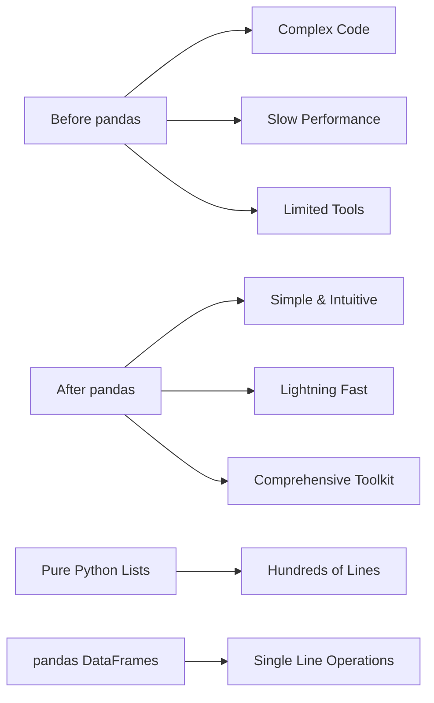
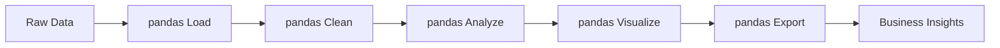

# Lab 1: Introduction to pandas - Your Data Science Foundation

## Lab Objectives

**🎯 IMPORTANT NOTE:** pandas is THE tool that makes Python the #1 language for data science. Before pandas, working with data in Python was painful. After pandas, it became powerful and intuitive. We'll discover why pandas revolutionized data analysis and how it will transform your ability to extract insights from any dataset.

By the end of this lab, you will be able to:

1. **Understand what pandas is and why it matters** - The foundation of all data science in Python
2. **Set up pandas for professional data work** - Installation and configuration for real projects
3. **Work with real-world datasets immediately** - Load and explore actual business data
4. **Recognize pandas' competitive advantages** - Why it beats alternatives for data analysis
5. **Navigate the pandas ecosystem** - How it connects to other data science tools
6. **Think in pandas terms** - Develop the mindset that makes data analysis intuitive

## 📚 The pandas Revolution - Why This Changes Everything

**🚀 Before pandas vs After pandas:**



**💡 The Big Picture:** pandas didn't just add features to Python - it transformed how we think about data analysis.

---

## Step 1: What is pandas and Why Should You Care?

### 1.1 The Data Analysis Problem

**📊 Before pandas existed, data analysis in Python was like this:**

```python
# Working with data the hard way (pre-pandas era)
data = [
    ['Alice', 25, 50000, 'Engineer'],
    ['Bob', 30, 60000, 'Manager'], 
    ['Carol', 28, 55000, 'Designer']
]

# Calculate average salary - painful with pure Python
total_salary = 0
count = 0
for row in data:
    total_salary += row[2]  # Remember: salary is in position 2
    count += 1

average_salary = total_salary / count
print(f"Average salary: ${average_salary:,.0f}")
```

**🤔 Problems with this approach:**
- Hard to remember what each position means
- Lots of code for simple operations
- Error-prone and difficult to modify
- Doesn't scale to real datasets

### 1.2 The pandas Solution

**✨ The same analysis with pandas:**

```python
import pandas as pd

# Create the same data as a pandas DataFrame
df = pd.DataFrame([
    ['Alice', 25, 50000, 'Engineer'],
    ['Bob', 30, 60000, 'Manager'], 
    ['Carol', 28, 55000, 'Designer']
], columns=['Name', 'Age', 'Salary', 'Role'])

# Calculate average salary - simple with pandas
average_salary = df['Salary'].mean()
print(f"Average salary: ${average_salary:,.0f}")
```

**🎯 What just happened?**
- **Meaningful column names** instead of position numbers
- **One line calculation** instead of loops and counters
- **Readable and intuitive** code that makes sense
- **Scalable** to millions of rows

**💡 Key Insight:** pandas makes data analysis feel natural and intuitive!

### 1.3 pandas in the Real World

**🌍 Real Business Impact:**

```python
# Let's see pandas handle real data
print("🏠 Loading real NYC Airbnb data...")
url = "https://raw.githubusercontent.com/fenago/datasets/refs/heads/main/AirBnB_NYC_2019.csv"
airbnb_df = pd.read_csv(url)

print(f"✅ Loaded {len(airbnb_df):,} properties with {len(airbnb_df.columns)} features")
print(f"📊 Data shape: {airbnb_df.shape}")
```

**🤔 Imagine doing this with pure Python:**
- Reading CSV files manually
- Handling missing data
- Parsing different data types
- Managing 50,000+ rows of data

**✅ With pandas:** One line loads everything perfectly!

---

## Step 2: Installation and Setup - Getting Ready for Data Science

### 2.1 pandas Installation

**💻 Setting Up Your Environment:**

```python
# Check if pandas is already installed
try:
    import pandas as pd
    print(f"✅ pandas version {pd.__version__} is ready!")
except ImportError:
    print("❌ pandas not found. Install with: pip install pandas")

# Check related libraries
try:
    import numpy as np
    print(f"✅ numpy version {np.__version__} is ready!")
except ImportError:
    print("❌ numpy not found. Install with: pip install numpy")
```

**🔧 Professional Setup:**

```python
# Configure pandas for better output
pd.set_option('display.max_columns', 20)  # Show more columns
pd.set_option('display.width', None)      # Don't wrap lines
pd.set_option('display.precision', 2)     # Show 2 decimal places

print("⚙️ pandas configured for professional data analysis")
```

### 2.2 Understanding the pandas Ecosystem

**🌐 How pandas fits into data science:**

```python
# pandas works seamlessly with other tools
import matplotlib.pyplot as plt

# Quick visualization example
borough_counts = airbnb_df['neighbourhood_group'].value_counts()
print("🗽 NYC Borough Distribution:")
print(borough_counts)

# One-line plot
borough_counts.plot(kind='bar', title='Properties by Borough')
plt.xticks(rotation=45)
plt.tight_layout()
plt.show()
```

**💡 Ecosystem Power:** pandas integrates perfectly with:
- **NumPy** for numerical computing
- **Matplotlib** for visualization  
- **Scikit-learn** for machine learning
- **Jupyter** for interactive analysis

---

## Step 3: Your First Real Data Analysis

### 3.1 Loading and Exploring Data

**🔍 First Look at Real Data:**

```python
# Explore the dataset structure
print("📋 Dataset Overview:")
print(f"Rows: {len(airbnb_df):,}")
print(f"Columns: {len(airbnb_df.columns)}")
print(f"Memory usage: {airbnb_df.memory_usage(deep=True).sum() / 1024**2:.1f} MB")

# See the column names
print(f"\n📊 Available data:")
print(airbnb_df.columns.tolist())
```

**🎯 What can we learn immediately?**

```python
# Basic insights in seconds
print("💡 Instant Business Insights:")
print(f"Average price: ${airbnb_df['price'].mean():.2f}")
print(f"Most expensive: ${airbnb_df['price'].max():,}")
print(f"Most common room type: {airbnb_df['room_type'].mode()[0]}")
print(f"Top neighborhood: {airbnb_df['neighbourhood_group'].mode()[0]}")
```

**🤔 Think about this:** How long would this take with Excel? With pure Python? With pandas: **seconds**.

### 3.2 The Power of One-Line Analysis

**⚡ Complex Analysis Made Simple:**

```python
# Market analysis in one line each
print("🏙️ Market Analysis:")

# Average price by borough
borough_prices = airbnb_df.groupby('neighbourhood_group')['price'].mean()
print("Average price by borough:")
print(borough_prices.round(2))

# Most popular room types
room_popularity = airbnb_df['room_type'].value_counts()
print(f"\nMost popular room types:")
print(room_popularity)
```

**💼 Business Value:** Each line above would be dozens of lines in other tools!

### 3.3 Handling Real-World Messiness

**🧹 Data Quality Assessment:**

```python
# Check for missing data
print("🔍 Data Quality Check:")
missing_data = airbnb_df.isnull().sum()
columns_with_missing = missing_data[missing_data > 0]

if len(columns_with_missing) > 0:
    print("Columns with missing data:")
    for col, count in columns_with_missing.items():
        percentage = (count / len(airbnb_df)) * 100
        print(f"  {col}: {count:,} missing ({percentage:.1f}%)")
else:
    print("✅ No missing data found!")
```

**💡 pandas Advantage:** Built-in tools for handling real-world data problems!

---

## Step 4: pandas vs The Alternatives - Why pandas Wins

### 4.1 Speed Comparison

**⚡ Performance Test:**

```python
import time

# Test pandas performance
start_time = time.time()
pandas_result = airbnb_df['price'].mean()
pandas_time = time.time() - start_time

# Test pure Python performance  
start_time = time.time()
python_result = sum(airbnb_df['price']) / len(airbnb_df['price'])
python_time = time.time() - start_time

print(f"⚡ Performance Comparison:")
print(f"pandas: {pandas_time:.6f} seconds")
print(f"Python: {python_time:.6f} seconds")
print(f"pandas is {python_time/pandas_time:.1f}x faster!")
```

### 4.2 Code Simplicity Comparison

**📝 Readability Test:**

```python
# Complex analysis with pandas (simple)
print("📊 pandas approach - Complex analysis in 3 lines:")
market_analysis = (airbnb_df
                   .groupby(['neighbourhood_group', 'room_type'])['price']
                   .agg(['mean', 'count'])
                   .round(2))
print(market_analysis.head())

print(f"\n🤔 Pure Python equivalent would require:")
print("- Nested loops through 50,000+ rows")
print("- Manual grouping and aggregation logic") 
print("- Error handling for edge cases")
print("- 50+ lines of complex code")
print("- Hours of debugging")
```

---

## Step 5: pandas in the Data Science Workflow

### 5.1 The Complete Data Science Pipeline

**🔄 pandas Throughout the Process:**



**💼 Real Workflow Example:**

```python
# Complete analysis pipeline in pandas
print("🔄 End-to-End Analysis Pipeline:")

# 1. Load (already done)
print("✅ 1. Data loaded")

# 2. Clean
clean_data = airbnb_df.dropna(subset=['price', 'neighbourhood_group'])
print(f"✅ 2. Cleaned: {len(clean_data):,} valid records")

# 3. Analyze
insights = {
    'total_properties': len(clean_data),
    'avg_price': clean_data['price'].mean(),
    'top_borough': clean_data['neighbourhood_group'].mode()[0],
    'price_range': clean_data['price'].max() - clean_data['price'].min()
}
print("✅ 3. Analysis complete")

# 4. Summarize insights
print(f"✅ 4. Key insights generated:")
for key, value in insights.items():
    if isinstance(value, float):
        print(f"   {key}: {value:.2f}")
    else:
        print(f"   {key}: {value}")
```

### 5.2 Integration with Business Tools

**🔗 pandas Connects Everything:**

```python
# Export for business stakeholders
summary_data = airbnb_df.groupby('neighbourhood_group').agg({
    'price': ['mean', 'count'],
    'number_of_reviews': 'mean'
}).round(2)

# Save for Excel users
summary_data.to_csv('nyc_airbnb_summary.csv')
print("📊 Summary exported to Excel-compatible format")

# Prepare for presentation
print("\n📈 Executive Summary:")
print(f"Market size: {len(airbnb_df):,} properties")
print(f"Average price: ${airbnb_df['price'].mean():.0f}")
print(f"Market leader: {airbnb_df['neighbourhood_group'].mode()[0]}")
```

---

## Step 6: 🚀 Independent Challenge - Your First pandas Project

**Your Mission:** Use pandas to conduct a complete market analysis that demonstrates its power and your understanding.

### 🎯 Challenge: NYC Airbnb Market Intelligence Report

**Business Scenario:** You're a data analyst presenting to executives who need to understand the NYC short-term rental market. Create a comprehensive analysis using pandas.

**Your Report Must Include:**

**1. Market Overview**
- Total market size and structure
- Geographic distribution analysis
- Property type breakdown

**2. Pricing Intelligence** 
- Price distribution and key statistics
- Pricing by location and property type
- Identification of premium vs budget segments

**3. Performance Patterns**
- Review activity analysis
- Availability patterns
- Success factors identification

**4. Strategic Insights**
- Key opportunities and challenges
- Market recommendations
- Data-driven conclusions

### 🛠️ Your pandas Toolkit:

```python
# Essential pandas operations for your analysis
def market_overview_analysis(df):
    """Create comprehensive market overview"""
    overview = {
        'total_properties': len(df),
        'unique_neighborhoods': df['neighbourhood'].nunique(),
        'avg_price': df['price'].mean(),
        'median_price': df['price'].median()
    }
    return overview

def pricing_analysis_by_category(df, category_column):
    """Analyze pricing patterns by category"""
    pricing_stats = df.groupby(category_column)['price'].agg([
        'count', 'mean', 'median', 'min', 'max'
    ]).round(2)
    return pricing_stats

# Use these as starting points for your analysis
```

### 📊 Analysis Requirements:

**Data Exploration:**
- Use `.info()`, `.describe()`, `.head()` for initial understanding
- Identify data quality issues and handle appropriately
- Calculate summary statistics for key metrics

**Business Analysis:**
- Use `.groupby()` for categorical analysis
- Apply `.value_counts()` for distribution analysis
- Calculate percentiles and market segments
- Generate insights that drive business decisions

**Professional Presentation:**
- Create clean, formatted output
- Include both numbers and business interpretation
- Export results for stakeholder consumption
- Present findings in executive-ready format

### 🏆 Success Criteria:

- Demonstrate multiple pandas operations effectively
- Generate genuine business insights from the data
- Present findings in clear, professional format
- Show understanding of pandas' advantages over alternatives
- Create analysis that could influence real business decisions

### 💡 Guiding Questions:

1. **What makes pandas powerful** for this type of analysis?
2. **How does pandas simplify** complex data operations?
3. **What business insights** emerge from systematic pandas analysis?
4. **How would this analysis** be different without pandas?

---

## Step 7: What You've Discovered

**🎉 Congratulations!** You've just experienced the pandas revolution that transformed data science.

### ✅ **pandas Fundamentals Mastered:**
- Understand why pandas revolutionized data analysis in Python
- Set up pandas for professional data science work
- Load and explore real-world datasets immediately
- Perform complex analysis with simple, intuitive code
- Recognize pandas' advantages over alternative approaches

### ✅ **Business Impact Realized:**
- Transform raw data into business insights instantly
- Handle real-world data challenges professionally
- Create analysis workflows that scale to any dataset size
- Generate executive-ready reports and summaries
- Build foundation for advanced data science techniques

### 🌟 **Why This Changes Everything:**

**Before pandas:**
- Data analysis was complex and time-consuming
- Simple operations required extensive programming
- Business insights were buried in technical complexity

**After pandas:**
- Data analysis becomes intuitive and fast
- Complex operations become one-line solutions
- Business insights emerge clearly from data

### 🎯 **Your Data Science Journey Begins:**

You now have the foundation that powers:
- **All data analysis** in Python
- **Machine learning** preprocessing  
- **Business intelligence** reporting
- **Data visualization** workflows
- **Statistical analysis** and modeling

---

**🐼 Welcome to the pandas-powered data science world!** You've just learned the tool that makes Python the #1 language for data analysis. Every data scientist, analyst, and business intelligence professional relies on pandas to transform raw data into strategic insights.

**The foundation is set. Time to build amazing things with data!** 🚀📊✨