# Lab 2: A Whirlwind Tour of pandas

## Lab Objectives

**🎯 IMPORTANT NOTE:** This is your introduction to the AMAZING world of pandas! We're going to take a whirlwind tour through pandas' core capabilities. Don't worry if some concepts feel overwhelming - we'll dive deep into each topic in future labs. Think of this as your "pandas preview" showing you what's possible!

By the end of this lab, you will be able to:

1. **Understand what pandas is** - Learn why pandas is essential for data science
2. **Load data from various sources** - Read CSV files from URLs and local files
3. **Explore DataFrames and Series** - Understand the two core pandas data structures
4. **Perform basic data operations** - Navigate, inspect, and manipulate data
5. **Apply essential pandas methods** - Use the most important pandas functions
6. **Save your work** - Export processed data using `.to_csv()`
7. **Handle real-world datasets** - Work with Airbnb and movie data
8. **Think like a data scientist** - Ask questions and find answers in data
9. **Work independently** - Apply pandas skills to new datasets without guidance

## 📚 Remember Our Learning Philosophy

- **📖 Guided Learning**: Follow along to build foundational pandas skills
- **🚀 Independent Exploration**: Challenge yourself with open-ended data questions

---

## What is pandas?

**pandas** (Python Data Analysis Library) is THE most important tool for data manipulation and analysis in Python. It's like Excel on steroids - but with the power of programming!

### Why pandas is Essential:
- **📊 Handles structured data** (tables, spreadsheets, databases)
- **🧹 Cleans messy real-world data** 
- **🔍 Filters and transforms data** efficiently
- **📈 Integrates with visualization libraries**
- **⚡ Fast performance** on large datasets
- **🤝 Works seamlessly** with other Python libraries


**🤔 Think About It:** What kinds of data do you encounter in your daily life that could benefit from pandas analysis? (Social media posts, financial records, sports statistics, etc.)

---

## Step 1: Setting Up pandas

### 1.1 Understanding the Import Process

Before we start, let's talk about **why** we import libraries the way we do. In Python, we don't automatically have access to every possible function - we need to explicitly import the tools we want to use.

**🎯 Your Task:** Run this code and pay attention to what each import does:

```python
# The pandas import - this is how we'll start most data science notebooks!
import pandas as pd

# Additional helpful libraries
import numpy as np
import matplotlib.pyplot as plt

# Let's check our pandas version
print("🐼 pandas version:", pd.__version__)
print("📊 numpy version:", np.__version__)
print("📈 matplotlib version:", plt.matplotlib.__version__)
```

**🤔 Stop and Think:** 
- Why do we use `pd` instead of typing out `pandas` every time?
- What do you think would happen if we forgot to import pandas?

**🎯 Try This:** After running the code above, try running just `pandas.__version__` (without the `pd.`). What error do you get? Why?

### 1.2 Configuring pandas for Better Output

Now let's make pandas output look better. These settings will make our data easier to read:

```python
# Set some display options to make output prettier
pd.set_option('display.max_columns', None)  # Show all columns
pd.set_option('display.width', None)        # Don't wrap lines
pd.set_option('display.max_colwidth', 50)   # Limit column width

print("✅ All libraries imported successfully!")
print("✅ Display options configured!")
```

**💡 Explanation:** These options tell pandas how to display data. Without these, large datasets might be truncated or hard to read.

**🤔 Reflection:** Think about working with spreadsheets - what display issues have you encountered? How might these settings help?

---

## Step 2: Understanding pandas Data Structures

### 2.1 The Foundation: What Are We Working With?

pandas has two main data structures. Let's understand them with a real-world analogy:


**🏠 Real-World Analogy:** 
- **Series** = A single column in your address book (just the names, or just the phone numbers)
- **DataFrame** = Your entire address book (names, phone numbers, addresses all together)

### 2.2 Creating Your First Series

Let's create a Series step by step and understand what each part does:

**🎯 Your Task:** Before running this code, predict what you think the output will look like:

```python
# Create a simple Series representing daily Airbnb prices
prices = pd.Series([100, 150, 200, 175, 300], 
                   index=['Mon', 'Tue', 'Wed', 'Thu', 'Fri'],
                   name='AirBnB_Price')

print("📊 Our first Series:")
print(prices)
```

**🎯 Now Run It:** Were your predictions correct?

**💡 Let's Break This Down:**
- `[100, 150, 200, 175, 300]` - These are our **values** (the actual data)
- `index=['Mon', 'Tue', 'Wed', 'Thu', 'Fri']` - These are our **labels** for each value
- `name='AirBnB_Price'` - This gives our Series a name for reference

**🤔 Interactive Question:** What day had the highest price? How can you tell?

**🎯 Explore Further:** Try accessing individual values:

```python
print(f"Tuesday's price: ${prices['Tue']}")
print(f"Weekend prices: ${prices['Fri']}")

# Get some information about our Series
print(f"\nType: {type(prices)}")
print(f"Name: {prices.name}")
print(f"Index labels: {list(prices.index)}")
print(f"Highest price: ${prices.max()}")
print(f"Average price: ${prices.mean():.2f}")
```

**💭 Pause and Reflect:** How is this different from a regular Python list? What advantages do you see?

### 2.3 Building Your First DataFrame

Now let's create a DataFrame - this is where pandas really starts to shine!

**🎯 Think First:** If a Series is like one column, what do you think a DataFrame with multiple columns will look like?

```python
# Create a simple DataFrame representing Airbnb properties
sample_data = {
    'Property': ['Cozy Studio', 'Luxury Loft', 'Garden Room', 'City View'],
    'Price': [100, 300, 150, 200],
    'Reviews': [50, 12, 89, 34],
    'Borough': ['Brooklyn', 'Manhattan', 'Queens', 'Manhattan']
}

df_sample = pd.DataFrame(sample_data)

print("📋 Our first DataFrame:")
print(df_sample)
```

**💡 Understanding the Structure:**
- Each **key** in the dictionary becomes a **column name**
- Each **list of values** becomes a **column of data**
- pandas automatically creates **row numbers** (0, 1, 2, 3) as the index

**🎯 Explore the DataFrame:**

```python
print(f"\nDataFrame shape: {df_sample.shape}")  # (rows, columns)
print(f"Column names: {list(df_sample.columns)}")
print(f"Number of properties: {len(df_sample)}")

# Get basic statistics
print(f"\nAverage price: ${df_sample['Price'].mean():.2f}")
print(f"Total reviews: {df_sample['Reviews'].sum()}")
```

**🤔 Interactive Questions:**
1. Which property has the most reviews?
2. What's the price difference between the most expensive and cheapest property?
3. How many properties are in Manhattan?

**💪 Challenge:** Can you figure out how to answer these questions using the DataFrame? Try before looking at the solutions!

<details>
<summary>🔍 Click for Solutions</summary>

```python
# 1. Property with most reviews
most_reviewed = df_sample.loc[df_sample['Reviews'].idxmax(), 'Property']
print(f"Most reviewed: {most_reviewed}")

# 2. Price difference
price_diff = df_sample['Price'].max() - df_sample['Price'].min()
print(f"Price difference: ${price_diff}")

# 3. Manhattan properties
manhattan_count = (df_sample['Borough'] == 'Manhattan').sum()
print(f"Manhattan properties: {manhattan_count}")
```
</details>

---

## Step 3: Loading Real Data - The Exciting Part!

### 3.1 From Sample to Reality

Now we're going to make a huge leap - from our tiny 4-row sample to a dataset with **thousands** of real Airbnb listings! This is where data science gets exciting.

**🌍 Real-World Context:** We're about to load data about actual Airbnb listings in New York City from 2019. This data was collected to help people understand the Airbnb market.

**🤔 Before We Load:** What questions do you think we could answer with this data?
- Which borough is most expensive?
- What types of rooms are most common?
- Where do people leave the most reviews?

**🎯 The Big Moment:** Let's load our first real dataset:

```python
# Load the Airbnb dataset
url_airbnb = "https://raw.githubusercontent.com/fenago/datasets/refs/heads/main/AirBnB_NYC_2019.csv"

print("📥 Loading Airbnb NYC data from the internet...")
print("🌐 This might take a few seconds...")

airbnb_df = pd.read_csv(url_airbnb)

print("✅ Data loaded successfully!")
print(f"📊 Dataset shape: {airbnb_df.shape}")
print(f"🏠 That's {airbnb_df.shape[0]:,} Airbnb listings with {airbnb_df.shape[1]} different pieces of information!")
```

**🎉 Congratulations!** You just loaded real data from the internet! This is exactly what data scientists do every day.

### 3.2 First Impressions - What Did We Just Load?

Let's be like detectives and investigate what we just downloaded:

**🎯 Investigation Step 1:** Get the basic info

```python
print("🔍 Let's investigate our data...")
print("=" * 60)

# Basic information about the dataset
print("📊 Dataset Info:")
airbnb_df.info()
```

**💡 Understanding info() Output:**
- **RangeIndex**: Shows we have rows numbered 0 through 48,894
- **Data columns**: Lists all 16 pieces of information we have about each listing
- **Dtypes**: Tells us what type of data each column contains (numbers, text, etc.)
- **Memory usage**: Shows how much computer memory this data is using

**🤔 Observation Questions:** 
- Which columns have missing values (non-null count less than total)?
- What types of data do we have (int64, float64, object)?

**🎯 Investigation Step 2:** See the actual data

```python
print("\n👀 First 5 rows - what does our data actually look like?")
print("=" * 60)
print(airbnb_df.head())

print("\n🎲 Random sample - let's see some different rows:")
print("=" * 60)
print(airbnb_df.sample(3))  # Show 3 random rows
```

**💭 Pause and Reflect:** 
- What patterns do you notice in the data?
- What surprises you about these Airbnb listings?
- What questions come to mind when you see this data?

### 3.3 Quick Data Health Check

Before we analyze data, we should always check its "health" - are there problems we need to know about?

**🩺 Data Health Checkup:**

```python
print("🩺 Data Health Check:")
print("=" * 50)

# Check for missing values
print("❓ Missing Values Check:")
missing_data = airbnb_df.isnull().sum()
columns_with_missing = missing_data[missing_data > 0]

if len(columns_with_missing) > 0:
    print("⚠️ Columns with missing data:")
    for column, missing_count in columns_with_missing.items():
        percentage = (missing_count / len(airbnb_df)) * 100
        print(f"   {column}: {missing_count:,} missing ({percentage:.1f}%)")
else:
    print("✅ No missing values found!")

# Basic statistics for numerical columns
print(f"\n📈 Quick Statistics (for numerical columns):")
print(airbnb_df.describe())
```

**🤔 Critical Thinking Questions:**
1. Why might some reviews be missing? Is this a problem?
2. Look at the price statistics - what seems unusual about the minimum price ($0)?
3. What does the maximum price tell us about luxury listings?

**💡 Data Science Insight:** Missing data is normal in real-world datasets! Part of being a data scientist is deciding how to handle it.

---

## Step 4: Essential pandas Operations - Your Data Science Toolkit

Now let's learn the fundamental operations that every data scientist uses daily. We'll work through each one with clear explanations and opportunities for you to experiment.

### 4.1 Selecting Data - Getting What You Need

**🎯 Learning Goal:** Understand how to extract specific pieces of information from your DataFrame.

**📚 The Concept:** Think of a DataFrame like a filing cabinet. Sometimes you want:
- One specific drawer (column)
- Multiple specific drawers (multiple columns) 
- Specific files from a drawer (specific rows)

**🔍 Single Column Selection (Returns a Series):**

```python
# Let's get just the property names
print("🏠 Let's look at some property names:")
property_names = airbnb_df['name']
print(f"Data type returned: {type(property_names)}")
print(f"First 10 property names:")
print(property_names.head(10))
```

**🤔 Stop and Think:** Why did we get a Series instead of a DataFrame? What's the difference?

**🔍 Multiple Column Selection (Returns a DataFrame):**

```python
# Let's get the essential information about each property
print("\n📍 Essential property information:")
essential_info = airbnb_df[['name', 'neighbourhood_group', 'room_type', 'price']]
print(f"Data type returned: {type(essential_info)}")
print(f"Shape of our selection: {essential_info.shape}")
print("\nFirst 5 rows:")
print(essential_info.head())
```

**💡 Key Insight:** Notice the double brackets `[['name', 'neighbourhood_group', ...]]` - this tells pandas we want multiple columns!

**🎯 Your Turn:** Try selecting different combinations of columns. What happens if you select just one column with double brackets `[['name']]`?

**🔍 Row Selection by Position:**

```python
# Let's look at specific rows
print("\n🎯 Looking at specific properties by position:")
print("First 3 properties:")
print(airbnb_df.iloc[0:3])  # Rows 0, 1, 2

print("\nA random property in the middle:")
print(airbnb_df.iloc[1000])  # Just row 1000
```

**💡 Understanding iloc:** The `iloc` stands for "integer location" - it selects rows by their position number.

### 4.2 Filtering Data - Finding What Matters

**🎯 Learning Goal:** Learn to ask questions of your data and get specific answers.

**📚 The Concept:** Filtering is like asking your data questions: "Show me only the expensive properties" or "Which listings are in Manhattan?"

**🔍 Simple Filtering - One Condition:**

```python
# Let's find expensive properties (over $200 per night)
print("💰 Finding expensive properties...")

# First, let's see what we're looking for
expensive_condition = airbnb_df['price'] > 200
print(f"Number of expensive properties: {expensive_condition.sum()}")
print(f"Percentage of expensive properties: {expensive_condition.mean():.1%}")

# Now let's actually get the expensive properties
expensive_properties = airbnb_df[airbnb_df['price'] > 200]
print(f"\n📊 Shape of expensive properties: {expensive_properties.shape}")
print("Sample expensive properties:")
print(expensive_properties[['name', 'price', 'neighbourhood_group']].head())
```

**🤔 Understanding What Happened:**
1. `airbnb_df['price'] > 200` creates a Series of True/False values
2. `airbnb_df[condition]` keeps only rows where the condition is True
3. `.sum()` on True/False counts how many True values there are
4. `.mean()` on True/False gives us the percentage (True=1, False=0)

**🎯 Your Experiment:** Try changing the price threshold. What happens with $300? $50?

**🔍 Complex Filtering - Multiple Conditions:**

```python
# Let's find expensive properties specifically in Manhattan
print("🏙️ Finding expensive Manhattan properties...")

# Multiple conditions require parentheses and & (and) or | (or)
manhattan_expensive = airbnb_df[
    (airbnb_df['neighbourhood_group'] == 'Manhattan') & 
    (airbnb_df['price'] > 200)
]

print(f"Expensive Manhattan properties: {len(manhattan_expensive)}")
print(f"Average price of these properties: ${manhattan_expensive['price'].mean():.2f}")

print("\n🏆 Sample expensive Manhattan properties:")
sample_cols = ['name', 'price', 'neighbourhood', 'room_type']
print(manhattan_expensive[sample_cols].head())
```

**💡 Important Syntax Notes:**
- Use `&` for "AND" (not the word "and")
- Use `|` for "OR" (not the word "or") 
- Use parentheses around each condition
- Use `==` for "equals" (not a single `=`)

**🎯 Challenge:** Can you find affordable Brooklyn private rooms (Brooklyn + Private room + price < $100)? Try it yourself!

### 4.3 Grouping and Aggregating - Finding Patterns

**🎯 Learning Goal:** Learn to ask summary questions like "What's the average price by borough?"

**📚 The Concept:** Grouping is like sorting your data into piles and then calculating something about each pile.

**🔍 Simple Grouping - Average Price by Borough:**

```python
print("💵 Let's find the average price by borough...")

# Group by borough and calculate mean price
borough_avg_price = airbnb_df.groupby('neighbourhood_group')['price'].mean()
print("Average price by borough:")
print(borough_avg_price.round(2).sort_values(ascending=False))

print(f"\nMost expensive borough: {borough_avg_price.idxmax()}")
print(f"Most affordable borough: {borough_avg_price.idxmin()}")
```

**💡 Breaking Down groupby():**
1. `groupby('neighbourhood_group')` - Sort data into piles by borough
2. `['price']` - Look at just the price column in each pile
3. `.mean()` - Calculate the average for each pile

**🎯 Explore Different Aggregations:**

```python
print("\n📊 Different ways to summarize by borough:")

# Count how many properties in each borough
borough_counts = airbnb_df['neighbourhood_group'].value_counts()
print("Number of properties by borough:")
print(borough_counts)

# Multiple statistics at once
borough_stats = airbnb_df.groupby('neighbourhood_group')['price'].agg(['count', 'mean', 'median', 'min', 'max'])
print("\nComplete price statistics by borough:")
print(borough_stats.round(2))
```

**🤔 Interpretation Questions:**
1. Which borough has the most listings? Why might this be?
2. Look at the difference between mean and median prices - what does this tell you?
3. Which borough has the biggest price range (max - min)?

**🔍 Advanced Grouping - Multiple Categories:**

```python
print("\n🏠 Room type analysis...")

# Group by room type
room_type_analysis = airbnb_df.groupby('room_type').agg({
    'price': ['mean', 'count'],
    'number_of_reviews': 'mean'
}).round(2)

print("Analysis by room type:")
print(room_type_analysis)

# Which room type is most popular?
most_popular_room = airbnb_df['room_type'].value_counts()
print(f"\nMost popular room type: {most_popular_room.index[0]} ({most_popular_room.iloc[0]:,} listings)")
```

**💭 Think Like a Data Scientist:** 
- Why might entire homes cost more than private rooms?
- What business insights could you give to someone starting an Airbnb?

---

## Step 5: Working with the Movies Dataset - Applying Your Skills

### 5.1 Loading and Initial Exploration

Now let's apply what we've learned to a completely different dataset! This time, YOU will be more involved in the exploration.

**🎬 Context:** This dataset contains information about top-grossing movies. Let's see what insights we can discover!

```python
# Load the movies dataset
url_movies = "https://raw.githubusercontent.com/fenago/datasets/refs/heads/main/movies.csv"

print("🎬 Loading movies data...")
movies_df = pd.read_csv(url_movies)

print("✅ Movies data loaded!")
print(f"📊 Dataset shape: {movies_df.shape}")
```

**🎯 Your Investigation Task:** Before looking at my code below, try to explore this dataset yourself:
1. Use `.info()` to understand the structure
2. Use `.head()` to see sample data  
3. Use `.describe()` if there are numerical columns

```python
# Let's explore together
print("🔍 Movies dataset exploration:")
print("=" * 50)
movies_df.info()

print("\n🎭 Sample movies:")
print("=" * 50)
print(movies_df.head())

print("\n🎲 Random sample:")
print("=" * 50)
print(movies_df.sample(3))
```

**🤔 What Do You Notice?**
- What columns do we have?
- What years does this data cover?
- What's interesting about the Gross column format?

### 5.2 Data Cleaning Challenge - The Gross Revenue Problem

**🚨 Data Science Reality Check:** Real data is messy! Notice how the Gross column has dollar signs and commas? We need to clean this before we can analyze it numerically.

**🎯 Your Challenge:** Look at the Gross column and think about how we could convert "$2,796.30" into a number we can calculate with.

```python
print("💰 The Gross Revenue Problem:")
print("Current Gross column (first 5 values):")
print(movies_df['Gross'].head())
print(f"Data type: {movies_df['Gross'].dtype}")

# This won't work for calculations:
try:
    average_gross = movies_df['Gross'].mean()
    print(f"Average gross: {average_gross}")
except Exception as e:
    print(f"❌ Error calculating average: {e}")
    print("We need to clean this data first!")
```

**💡 The Solution - Step by Step:**

```python
print("\n🧹 Cleaning the Gross column...")

# Step 1: Remove dollar signs and spaces
movies_df['Gross_Clean'] = movies_df['Gross'].str.replace('$', '').str.replace(' ', '')
print("After removing $ and spaces:")
print(movies_df['Gross_Clean'].head())

# Step 2: Convert to float (decimal numbers)
movies_df['Gross_Clean'] = movies_df['Gross_Clean'].astype(float)
print(f"\nNew data type: {movies_df['Gross_Clean'].dtype}")

# Step 3: Now we can calculate!
average_gross = movies_df['Gross_Clean'].mean()
print(f"✅ Average gross revenue: ${average_gross:.2f} million")
```

**🎯 Your Turn:** Can you calculate the median gross revenue? The highest-grossing movie?

### 5.3 Movie Industry Analysis

Now let's use our pandas skills to answer interesting questions about the movie industry:

**🎬 Question 1: Which studios are most successful?**

```python
print("🏭 Studio Analysis:")
print("=" * 40)

# Count movies per studio
studio_counts = movies_df['Studio'].value_counts()
print("Movies per studio (top 10):")
print(studio_counts.head(10))

# Average gross per studio
studio_avg_gross = movies_df.groupby('Studio')['Gross_Clean'].mean().sort_values(ascending=False)
print("\nAverage gross revenue per studio (top 10):")
for studio, avg_gross in studio_avg_gross.head(10).items():
    print(f"{studio}: ${avg_gross:.2f} million")
```

**🎬 Question 2: How has the movie industry changed over time?**

```python
print("\n📅 Time Analysis:")
print("=" * 40)

# Movies per year
movies_per_year = movies_df['Year'].value_counts().sort_index()
print("Movies in dataset by year:")
print(movies_per_year.tail(10))  # Last 10 years

# Average gross by decade (this is advanced!)
movies_df['Decade'] = (movies_df['Year'] // 10) * 10  # Convert year to decade
decade_analysis = movies_df.groupby('Decade')['Gross_Clean'].agg(['count', 'mean']).round(2)
print("\nMovies and average gross by decade:")
print(decade_analysis)
```

**🤔 Discussion Questions:**
1. Which studio dominates the list? Why might this be?
2. How has average movie gross revenue changed over time?
3. What external factors might influence these trends?

---

## Step 6: Data Visualization - Making Data Tell Stories

### 6.1 Why Visualize Data?

**🎨 The Power of Visualization:** Numbers tell us facts, but visualizations help us see patterns and tell stories. Let's make our data come alive!

**🏠 Airbnb Price Visualization:**

```python
import matplotlib.pyplot as plt

print("📊 Creating visualizations of our Airbnb data...")

# Create a figure with two plots side by side
plt.figure(figsize=(15, 6))

# Plot 1: Price distribution
plt.subplot(1, 2, 1)
airbnb_df['price'].hist(bins=50, alpha=0.7, color='skyblue', edgecolor='black')
plt.title('Distribution of Airbnb Prices in NYC', fontsize=14, fontweight='bold')
plt.xlabel('Price per Night ($)')
plt.ylabel('Number of Properties')
plt.axvline(airbnb_df['price'].mean(), color='red', linestyle='--', label=f'Average: ${airbnb_df["price"].mean():.2f}')
plt.legend()
plt.grid(True, alpha=0.3)

# Plot 2: Average price by borough
plt.subplot(1, 2, 2)
borough_avg_price = airbnb_df.groupby('neighbourhood_group')['price'].mean().sort_values(ascending=False)
bars = borough_avg_price.plot(kind='bar', color='lightcoral', alpha=0.8)
plt.title('Average Price by Borough', fontsize=14, fontweight='bold')
plt.xlabel('Borough')
plt.ylabel('Average Price ($)')
plt.xticks(rotation=45)
plt.grid(True, alpha=0.3)

# Add value labels on top of bars
for i, bar in enumerate(bars.patches):
    height = bar.get_height()
    plt.text(bar.get_x() + bar.get_width()/2., height + 5, f'${height:.0f}', 
             ha='center', va='bottom', fontweight='bold')

plt.tight_layout()
plt.show()

print("📈 Key Insights from the visualizations:")
print(f"• Most properties cost between $50-$200 per night")
print(f"• Manhattan is clearly the most expensive borough")
print(f"• There are some very expensive outliers (luxury properties)")
```

**🤔 Visual Analysis Questions:**
1. What does the shape of the price distribution tell you?
2. How big is the price gap between Manhattan and other boroughs?
3. What business opportunities do these patterns suggest?

### 6.2 Room Type Analysis Visualization

```python
print("\n🏠 Room Type Analysis:")

plt.figure(figsize=(12, 8))

# Plot 1: Room type distribution (pie chart)
plt.subplot(2, 2, 1)
room_counts = airbnb_df['room_type'].value_counts()
colors = ['lightblue', 'lightcoral', 'lightgreen']
room_counts.plot(kind='pie', autopct='%1.1f%%', startangle=90, colors=colors)
plt.title('Distribution of Room Types')
plt.ylabel('')

# Plot 2: Average price by room type
plt.subplot(2, 2, 2)
room_avg_price = airbnb_df.groupby('room_type')['price'].mean()
room_avg_price.plot(kind='bar', color='orange', alpha=0.7)
plt.title('Average Price by Room Type')
plt.xlabel('Room Type')
plt.ylabel('Average Price ($)')
plt.xticks(rotation=45)

# Plot 3: Reviews by room type
plt.subplot(2, 2, 3)
room_avg_reviews = airbnb_df.groupby('room_type')['number_of_reviews'].mean()
room_avg_reviews.plot(kind='bar', color='green', alpha=0.7)
plt.title('Average Reviews by Room Type')
plt.xlabel('Room Type')
plt.ylabel('Average Number of Reviews')
plt.xticks(rotation=45)

# Plot 4: Price vs Reviews scatter plot
plt.subplot(2, 2, 4)
sample_data = airbnb_df.sample(1000)  # Use a sample for cleaner visualization
plt.scatter(sample_data['price'], sample_data['number_of_reviews'], alpha=0.6, color='purple')
plt.title('Price vs Number of Reviews')
plt.xlabel('Price ($)')
plt.ylabel('Number of Reviews')
plt.grid(True, alpha=0.3)

plt.tight_layout()
plt.show()

print("🎯 Insights from room type analysis:")
print(f"• {room_counts.index[0]} is the most common room type ({room_counts.iloc[0]:,} listings)")
print(f"• Entire homes/apartments command the highest average price")
print(f"• Private rooms seem to get more reviews on average")
```

**💭 Think Like a Business Analyst:** What recommendations would you give to someone wanting to start an Airbnb business based on these insights?

---

## Step 7: Saving Your Work - The Professional Touch

### 7.1 Why Saving Processed Data Matters

**💾 Professional Data Science Practice:** Always save your cleaned and analyzed data! This allows you to:
- Share insights with colleagues
- Build on your analysis later
- Create reproducible workflows
- Backup your hard work

### 7.2 Basic CSV Export with Context

Let's save some of our analysis results:

```python
print("💾 Saving our analysis results...")

# Save the expensive Manhattan properties we found earlier
manhattan_expensive = airbnb_df[
    (airbnb_df['neighbourhood_group'] == 'Manhattan') & 
    (airbnb_df['price'] > 200)
]

# Select relevant columns for our saved file
columns_to_save = ['name', 'neighbourhood', 'price', 'room_type', 'number_of_reviews']
manhattan_luxury = manhattan_expensive[columns_to_save]

# Save to CSV
manhattan_luxury.to_csv('manhattan_luxury_properties.csv', index=False)
print(f"✅ Saved {len(manhattan_luxury)} luxury Manhattan properties to CSV!")

# Let's see what we saved
print("\nPreview of saved data:")
print(manhattan_luxury.head())
```

**💡 Understanding the Parameters:**
- `index=False` - Don't save the row numbers (usually what you want)
- The filename automatically includes today's analysis

### 7.3 Creating Summary Reports

```python
print("\n📊 Creating summary reports...")

# Create a comprehensive borough analysis
borough_summary = airbnb_df.groupby('neighbourhood_group').agg({
    'price': ['count', 'mean', 'median', 'min', 'max'],
    'number_of_reviews': 'mean',
    'availability_365': 'mean'
}).round(2)

# Flatten the column names for easier reading
borough_summary.columns = ['Property_Count', 'Avg_Price', 'Median_Price', 'Min_Price', 'Max_Price', 'Avg_Reviews', 'Avg_Availability']

print("Borough Summary Report:")
print(borough_summary)

# Save the summary
borough_summary.to_csv('airbnb_borough_summary_report.csv')
print("\n✅ Borough summary report saved!")

# Create a room type analysis
room_type_summary = airbnb_df.groupby('room_type').agg({
    'price': ['count', 'mean'],
    'number_of_reviews': 'mean'
}).round(2)

room_type_summary.columns = ['Count', 'Avg_Price', 'Avg_Reviews']
room_type_summary.to_csv('airbnb_room_type_analysis.csv')
print("✅ Room type analysis saved!")
```

### 7.4 Professional File Naming and Documentation

```python
print("\n📁 Professional file management tips:")

# Add today's date to filename for version control
from datetime import datetime
today = datetime.now().strftime("%Y%m%d")

# Save with descriptive, dated filename
final_filename = f'airbnb_nyc_analysis_{today}.csv'
airbnb_df.to_csv(final_filename, index=False)

print(f"✅ Complete dataset saved as: {final_filename}")
print("\n📋 Files created in this session:")
print("• manhattan_luxury_properties.csv - High-end Manhattan listings")
print("• airbnb_borough_summary_report.csv - Statistical analysis by borough")
print("• airbnb_room_type_analysis.csv - Room type comparison")
print(f"• {final_filename} - Complete processed dataset")

print("\n💡 Pro Tips for File Management:")
print("• Use descriptive names that future-you will understand")
print("• Include dates for version control")
print("• Save both raw data and processed/cleaned data")
print("• Document what each file contains")
```

---

## Step 8: pandas Superpowers Preview - Advanced Features

### 8.1 String Operations - Text Data Magic

**🔤 The Power of Text Analysis:** pandas can work with text data just as easily as numbers!

```python
print("📝 Text analysis with pandas:")

# Working with property names
print("🏠 Property name analysis:")

# Convert to uppercase
print("Sample names in uppercase:")
sample_names = airbnb_df['name'].head(3)
print("Original:", list(sample_names))
print("Uppercase:", list(sample_names.str.upper()))

# Find properties mentioning specific words
park_properties = airbnb_df[airbnb_df['name'].str.contains('Park', case=False, na=False)]
cozy_properties = airbnb_df[airbnb_df['name'].str.contains('cozy', case=False, na=False)]
luxury_properties = airbnb_df[airbnb_df['name'].str.contains('luxury', case=False, na=False)]

print(f"\n🌳 Properties mentioning 'Park': {len(park_properties)}")
print(f"🛋️ Properties mentioning 'Cozy': {len(cozy_properties)}")
print(f"💎 Properties mentioning 'Luxury': {len(luxury_properties)}")

# Analyze property name lengths
airbnb_df['name_length'] = airbnb_df['name'].str.len()
print(f"\nAverage property name length: {airbnb_df['name_length'].mean():.1f} characters")
print(f"Longest property name: {airbnb_df['name_length'].max()} characters")

# Show the property with the longest name
longest_name_property = airbnb_df.loc[airbnb_df['name_length'].idxmax()]
print(f"Property with longest name: '{longest_name_property['name']}'")
```

**🤔 Think About It:** What marketing insights could you derive from analyzing property names?

### 8.2 Date Operations - Time-Based Analysis

```python
print("\n📅 Date and time analysis:")

# Working with dates (if last_review column exists and has valid dates)
if 'last_review' in airbnb_df.columns:
    # Convert to datetime format
    airbnb_df['last_review'] = pd.to_datetime(airbnb_df['last_review'], errors='coerce')
    
    # Analyze review patterns
    review_data = airbnb_df.dropna(subset=['last_review'])  # Remove properties with no reviews
    
    if len(review_data) > 0:
        print(f"📊 Review date analysis:")
        print(f"Date range: {review_data['last_review'].min()} to {review_data['last_review'].max()}")
        
        # Extract components
        review_data['review_year'] = review_data['last_review'].dt.year
        review_data['review_month'] = review_data['last_review'].dt.month
        
        # Analyze by year
        reviews_by_year = review_data['review_year'].value_counts().sort_index()
        print(f"\nReviews by year (last few years):")
        print(reviews_by_year.tail())
        
        # Find most recent reviews
        recent_reviews = review_data[review_data['last_review'] > '2019-06-01']
        print(f"\nProperties with recent reviews (after June 2019): {len(recent_reviews)}")
```

### 8.3 Advanced Filtering and Conditional Logic

```python
print("\n🎯 Advanced filtering techniques:")

# Complex business logic - finding "good deals"
print("💡 Finding 'good deals' using multiple criteria:")

# Define what makes a good deal:
# 1. Reasonably priced (under $150)
# 2. Good review activity (more than 5 reviews)
# 3. Available most of the year (availability > 100 days)
# 4. Not in the most expensive borough (not Manhattan)

good_deals = airbnb_df[
    (airbnb_df['price'] < 150) &
    (airbnb_df['number_of_reviews'] > 5) &
    (airbnb_df['availability_365'] > 100) &
    (airbnb_df['neighbourhood_group'] != 'Manhattan')
]

print(f"Properties meeting 'good deal' criteria: {len(good_deals)}")

if len(good_deals) > 0:
    print("\nTop 5 'good deals' by number of reviews:")
    deal_display = good_deals.nlargest(5, 'number_of_reviews')[
        ['name', 'neighbourhood_group', 'price', 'number_of_reviews', 'availability_365']
    ]
    print(deal_display)
    
    # Average stats for good deals
    print(f"\nGood deals average price: ${good_deals['price'].mean():.2f}")
    print(f"Good deals average reviews: {good_deals['number_of_reviews'].mean():.1f}")
```

**💭 Business Thinking:** This kind of analysis helps travelers find value and helps property owners understand their competition!

---

## Step 9: 🚀 Independent Challenge - Movies Deep Dive

**Time to spread your wings!** 🦅 This is where you become a real data scientist - working independently to solve problems and discover insights.

### Your Mission: Become a Movie Industry Analyst

You have all the tools you need from our Airbnb analysis. Now apply them to understand the movie industry!

**🎬 Your Research Questions:**

### **Phase 1: Basic Data Investigation** (Start Here!)
1. **Dataset Overview**: How many movies? What years? What's the data quality?
2. **Studio Landscape**: Which studios appear most frequently? How is the market distributed?
3. **Financial Overview**: What's the revenue range? (Remember: you need to clean the Gross column!)

### **Phase 2: Advanced Analysis** (Stretch Yourself!)
4. **Studio Performance**: Which studio has the highest total revenue? Average revenue?
5. **Time Trends**: How has the movie industry changed over decades?
6. **Top Performers**: What are the highest-grossing movies of all time?
7. **Market Concentration**: Do a few movies/studios dominate the market?

### **Phase 3: Creative Exploration** (Think Like a Data Scientist!)
8. **Your Own Questions**: What interesting patterns can you discover?
9. **Business Insights**: What would you tell a movie investor?
10. **Visualizations**: Create at least 2 charts that tell a story

### **Phase 4: Professional Deliverable** (Real-World Skill!)
11. **Save Your Work**: Create a summary CSV with your key findings
12. **Document Insights**: Use print statements to explain what you discovered

### 📋 Your Toolkit (Methods You've Learned):

**Data Loading & Exploration:**
- `pd.read_csv()` - Load the data
- `.info()`, `.head()`, `.describe()` - Understand structure
- `.shape`, `.columns` - Basic properties

**Data Cleaning:**
- `.str.replace()` - Clean the Gross column
- `.astype()` - Convert data types

**Data Analysis:**
- `.groupby()` - Group by studio, year, etc.
- `.agg()` - Multiple calculations at once
- `.value_counts()` - Count frequencies
- `.sort_values()` - Rank and order
- `.nlargest()`, `.nsmallest()` - Find top/bottom performers

**Filtering & Selection:**
- `df[condition]` - Filter rows
- `df[['col1', 'col2']]` - Select columns
- Complex conditions with `&` and `|`

**Visualization:**
- `.plot()` - Basic plotting
- `.hist()` - Histograms
- `plt.figure()`, `plt.subplot()` - Multiple plots

**Saving Results:**
- `.to_csv()` - Save your analysis

### 🎯 Challenge Rules & Mindset:

**✅ Allowed:**
- Look back at the Airbnb examples for inspiration
- Google pandas methods and syntax
- Experiment and make mistakes
- Ask "What if...?" questions

**❌ Not Allowed:**
- Copying code without understanding it
- Giving up when something doesn't work immediately
- Skipping the data cleaning step

**🧠 Think Like a Professional:**
- Start simple, then get more complex
- Always examine your results - do they make sense?
- Comment your code so future-you understands it
- Save your work frequently

### 💡 Hints to Get You Started:

<details>
<summary>🔍 Hint 1: Data Cleaning (Click if stuck)</summary>

```python
# The Gross column needs cleaning
# Step 1: Look at what you're working with
print(movies_df['Gross'].head())

# Step 2: Remove dollar signs and spaces
# movies_df['Gross_Clean'] = movies_df['Gross'].str.replace(...

# Step 3: Convert to numbers
# movies_df['Gross_Clean'] = movies_df['Gross_Clean'].astype(...)
```
</details>

<details>
<summary>🔍 Hint 2: Studio Analysis (Click if stuck)</summary>

```python
# Count movies per studio
# movies_df['Studio'].value_counts()

# Average revenue per studio
# movies_df.groupby('Studio')['Gross_Clean'].mean()
```
</details>

<details>
<summary>🔍 Hint 3: Time Analysis (Click if stuck)</summary>

```python
# Group by year or decade
# movies_df.groupby('Year')['Gross_Clean'].sum()

# Create decades
# movies_df['Decade'] = (movies_df['Year'] // 10) * 10
```
</details>

### 🏆 Success Criteria:

You'll know you're succeeding when:
- You can load and explore the movies dataset confidently
- You successfully clean the Gross revenue data
- You can answer basic questions about studios and years
- You create at least one interesting visualization
- You save a summary of your findings
- You discover at least one insight that surprises you!

### 📝 Reflection Questions (Answer These When Done):

1. What was the most challenging part of this analysis?
2. What insight surprised you the most?
3. If you were advising a movie studio, what would you tell them?
4. What additional data would help you do a better analysis?

**🚀 Ready? Start your engines and dive into the movie data! Remember: Every expert was once a beginner. You've got this!**

---

## Step 10: What You've Accomplished - A Data Science Journey

```mermaid
graph LR
    A[Started as Beginner] --> B[Loaded Real Data]
    B --> C[Mastered DataFrames]
    C --> D[Filtered & Grouped Like Pro]
    D --> E[Created Visualizations]
    E --> F[Solved Real Problems]
    F --> G[Worked Independently]
    G --> H[Data Scientist Mindset! 🎯]
```



**🎉 Congratulations!** You've just completed an intensive journey through the world of pandas! Look at how far you've come:

### ✅ **Technical Skills Mastered**

**Data Loading & Exploration:**
- ✅ Load datasets from URLs using `pd.read_csv()`
- ✅ Understand DataFrame structure with `.info()`, `.shape`, `.head()`
- ✅ Perform data quality checks for missing values and outliers

**Data Manipulation:**
- ✅ Select columns and rows with confidence
- ✅ Filter data using complex conditions
- ✅ Group data and calculate aggregations
- ✅ Clean messy real-world data (removing $ signs, converting types)

**Analysis & Insights:**
- ✅ Calculate summary statistics and business metrics
- ✅ Compare categories (boroughs, room types, studios)
- ✅ Identify patterns and trends in data
- ✅ Create meaningful visualizations

**Professional Practices:**
- ✅ Save processed data with descriptive filenames
- ✅ Document your analysis with clear explanations
- ✅ Think critically about data quality and limitations

### ✅ **Real-World Experience Gained**

**Business Analysis Skills:**
- 🏠 Analyzed Airbnb market dynamics across NYC boroughs
- 🎬 Investigated movie industry trends and studio performance
- 💰 Worked with financial data and revenue analysis
- 📊 Translated data findings into business insights

**Problem-Solving Abilities:**
- 🧹 Cleaned messy data (currency formatting, missing values)
- 🔍 Asked meaningful questions and found data-driven answers
- 🎯 Worked independently to solve open-ended problems
- 💡 Generated actionable recommendations from data

### ✅ **Data Scientist Mindset Developed**

**Critical Thinking:**
- ❓ Always questioning data quality and assumptions
- 🔬 Testing hypotheses with evidence
- 📈 Looking for patterns and relationships
- 🚨 Recognizing when results don't make sense

**Professional Workflow:**
- 📋 Starting with data exploration before jumping to conclusions
- 💾 Saving work and creating reproducible analysis
- 📝 Documenting insights for future reference
- 🔄 Iterating and refining analysis based on findings

### 🌟 **Key Insights from Your Analysis**

**From Airbnb Data:**
- Manhattan commands premium prices (but you found specific numbers!)
- Room type significantly impacts pricing and review patterns
- Geographic location drives major pricing differences
- Review activity correlates with certain property characteristics

**From Movies Data (Your Independent Work):**
- [Your discoveries about studio market share]
- [Your insights about industry trends over time]
- [Your findings about revenue patterns]

### 🎯 **What This Means for Your Future**

**You're Now Ready To:**
- 📊 Tackle any CSV dataset with confidence
- 🔍 Ask good questions and find answers in data
- 🏢 Provide data-driven insights for business decisions
- 📈 Create compelling visualizations that tell stories
- 💼 Work independently on data science projects

**In Your Next Role, You Can:**
- Analyze sales data to identify top-performing products
- Examine customer behavior patterns for marketing insights
- Evaluate operational efficiency using performance metrics
- Support strategic decisions with evidence-based analysis

---

## Next Steps in Your Data Science Journey

### **Immediate Next Labs:**
- **Lab 3 (Python Crash Course)**: Advanced Python techniques for data science
- **Lab 4 (NumPy)**: High-performance numerical computing foundations
- **Lab 5-6 (Series Deep Dive)**: Master every aspect of pandas Series
- **Lab 7-8 (DataFrame Mastery)**: Become an expert in complex DataFrame operations

### **Skills You'll Build:**
- **Advanced data cleaning** and preprocessing techniques
- **Statistical analysis** and hypothesis testing
- **Machine learning** model building and evaluation
- **Advanced visualization** and dashboard creation

### **Career Development:**
- **Portfolio projects** using real datasets
- **GitHub repository** showcasing your analysis skills
- **Professional presentations** of data insights
- **Industry-specific** domain knowledge

---

## 🏆 Final Reflection Questions

Take a moment to reflect on your learning:

1. **What surprised you most** about working with real data?
2. **Which pandas operation** felt most powerful to you?
3. **What business question** would you want to answer next?
4. **How confident do you feel** about tackling a new dataset independently?

### 💬 **Share Your Success!**

You've accomplished something significant today. Consider:
- Sharing your movie analysis insights with classmates
- Posting about your learning journey on social media
- Adding this project to your portfolio
- Teaching someone else what you learned

---

## 📚 Additional Resources for Continued Learning

### **Essential References:**
- **[pandas Documentation](https://pandas.pydata.org/docs/)** - Your go-to reference
- **[10 Minutes to pandas](https://pandas.pydata.org/docs/user_guide/10min.html)** - Quick refresher
- **[pandas Cheat Sheet](https://pandas.pydata.org/Pandas_Cheat_Sheet.pdf)** - Keep this handy!

### **Practice Datasets:**
- **[Kaggle Learn](https://www.kaggle.com/learn/pandas)** - Free pandas course with exercises
- **[Real Python pandas Guide](https://realpython.com/pandas-python-explore-dataset/)** - Comprehensive tutorials
- **[GitHub Awesome Datasets](https://github.com/awesomedata/awesome-public-datasets)** - Thousands of practice datasets

### **Next Level Skills:**
- **Data visualization with Seaborn and Plotly**
- **Working with databases using pandas**
- **Time series analysis for financial/business data**
- **Web scraping to create your own datasets**

---

**🎊 You did it!** You've taken your first major step into the world of professional data science. The combination of technical skills, business thinking, and independent problem-solving you've demonstrated today are exactly what employers are looking for.

**Keep exploring, keep questioning, and keep discovering insights in data!** 🚀📊✨

*The journey of a thousand insights begins with a single DataFrame...* 🐼