# Lab 3: Python Crash Course for Data Science

## Lab Objectives

**🎯 IMPORTANT NOTE:** This lab is your deep dive into Python fundamentals that will make you a MUCH better data scientist! While you've been using Python with pandas, now we're going to understand the language itself. Think of this as learning the "why" behind what you've been doing - it will make everything else much clearer!

By the end of this lab, you will be able to:

1. **Master Python data types** - Understand numbers, strings, booleans, and None in depth
2. **Use variables effectively** - Store and manipulate data like a pro
3. **Apply operators confidently** - Perform calculations, comparisons, and logical operations
4. **Create custom functions** - Write reusable code for data science workflows
5. **Work with Python data structures** - Lists, dictionaries, tuples, and sets for organizing data
6. **Understand control flow** - Make decisions and repeat operations in your code
7. **Use string methods** - Clean and manipulate text data effectively
8. **Grasp object-oriented basics** - Understand how Python organizes code and data
9. **Think like a programmer** - Solve problems systematically and write clean code

## 📚 Why This Matters for Data Science

**🔬 Real Talk:** You've been using Python for data science, but understanding the language fundamentals will:
- Make you **debug errors faster**
- Help you **write cleaner, more efficient code**
- Enable you to **create custom solutions** for unique data problems
- Prepare you for **advanced topics** like machine learning and web scraping
- Make you **interview-ready** for data science positions


---

## Step 1: Python Data Types - The Building Blocks

### 1.1 Understanding Python's Type System

**🧱 Foundation Concept:** Everything in Python is an object with a specific type. Understanding types helps you know what operations you can perform on your data.

**🤔 Before We Start:** In your pandas work, you've seen `int64`, `float64`, `object` data types. These come from Python's basic types!

**🎯 Your Exploration Task:** Run each code block and observe what Python returns. Try to predict the output before running!

### 1.2 Numbers - The Foundation of Data Science

```python
# Integer numbers (whole numbers)
print("🔢 Integer Examples:")
print("Positive integer:", 42)
print("Negative integer:", -17)
print("Zero:", 0)
print("Type of 42:", type(42))

# Let's do some data science math
total_customers = 1250
new_customers = 87
print(f"\nTotal customers: {total_customers}")
print(f"New customers: {new_customers}")
```

**💡 Understanding Output:** The `type()` function tells us what kind of data we're working with. `int` means integer.

**🎯 Try This:** Change the numbers above and see how the output changes. What happens with very large numbers?

```python
# Floating-point numbers (decimals)
print("💰 Float Examples:")
print("Price:", 29.99)
print("Temperature:", -5.7)
print("Pi approximation:", 3.14159)
print("Type of 29.99:", type(29.99))

# Data science calculations often involve decimals
revenue = 1250.75
cost = 890.50
profit = revenue - cost
print(f"\nRevenue: ${revenue}")
print(f"Cost: ${cost}")
print(f"Profit: ${profit}")
```

**🤔 Observation Question:** Why might data science involve so many floating-point numbers? Think about averages, percentages, and measurements.

### 1.3 Strings - Text Data is Everywhere

```python
# String examples - text data
print("📝 String Examples:")
print("Customer name:", "Alice Johnson")
print("Product code:", "SKU-2024-001")
print("Email domain:", "@company.com")
print("Type of 'Alice':", type("Alice Johnson"))

# Strings can use single or double quotes
name1 = 'John Doe'
name2 = "Jane Smith"
product_description = """This is a multi-line 
product description that can 
span several lines."""

print(f"\nCustomer 1: {name1}")
print(f"Customer 2: {name2}")
print(f"Description:\n{product_description}")
```

**🎯 String Investigation:** Let's explore what we can do with strings:

```python
# String exploration
company_name = "Data Science Corp"

print("🔍 String Analysis:")
print(f"Company name: '{company_name}'")
print(f"Length: {len(company_name)} characters")
print(f"First character: '{company_name[0]}'")
print(f"Last character: '{company_name[-1]}'")
print(f"First 4 characters: '{company_name[:4]}'")
print(f"Last 4 characters: '{company_name[-4:]}'")
```

**🤔 Think About It:** How might string slicing be useful when cleaning data? What if you needed to extract area codes from phone numbers?

### 1.4 Booleans - True or False Logic

```python
# Boolean values - True/False
print("✅ Boolean Examples:")
print("Is customer premium?", True)
print("Has discount applied?", False)
print("Type of True:", type(True))

# Booleans from comparisons
age = 25
is_adult = age >= 18
print(f"\nCustomer age: {age}")
print(f"Is adult: {is_adult}")

# Booleans in data filtering (like you've seen in pandas!)
price = 99.99
is_expensive = price > 100
is_affordable = price <= 50
print(f"\nProduct price: ${price}")
print(f"Is expensive (>$100): {is_expensive}")
print(f"Is affordable (≤$50): {is_affordable}")
```

**💡 Data Science Connection:** Remember filtering DataFrames? `df[df['price'] > 100]` uses Boolean logic!

### 1.5 None - Representing Missing Data

```python
# None - represents absence of value
print("❓ None Examples:")
customer_middle_name = None
optional_comment = None

print(f"Middle name: {customer_middle_name}")
print(f"Comment: {optional_comment}")
print(f"Type of None: {type(None)}")

# None in data science context
customer_data = {
    'name': 'Bob Wilson',
    'age': 34,
    'phone': '555-1234',
    'email': None,  # Email not provided
    'loyalty_points': None  # New customer, no points yet
}

print(f"\nCustomer data: {customer_data}")
for key, value in customer_data.items():
    if value is None:
        print(f"⚠️ Missing data for: {key}")
```

**🤔 Real-World Question:** How does this relate to missing values in pandas DataFrames? What does `NaN` vs `None` mean?

---

## Step 2: Variables and Operations - Storing and Manipulating Data

### 2.1 Variables - Your Data Containers

**📦 Concept:** Variables are like labeled boxes that store your data. Good variable names make your code readable and professional.

```python
# Good variable naming for data science
customer_id = 12345
customer_name = "Sarah Connor"
purchase_amount = 299.99
is_first_time_customer = True
last_purchase_date = "2024-01-15"

print("👤 Customer Profile:")
print(f"ID: {customer_id}")
print(f"Name: {customer_name}")
print(f"Purchase: ${purchase_amount}")
print(f"First time customer: {is_first_time_customer}")
print(f"Last purchase: {last_purchase_date}")
```

**🎯 Your Task:** Create variables for a different customer. What information might be important for a data scientist to track?

**💡 Professional Tip:** Use descriptive names. `amt` vs `purchase_amount` - which is clearer six months from now?

### 2.2 Mathematical Operations - Calculating Insights

```python
# Mathematical operations for data analysis
print("🧮 Data Science Calculations:")

# Sales data
daily_sales = [1250, 1890, 2100, 1750, 2300]
num_days = len(daily_sales)
total_sales = sum(daily_sales)
average_daily_sales = total_sales / num_days

print(f"Sales data: {daily_sales}")
print(f"Total sales: ${total_sales}")
print(f"Average daily sales: ${average_daily_sales:.2f}")

# Growth calculations
old_revenue = 50000
new_revenue = 65000
growth_amount = new_revenue - old_revenue
growth_percentage = (growth_amount / old_revenue) * 100

print(f"\n📈 Growth Analysis:")
print(f"Old revenue: ${old_revenue:,}")
print(f"New revenue: ${new_revenue:,}")
print(f"Growth: ${growth_amount:,} ({growth_percentage:.1f}%)")
```

**🎯 Practice Challenge:** Calculate the percentage change for these metrics:
- Website visitors: 10,000 → 12,500
- Conversion rate: 2.3% → 2.8%
- Customer satisfaction: 4.2 → 4.6 (out of 5)

### 2.3 String Operations - Data Cleaning Basics

```python
# String operations for data cleaning
print("🧹 Data Cleaning with Strings:")

# Messy customer data (common in real datasets!)
messy_name = "  JOHN DOE  "
messy_email = "John.DOE@COMPANY.COM"
messy_phone = "(555) 123-4567"

# Cleaning operations
clean_name = messy_name.strip().title()
clean_email = messy_email.lower()
clean_phone = messy_phone.replace("(", "").replace(")", "").replace(" ", "").replace("-", "")

print(f"Original name: '{messy_name}'")
print(f"Clean name: '{clean_name}'")
print(f"Original email: '{messy_email}'")
print(f"Clean email: '{clean_email}'")
print(f"Original phone: '{messy_phone}'")
print(f"Clean phone: '{clean_phone}'")

# String concatenation for reporting
full_customer_info = f"Customer: {clean_name} | Email: {clean_email} | Phone: {clean_phone}"
print(f"\n📋 Customer record: {full_customer_info}")
```

**🤔 Think Like a Data Scientist:** What other data cleaning operations might you need? How about extracting domain names from emails?

### 2.4 Comparison Operations - Making Decisions

```python
# Comparison operations for data analysis
print("⚖️ Data Comparisons:")

# Customer segmentation based on spending
customer_spending = [450, 125, 890, 200, 1250, 75, 350]

for i, spending in enumerate(customer_spending):
    customer_id = f"CUST{i+1:03d}"
    
    if spending >= 1000:
        segment = "Premium"
    elif spending >= 500:
        segment = "Gold"
    elif spending >= 200:
        segment = "Silver"
    else:
        segment = "Bronze"
    
    print(f"{customer_id}: ${spending:>4} → {segment}")

# Boolean combinations for complex filtering
print(f"\n🎯 Complex Filtering Examples:")
age = 28
income = 75000
has_children = True

is_target_demographic = (age >= 25 and age <= 40) and income > 50000
is_family_focused = has_children and income > 60000

print(f"Customer: Age {age}, Income ${income:,}, Has children: {has_children}")
print(f"Target demographic: {is_target_demographic}")
print(f"Family-focused segment: {is_family_focused}")
```

**💭 Business Thinking:** How might these customer segments be used in marketing campaigns or product recommendations?

---

## Step 3: Functions - Reusable Code for Data Science

### 3.1 Why Functions Matter in Data Science

**🔧 The Problem:** You find yourself writing the same calculations over and over. Functions solve this!

**🎯 Real Scenario:** Let's say you need to calculate profit margins for different products:

```python
# Without functions (repetitive and error-prone)
print("❌ Repetitive approach:")

# Product A
revenue_a = 1000
cost_a = 600
profit_a = revenue_a - cost_a
margin_a = (profit_a / revenue_a) * 100
print(f"Product A: ${profit_a} profit, {margin_a:.1f}% margin")

# Product B  
revenue_b = 750
cost_b = 500
profit_b = revenue_b - cost_b
margin_b = (profit_b / revenue_b) * 100
print(f"Product B: ${profit_b} profit, {margin_b:.1f}% margin")

# This gets tedious and error-prone with many products!
```

### 3.2 Creating Your First Function

```python
# With functions (clean and reusable)
print("✅ Function approach:")

def calculate_profit_margin(revenue, cost):
    """
    Calculate profit and margin percentage for a product.
    
    Args:
        revenue (float): Total revenue from product
        cost (float): Total cost of product
    
    Returns:
        tuple: (profit, margin_percentage)
    """
    profit = revenue - cost
    margin_percentage = (profit / revenue) * 100
    return profit, margin_percentage

# Now we can reuse this for any product!
products = [
    ("Product A", 1000, 600),
    ("Product B", 750, 500),
    ("Product C", 1200, 800),
    ("Product D", 500, 350)
]

print("📊 Product Analysis:")
for name, revenue, cost in products:
    profit, margin = calculate_profit_margin(revenue, cost)
    print(f"{name}: ${profit} profit, {margin:.1f}% margin")
```

**💡 Function Benefits:**
- **Reusable**: Write once, use many times
- **Testable**: Easy to verify calculations
- **Maintainable**: Fix bugs in one place
- **Readable**: Clear what the code does

### 3.3 Functions with Default Parameters

```python
# Functions with default values
def format_currency(amount, currency="USD", decimal_places=2):
    """
    Format a number as currency.
    
    Args:
        amount (float): The amount to format
        currency (str): Currency symbol (default: "USD")
        decimal_places (int): Number of decimal places (default: 2)
    
    Returns:
        str: Formatted currency string
    """
    if currency == "USD":
        symbol = "$"
    elif currency == "EUR":
        symbol = "€"
    elif currency == "GBP":
        symbol = "£"
    else:
        symbol = currency
    
    return f"{symbol}{amount:,.{decimal_places}f}"

# Testing our function
print("💰 Currency Formatting:")
print(format_currency(1234.567))  # Uses defaults
print(format_currency(1234.567, "EUR"))  # Different currency
print(format_currency(1234.567, "USD", 0))  # No decimals
print(format_currency(1234567.89, "GBP", 2))  # British pounds
```

**🎯 Your Turn:** Create a function that calculates the percentage change between two values. Test it with different scenarios.

### 3.4 Functions for Data Analysis

```python
# More complex data science functions
def analyze_sales_data(sales_list):
    """
    Analyze a list of sales data and return key metrics.
    
    Args:
        sales_list (list): List of daily sales figures
    
    Returns:
        dict: Dictionary containing analysis results
    """
    if not sales_list:
        return {"error": "No data provided"}
    
    total_sales = sum(sales_list)
    average_sales = total_sales / len(sales_list)
    max_sales = max(sales_list)
    min_sales = min(sales_list)
    sales_range = max_sales - min_sales
    
    # Find the day with highest and lowest sales
    max_day = sales_list.index(max_sales) + 1
    min_day = sales_list.index(min_sales) + 1
    
    return {
        "total_sales": total_sales,
        "average_sales": average_sales,
        "max_sales": max_sales,
        "min_sales": min_sales,
        "sales_range": sales_range,
        "best_day": max_day,
        "worst_day": min_day,
        "num_days": len(sales_list)
    }

# Test our analysis function
weekly_sales = [1250, 1890, 2100, 1750, 2300, 1950, 1600]
analysis = analyze_sales_data(weekly_sales)

print("📈 Sales Analysis Report:")
print(f"Total sales: ${analysis['total_sales']:,}")
print(f"Average daily sales: ${analysis['average_sales']:,.2f}")
print(f"Best day (day {analysis['best_day']}): ${analysis['max_sales']:,}")
print(f"Worst day (day {analysis['worst_day']}): ${analysis['min_sales']:,}")
print(f"Sales range: ${analysis['sales_range']:,}")
```

**🤔 Professional Question:** How is this function approach similar to using pandas methods like `.describe()`?

---

## Step 4: Python Data Structures - Organizing Your Data

### 4.1 Lists - Ordered Collections

**📝 When to Use Lists:** When you need an ordered collection that can change (mutable).

```python
# Lists for data science
print("📋 Working with Lists:")

# Customer journey tracking
customer_actions = ["visited_website", "viewed_product", "added_to_cart", "checkout", "purchased"]
print(f"Customer journey: {customer_actions}")

# Adding new actions
customer_actions.append("left_review")
customer_actions.append("shared_on_social")
print(f"Updated journey: {customer_actions}")

# Analyzing the journey
print(f"\nJourney Analysis:")
print(f"Total steps: {len(customer_actions)}")
print(f"First action: {customer_actions[0]}")
print(f"Last action: {customer_actions[-1]}")
print(f"Conversion steps: {customer_actions[3:5]}")  # checkout to purchase
```

**🎯 List Comprehensions - Powerful Data Processing:**

```python
# List comprehensions for data transformation
print("🔄 Data Transformations:")

# Sales data processing
daily_sales = [1200, 1350, 980, 1450, 1250, 1100, 1380]

# Traditional approach
sales_in_thousands = []
for sale in daily_sales:
    sales_in_thousands.append(sale / 1000)

print(f"Original sales: {daily_sales}")
print(f"Sales in thousands (traditional): {sales_in_thousands}")

# List comprehension approach (more Pythonic!)
sales_in_k = [sale / 1000 for sale in daily_sales]
print(f"Sales in thousands (comprehension): {sales_in_k}")

# Conditional list comprehensions
high_performance_days = [sale for sale in daily_sales if sale > 1300]
print(f"High performance days (>$1300): {high_performance_days}")

# Complex transformations
sales_analysis = [
    {"day": i+1, "sales": sale, "performance": "High" if sale > 1300 else "Standard"}
    for i, sale in enumerate(daily_sales)
]

print(f"\nDetailed analysis:")
for day_data in sales_analysis:
    print(f"Day {day_data['day']}: ${day_data['sales']} ({day_data['performance']})")
```

### 4.2 Dictionaries - Key-Value Data Storage

**🗂️ When to Use Dictionaries:** When you need to associate keys with values (like Excel VLOOKUP).

```python
# Dictionaries for structured data
print("🗂️ Working with Dictionaries:")

# Customer profile
customer_profile = {
    "customer_id": "CUST_001",
    "name": "Emily Chen",
    "age": 32,
    "email": "emily.chen@email.com",
    "total_purchases": 2450.75,
    "membership_level": "Gold",
    "last_purchase_date": "2024-01-15",
    "preferred_categories": ["Electronics", "Books", "Home & Garden"]
}

print("👤 Customer Profile:")
for key, value in customer_profile.items():
    print(f"{key.replace('_', ' ').title()}: {value}")

# Dynamic data access
print(f"\n🎯 Quick Access:")
print(f"Customer {customer_profile['name']} is a {customer_profile['membership_level']} member")
print(f"Total spent: ${customer_profile['total_purchases']:,.2f}")

# Safe data access with .get()
phone = customer_profile.get('phone', 'Not provided')
print(f"Phone: {phone}")
```

**🎯 Dictionary for Data Analysis:**

```python
# Product inventory analysis
inventory = {
    "laptops": {"stock": 45, "price": 899.99, "category": "Electronics"},
    "headphones": {"stock": 120, "price": 79.99, "category": "Electronics"},
    "desk_chair": {"stock": 30, "price": 199.99, "category": "Furniture"},
    "notebook": {"stock": 200, "price": 12.99, "category": "Office"},
    "monitor": {"stock": 15, "price": 299.99, "category": "Electronics"}
}

print("📦 Inventory Analysis:")

# Calculate total inventory value
total_value = 0
low_stock_items = []

for product, details in inventory.items():
    item_value = details["stock"] * details["price"]
    total_value += item_value
    
    print(f"{product.replace('_', ' ').title()}:")
    print(f"  Stock: {details['stock']} units")
    print(f"  Price: ${details['price']}")
    print(f"  Total value: ${item_value:,.2f}")
    
    if details["stock"] < 20:
        low_stock_items.append(product)
    print()

print(f"💰 Total inventory value: ${total_value:,.2f}")
print(f"⚠️ Low stock items: {low_stock_items}")
```

### 4.3 Tuples - Immutable Ordered Data

**🔒 When to Use Tuples:** When you need ordered data that shouldn't change.

```python
# Tuples for coordinates, RGB colors, database records
print("📍 Working with Tuples:")

# Store locations (latitude, longitude)
store_locations = [
    ("New York Store", 40.7128, -74.0060),
    ("Los Angeles Store", 34.0522, -118.2437),
    ("Chicago Store", 41.8781, -87.6298),
    ("Houston Store", 29.7604, -95.3698)
]

print("🏪 Store Locations:")
for store_name, lat, lon in store_locations:
    print(f"{store_name}: ({lat:.4f}, {lon:.4f})")

# RGB color codes for data visualization
brand_colors = {
    "primary": (70, 130, 180),    # Steel Blue
    "secondary": (255, 165, 0),   # Orange
    "success": (34, 139, 34),     # Forest Green
    "warning": (255, 215, 0),     # Gold
    "danger": (220, 20, 60)       # Crimson
}

print(f"\n🎨 Brand Colors (RGB):")
for color_name, rgb in brand_colors.items():
    print(f"{color_name.title()}: RGB{rgb}")
```

### 4.4 Sets - Unique Collections

**🎯 When to Use Sets:** When you need unique values or set operations.

```python
# Sets for unique data analysis
print("🔧 Working with Sets:")

# Analyzing customer behavior
customers_january = {"alice", "bob", "charlie", "diana", "eve"}
customers_february = {"bob", "diana", "frank", "grace", "alice"}

print("👥 Customer Analysis:")
print(f"January customers: {customers_january}")
print(f"February customers: {customers_february}")

# Set operations for business insights
returning_customers = customers_january & customers_february  # Intersection
all_customers = customers_january | customers_february        # Union
lost_customers = customers_january - customers_february       # Difference
new_customers = customers_february - customers_january        # Difference

print(f"\n📊 Customer Insights:")
print(f"Returning customers: {returning_customers}")
print(f"All unique customers: {all_customers}")
print(f"Lost customers: {lost_customers}")
print(f"New customers: {new_customers}")

# Customer retention metrics
retention_rate = len(returning_customers) / len(customers_january) * 100
acquisition_rate = len(new_customers) / len(customers_february) * 100

print(f"\n📈 Metrics:")
print(f"Customer retention rate: {retention_rate:.1f}%")
print(f"New customer acquisition rate: {acquisition_rate:.1f}%")
```

---

## Step 5: Control Flow - Making Decisions and Repeating Actions

### 5.1 Conditional Logic - If/Elif/Else

**🤔 Decision Making in Code:** Just like in business, your code needs to make decisions based on conditions.

```python
# Customer segmentation logic
def segment_customer(total_spent, years_active, num_purchases):
    """
    Segment customers based on multiple criteria.
    """
    print(f"Analyzing customer: ${total_spent} spent, {years_active} years active, {num_purchases} purchases")
    
    if total_spent >= 5000 and years_active >= 3:
        segment = "VIP"
        discount = 20
    elif total_spent >= 2000 and num_purchases >= 10:
        segment = "Loyal"
        discount = 15
    elif total_spent >= 1000:
        segment = "Regular"
        discount = 10
    elif num_purchases >= 5:
        segment = "Developing"
        discount = 5
    else:
        segment = "New"
        discount = 0
    
    print(f"→ Segment: {segment}, Discount: {discount}%")
    return segment, discount

# Test customer segmentation
customers_to_analyze = [
    (6500, 4, 25),   # VIP customer
    (2500, 2, 15),   # Loyal customer
    (1200, 1, 8),    # Regular customer
    (800, 1, 6),     # Developing customer
    (150, 0, 2)      # New customer
]

print("🎯 Customer Segmentation Analysis:")
for i, (spent, years, purchases) in enumerate(customers_to_analyze):
    print(f"\nCustomer {i+1}:")
    segment_customer(spent, years, purchases)
```

### 5.2 Loops - Repeating Operations

**🔄 Processing Multiple Items:** Loops let you apply the same logic to many data points.

```python
# For loops for data processing
print("🔄 Processing Sales Data:")

monthly_sales = [
    ("January", 45000), ("February", 52000), ("March", 48000),
    ("April", 55000), ("May", 61000), ("June", 58000),
    ("July", 63000), ("August", 59000), ("September", 57000),
    ("October", 62000), ("November", 68000), ("December", 72000)
]

# Calculate year-over-year growth (assuming 5% target)
target_growth = 0.05
print("📈 Monthly Performance Analysis:")

total_sales = 0
months_above_target = 0
best_month = ("", 0)

for month, sales in monthly_sales:
    total_sales += sales
    
    # Assuming previous year was 10% lower for demonstration
    previous_year_sales = sales * 0.9
    growth_rate = (sales - previous_year_sales) / previous_year_sales
    
    if growth_rate >= target_growth:
        status = "✅ Above Target"
        months_above_target += 1
    else:
        status = "❌ Below Target"
    
    if sales > best_month[1]:
        best_month = (month, sales)
    
    print(f"{month:>10}: ${sales:>6,} | Growth: {growth_rate:>5.1%} | {status}")

print(f"\n📊 Year Summary:")
print(f"Total sales: ${total_sales:,}")
print(f"Average monthly sales: ${total_sales/12:,.0f}")
print(f"Months above target: {months_above_target}/12")
print(f"Best performing month: {best_month[0]} (${best_month[1]:,})")
```

**🎯 While Loops for Data Validation:**

```python
# While loops for data cleaning
print("🧹 Data Validation Example:")

def clean_user_input():
    """
    Simulate cleaning user input data until it's valid.
    """
    # Simulated messy data inputs
    messy_inputs = ["  john@email.com  ", "INVALID", "jane@company.COM", "", "bob@site.net"]
    
    cleaned_emails = []
    i = 0
    
    while i < len(messy_inputs):
        email = messy_inputs[i].strip().lower()
        
        # Basic email validation
        if "@" in email and "." in email and len(email) > 5:
            cleaned_emails.append(email)
            print(f"✅ Valid email: {email}")
        else:
            print(f"❌ Invalid email: '{messy_inputs[i]}' - skipping")
        
        i += 1
    
    return cleaned_emails

clean_emails = clean_user_input()
print(f"\n📧 Clean email list: {clean_emails}")
```

### 5.3 List Comprehensions - Elegant Data Processing

```python
# Advanced list comprehensions for data analysis
print("🚀 Advanced Data Processing:")

# Sales data with multiple attributes
sales_data = [
    {"product": "Laptop", "price": 899.99, "quantity": 12, "category": "Electronics"},
    {"product": "Phone", "price": 599.99, "quantity": 25, "category": "Electronics"},
    {"product": "Desk", "price": 299.99, "quantity": 8, "category": "Furniture"},
    {"product": "Chair", "price": 199.99, "quantity": 15, "category": "Furniture"},
    {"product": "Monitor", "price": 249.99, "quantity": 20, "category": "Electronics"},
]

# Extract total revenue per product
revenues = [item["price"] * item["quantity"] for item in sales_data]
print(f"Product revenues: {[f'${rev:,.2f}' for rev in revenues]}")

# Filter high-value electronics
high_value_electronics = [
    item for item in sales_data 
    if item["category"] == "Electronics" and item["price"] > 500
]
print(f"High-value electronics: {[item['product'] for item in high_value_electronics]}")

# Create summary statistics
category_summary = {}
for item in sales_data:
    cat = item["category"]
    if cat not in category_summary:
        category_summary[cat] = {"count": 0, "total_revenue": 0}
    
    category_summary[cat]["count"] += item["quantity"]
    category_summary[cat]["total_revenue"] += item["price"] * item["quantity"]

print(f"\n📊 Category Summary:")
for category, stats in category_summary.items():
    avg_revenue = stats["total_revenue"] / stats["count"] if stats["count"] > 0 else 0
    print(f"{category}: {stats['count']} units, ${stats['total_revenue']:,.2f} revenue, ${avg_revenue:.2f} avg per unit")
```

---

## Step 6: Object-Oriented Programming Basics

### 6.1 Understanding Classes and Objects

**🏗️ Building Blocks:** Everything in Python is an object. Let's understand how to create our own!

```python
# Understanding existing objects first
print("🔍 Exploring Existing Objects:")

# Strings are objects with methods
customer_name = "john doe"
print(f"Original: '{customer_name}'")
print(f"Capitalized: '{customer_name.title()}'")
print(f"Uppercase: '{customer_name.upper()}'")
print(f"Type: {type(customer_name)}")

# Lists are objects with methods
sales_figures = [100, 200, 150, 300]
print(f"\nSales figures: {sales_figures}")
sales_figures.append(250)
print(f"After adding 250: {sales_figures}")
print(f"Total: {sum(sales_figures)}")
print(f"Type: {type(sales_figures)}")
```

### 6.2 Creating Your First Class

```python
# Creating a Customer class for our data science work
class Customer:
    """A class to represent a customer in our analysis."""
    
    def __init__(self, customer_id, name, email):
        """Initialize a new customer."""
        self.customer_id = customer_id
        self.name = name
        self.email = email
        self.purchases = []
        self.total_spent = 0.0
    
    def add_purchase(self, amount, product):
        """Add a purchase to the customer's history."""
        self.purchases.append({"amount": amount, "product": product})
        self.total_spent += amount
        print(f"Added ${amount} purchase ({product}) for {self.name}")
    
    def get_segment(self):
        """Determine customer segment based on spending."""
        if self.total_spent >= 1000:
            return "Premium"
        elif self.total_spent >= 500:
            return "Regular"
        else:
            return "Basic"
    
    def get_summary(self):
        """Return a summary of the customer."""
        return {
            "id": self.customer_id,
            "name": self.name,
            "email": self.email,
            "total_spent": self.total_spent,
            "num_purchases": len(self.purchases),
            "segment": self.get_segment()
        }

# Using our Customer class
print("👤 Customer Class Demo:")

# Create customer objects
customer1 = Customer("CUST001", "Alice Johnson", "alice@email.com")
customer2 = Customer("CUST002", "Bob Smith", "bob@email.com")

# Add purchases
customer1.add_purchase(299.99, "Laptop")
customer1.add_purchase(79.99, "Mouse")
customer1.add_purchase(899.99, "Monitor")

customer2.add_purchase(49.99, "Book")
customer2.add_purchase(149.99, "Headphones")

# Analyze customers
print(f"\n📊 Customer Analysis:")
for customer in [customer1, customer2]:
    summary = customer.get_summary()
    print(f"Customer {summary['name']}:")
    print(f"  Total spent: ${summary['total_spent']:.2f}")
    print(f"  Purchases: {summary['num_purchases']}")
    print(f"  Segment: {summary['segment']}")
    print()
```

### 6.3 Working with Datetime Objects

```python
# Working with datetime objects (common in data science)
import datetime as dt

print("📅 Working with Dates:")

# Creating date objects
today = dt.date.today()
launch_date = dt.date(2024, 1, 15)
end_of_quarter = dt.date(2024, 3, 31)

print(f"Today: {today}")
print(f"Product launch: {launch_date}")
print(f"Quarter end: {end_of_quarter}")

# Date calculations
days_since_launch = (today - launch_date).days
days_to_quarter_end = (end_of_quarter - today).days

print(f"\nDays since launch: {days_since_launch}")
print(f"Days to quarter end: {days_to_quarter_end}")

# Working with date attributes
print(f"\nDate components:")
print(f"Today's year: {today.year}")
print(f"Today's month: {today.month}")
print(f"Today's day: {today.day}")
print(f"Day of week: {today.weekday()}")  # 0 = Monday
```

---

## Step 7: String Methods for Data Cleaning

### 7.1 Essential String Methods for Data Scientists

**🧹 Real-World Data is Messy:** String methods are your first line of defense against messy data!

```python
# Comprehensive string cleaning example
print("🧹 Data Cleaning with String Methods:")

# Messy customer data (typical real-world scenario)
messy_customer_data = [
    "  ALICE JOHNSON  ",
    "bob.smith@COMPANY.com",
    "  Charlie Brown Jr.  ",
    "diana.ross@music.COM  ",
    "  EDWARD NORTON III  "
]

cleaned_data = []

for raw_name in messy_customer_data:
    # Clean the data step by step
    step1 = raw_name.strip()          # Remove whitespace
    step2 = step1.lower()             # Convert to lowercase
    step3 = step2.title()             # Proper case
    
    cleaned_data.append(step3)
    
    print(f"'{raw_name}' → '{step3}'")

print(f"\nCleaned data: {cleaned_data}")
```

**🎯 Advanced String Operations:**

```python
# Advanced string manipulation for data analysis
print("\n🔍 Advanced String Analysis:")

# Product description analysis
product_descriptions = [
    "Premium Wireless Bluetooth Headphones - Noise Cancelling",
    "Ultra-Portable Laptop Computer 15.6 inch Screen",
    "Professional Gaming Mouse - RGB LED Lighting",
    "Ergonomic Office Chair - Adjustable Height",
    "4K Ultra HD Smart TV - 55 inch Display"
]

# Extract keywords and analyze
print("📊 Product Keyword Analysis:")
all_keywords = []

for i, description in enumerate(product_descriptions):
    # Convert to lowercase and split into words
    words = description.lower().replace("-", " ").split()
    
    # Filter out common words (simple approach)
    filtered_words = [word for word in words if len(word) > 3 and word not in ["inch", "with"]]
    
    print(f"Product {i+1}: {description}")
    print(f"Keywords: {filtered_words}")
    
    all_keywords.extend(filtered_words)
    print()

# Count keyword frequency
keyword_count = {}
for keyword in all_keywords:
    keyword_count[keyword] = keyword_count.get(keyword, 0) + 1

print("🏆 Most common keywords:")
sorted_keywords = sorted(keyword_count.items(), key=lambda x: x[1], reverse=True)
for keyword, count in sorted_keywords[:5]:
    print(f"{keyword}: {count} times")
```

### 7.2 String Validation and Formatting

```python
# String validation for data quality
print("✅ Data Validation Examples:")

def validate_email(email):
    """Simple email validation."""
    email = email.strip().lower()
    
    # Basic checks
    has_at = "@" in email
    has_dot = "." in email
    proper_length = len(email) >= 5
    no_spaces = " " not in email
    
    is_valid = has_at and has_dot and proper_length and no_spaces
    
    return is_valid, email

def validate_phone(phone):
    """Clean and validate phone number."""
    # Remove common characters
    cleaned = phone.replace("(", "").replace(")", "").replace("-", "").replace(" ", "").replace(".", "")
    
    # Check if all remaining characters are digits
    is_valid = cleaned.isdigit() and len(cleaned) == 10
    
    # Format if valid
    if is_valid:
        formatted = f"({cleaned[:3]}) {cleaned[3:6]}-{cleaned[6:]}"
        return True, formatted
    else:
        return False, cleaned

# Test data validation
test_emails = ["alice@company.com", "  BOB@SITE.ORG  ", "invalid-email", "charlie@domain.co.uk"]
test_phones = ["(555) 123-4567", "555.123.4567", "5551234567", "invalid-phone", "123-456-789"]

print("📧 Email Validation:")
for email in test_emails:
    is_valid, clean_email = validate_email(email)
    status = "✅ Valid" if is_valid else "❌ Invalid"
    print(f"{email:>20} → {clean_email:>25} | {status}")

print("\n📞 Phone Validation:")
for phone in test_phones:
    is_valid, clean_phone = validate_phone(phone)
    status = "✅ Valid" if is_valid else "❌ Invalid"
    print(f"{phone:>15} → {clean_phone:>15} | {status}")
```

---

## Step 8: 🚀 Independent Challenge - Customer Analytics System

**Time to build something real!** 🛠️ You're going to create a customer analytics system using everything you've learned.

### Your Mission: Build a Customer Analytics Dashboard

You'll create a system that can:
1. **Store customer data** using classes and dictionaries
2. **Clean messy input data** using string methods
3. **Analyze customer behavior** using functions and control flow
4. **Generate business insights** using data structures and calculations

### **Phase 1: Data Structures Setup** (Start Here!)

Create a system to store and manage customer data:
- Design a `Customer` class with appropriate attributes
- Create functions to add customers and purchases
- Use dictionaries to track products and categories

### **Phase 2: Data Cleaning Pipeline** (String Mastery!)

Build functions to clean common data quality issues:
- Names with inconsistent capitalization and spacing
- Email addresses with mixed cases and extra spaces
- Phone numbers in different formats
- Product names with inconsistent formatting

### **Phase 3: Business Analytics** (The Fun Part!)

Implement analytics functions to answer:
- Who are your top customers by spending?
- What are the most popular products?
- How do customer segments compare?
- What's the average customer lifetime value?

### **Phase 4: Reporting System** (Professional Touch!)

Create functions that generate formatted reports:
- Customer summary reports
- Product performance analysis
- Monthly/quarterly business insights

### 📋 Your Starter Data (Use This!):

```python
# Messy customer data (typical real-world scenario)
raw_customer_data = [
    {"name": "  alice JOHNSON  ", "email": "Alice.Johnson@EMAIL.com  ", "phone": "(555) 123-4567"},
    {"name": "bob smith", "email": "  BOB@company.COM", "phone": "555.234.5678"},
    {"name": "CHARLIE BROWN JR.", "email": "charlie.brown@site.org", "phone": "5553456789"},
    {"name": "diana ross  ", "email": "  Diana@music.NET  ", "phone": "(555) 456-7890"},
]

# Purchase history data
purchase_data = [
    {"customer_email": "alice.johnson@email.com", "product": "laptop", "amount": 899.99, "date": "2024-01-15"},
    {"customer_email": "alice.johnson@email.com", "product": "mouse", "amount": 29.99, "date": "2024-01-20"},
    {"customer_email": "bob@company.com", "product": "monitor", "amount": 299.99, "date": "2024-01-18"},
    {"customer_email": "charlie.brown@site.org", "product": "keyboard", "amount": 79.99, "date": "2024-01-22"},
    {"customer_email": "diana@music.net", "product": "headphones", "amount": 199.99, "date": "2024-01-25"},
    {"customer_email": "alice.johnson@email.com", "product": "webcam", "amount": 89.99, "date": "2024-02-01"},
]
```

### 🎯 Challenge Requirements:

**Must Implement:**
1. **Customer class** with methods for adding purchases and calculating metrics
2. **Data cleaning functions** that handle the messy input data
3. **Analytics functions** that answer business questions
4. **At least one advanced feature** (your choice):
   - Customer segmentation algorithm
   - Product recommendation system
   - Sales forecasting
   - Data export functionality

### 🏆 Success Criteria:

You'll know you're succeeding when:
- Your system can process the messy data without errors
- You can answer business questions about customers and products
- Your code is organized into logical functions and classes
- You can generate formatted reports

### 💡 Hints to Get Started:

<details>
<summary>🔍 Hint 1: Customer Class Structure</summary>

```python
class Customer:
    def __init__(self, name, email, phone):
        # Clean the data during initialization
        self.name = self.clean_name(name)
        self.email = self.clean_email(email)
        self.phone = self.clean_phone(phone)
        self.purchases = []
        self.total_spent = 0.0
    
    def clean_name(self, name):
        # Implement name cleaning logic
        pass
    
    def add_purchase(self, product, amount, date):
        # Implement purchase tracking
        pass
```
</details>

<details>
<summary>🔍 Hint 2: Data Cleaning Approach</summary>

```python
def clean_customer_data(raw_data):
    """Clean a list of customer dictionaries."""
    cleaned_customers = []
    
    for customer in raw_data:
        # Clean each field
        clean_customer = {
            'name': clean_name(customer['name']),
            'email': clean_email(customer['email']),
            'phone': clean_phone(customer['phone'])
        }
        cleaned_customers.append(clean_customer)
    
    return cleaned_customers
```
</details>

<details>
<summary>🔍 Hint 3: Analytics Functions</summary>

```python
def analyze_top_customers(customers, top_n=5):
    """Find top customers by spending."""
    # Sort customers by total_spent
    # Return top N customers
    pass

def calculate_product_popularity(all_purchases):
    """Count how many times each product was purchased."""
    # Use a dictionary to count products
    pass
```
</details>

### 📝 Reflection Questions (Answer When Done):

1. **What was the most challenging part** of building this system?
2. **Which Python features** were most useful for data analysis?
3. **How would you extend this system** for a real business?
4. **What patterns did you notice** in the customer data?

### 🎪 Bonus Challenges (If You're Feeling Ambitious!):

- **Data Export**: Save your analysis results to CSV format
- **Data Visualization**: Create simple text-based charts
- **Error Handling**: Make your system robust against bad data
- **Performance Metrics**: Calculate customer lifetime value and retention rates

**🚀 Ready? Start building your customer analytics system!**

---

## Step 9: What You've Accomplished - Python Mastery

```mermaid
graph LR
    A[Started Lab 3] --> B[Mastered Data Types]
    B --> C[Created Functions]
    C --> D[Built Data Structures]
    D --> E[Implemented Classes]
    E --> F[Cleaned Real Data]
    F --> G[Built Analytics System]
    G --> H[Python Expert! 🐍]
```



**🎉 Incredible Work!** You've just mastered the Python fundamentals that separate beginners from professional data scientists!

### ✅ **Core Python Skills Mastered**

**Data Types & Variables:**
- ✅ Numbers, strings, booleans, and None
- ✅ Variable naming and professional coding practices
- ✅ Type checking and data validation

**Operations & Logic:**
- ✅ Mathematical operations for data analysis
- ✅ String manipulation for data cleaning
- ✅ Boolean logic for filtering and decision making
- ✅ Comparison operations for data analysis

**Functions & Code Organization:**
- ✅ Writing reusable functions with parameters
- ✅ Return values and function documentation
- ✅ Default parameters and flexible function design

**Data Structures:**
- ✅ Lists for ordered data and sequences
- ✅ Dictionaries for key-value relationships
- ✅ Tuples for immutable data
- ✅ Sets for unique collections and operations

**Control Flow:**
- ✅ Conditional logic (if/elif/else)
- ✅ Loops for data processing (for/while)
- ✅ List comprehensions for elegant data transformation

**Object-Oriented Programming:**
- ✅ Understanding classes and objects
- ✅ Creating custom classes for data modeling
- ✅ Methods and attributes for data organization

### ✅ **Data Science Applications Mastered**

**Data Cleaning & Validation:**
- 🧹 String cleaning for messy real-world data
- ✅ Email and phone number validation
- 🔧 Data type conversion and formatting

**Business Analytics:**
- 📊 Customer segmentation algorithms
- 💰 Revenue and profit calculations
- 📈 Growth rate and performance metrics
- 🎯 Data filtering and categorization

**Professional Workflows:**
- 📋 Structured data organization
- 🏗️ Modular code design
- 📝 Documentation and code clarity
- 🧪 Testing and validation

### 🌟 **Why This Makes You Job-Ready**

**Technical Interview Skills:**
- You can explain Python data types and when to use each
- You can write functions to solve business problems
- You understand object-oriented programming concepts
- You can process and clean real-world messy data

**Practical Problem Solving:**
- You can break down complex problems into smaller functions
- You can design data structures to model business scenarios
- You can validate and clean data quality issues
- You can generate insights from raw data

**Professional Development Habits:**
- You write clean, readable, documented code
- You use appropriate data structures for each situation
- You think about edge cases and error handling
- You can build complete systems, not just single scripts

### 🎯 **How This Connects to Your Data Science Journey**

**pandas Superpowers Unlocked:**
- Now you understand WHY pandas methods work the way they do
- You can create custom functions to extend pandas capabilities
- You can debug pandas issues by understanding Python fundamentals
- You can build data pipelines that combine pandas with custom logic

**Machine Learning Readiness:**
- Object-oriented programming prepares you for scikit-learn
- Function writing skills prepare you for custom feature engineering
- Data structure mastery prepares you for complex model inputs
- String processing prepares you for text analysis and NLP

**Real-World Project Capability:**
- You can build complete data analysis systems
- You can process messy data from any source
- You can create reusable analytics tools
- You can collaborate effectively on code projects

---

## Next Steps in Your Python Journey

### **Immediate Applications:**
- **Enhance your pandas workflows** with custom functions
- **Build data cleaning pipelines** for any dataset
- **Create analytics dashboards** for business insights
- **Automate repetitive data tasks** with Python scripts

### **Advanced Topics You're Ready For:**
- **Web scraping** to collect data from websites
- **API integration** to fetch data from services
- **Database connections** for enterprise data access
- **Advanced visualizations** with matplotlib and seaborn

### **Career Development:**
- **GitHub portfolio** showcasing your Python projects
- **Technical interviews** with confidence in Python fundamentals
- **Open source contributions** to data science projects
- **Mentoring others** in Python and data science basics

---

## 🏆 Final Reflection

Take a moment to appreciate how far you've come:

1. **From copy-paste to creation** - You now write original Python code
2. **From confusion to clarity** - You understand how Python works under the hood
3. **From simple scripts to systems** - You can build complete analytics solutions
4. **From student to practitioner** - You're using professional development practices

### 💬 **Share Your Success!**

You've accomplished something significant today:
- **Built a complete customer analytics system** from scratch
- **Mastered Python fundamentals** that many developers struggle with
- **Applied programming concepts** to real business problems
- **Developed professional coding habits** that will serve you throughout your career

### 📚 **Keep the Momentum Going:**

- **Practice daily** - even 15 minutes of coding maintains your skills
- **Build projects** - apply these concepts to problems you care about
- **Join communities** - Python and data science communities are welcoming and helpful
- **Teach others** - explaining concepts solidifies your own understanding

---

## Additional Resources for Continued Learning

### **Essential Python References:**
- **[Python Official Documentation](https://docs.python.org/3/)** - Comprehensive reference
- **[Real Python](https://realpython.com/)** - Excellent tutorials and articles
- **[Python for Data Analysis](https://wesmckinney.com/book/)** - Advanced data science with Python

### **Practice Platforms:**
- **[LeetCode](https://leetcode.com/)** - Coding interview practice
- **[HackerRank](https://www.hackerrank.com/)** - Python challenges
- **[Kaggle Learn](https://www.kaggle.com/learn/)** - Data science competitions and courses

### **Community Resources:**
- **[Python Reddit](https://www.reddit.com/r/Python/)** - Active community discussions
- **[Stack Overflow](https://stackoverflow.com/questions/tagged/python)** - Get help with specific problems
- **[Python Discord](https://pythondiscord.com/)** - Real-time community support

---

**🐍 Congratulations on mastering Python fundamentals for data science!** You're now equipped with the core programming skills that will accelerate every aspect of your data science journey.

**The journey from pandas user to Python developer is complete. Now the real fun begins!** 🚀📊✨