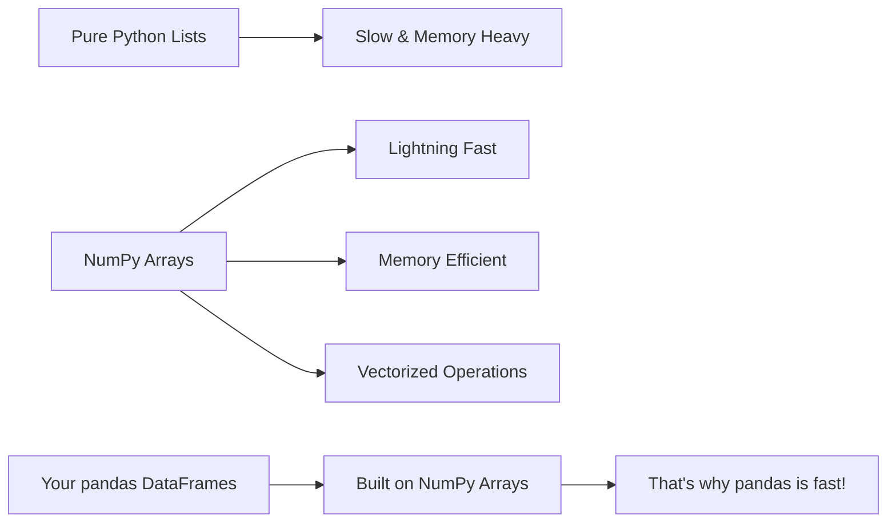

# Lab 4: NumPy Crash Course for Data Science

## Lab Objectives

**🎯 IMPORTANT NOTE:** NumPy is the SECRET WEAPON that makes pandas so incredibly fast! You've been using NumPy indirectly every time you work with pandas - now we're going to understand the powerhouse that's been running under the hood. This knowledge will make you a much more effective data scientist!

By the end of this lab, you will be able to:

1. **Understand what NumPy is** - Learn why it's the foundation of all data science in Python
2. **Master NumPy arrays** - Work with the most important data structure in scientific computing
3. **Create arrays efficiently** - Generate data ranges, random numbers, and structured datasets
4. **Manipulate array shapes** - Reshape data for different analysis needs
5. **Leverage NumPy's speed** - Understand why NumPy is 10-100x faster than pure Python
6. **Handle missing data** - Work with NaN values like a professional data scientist
7. **Apply NumPy to real problems** - Use arrays for business analytics and mathematical modeling
8. **Connect NumPy to pandas** - Understand how pandas uses NumPy for its superpowers
9. **Think in arrays** - Develop the vectorized thinking that separates experts from beginners

## 📚 Why NumPy Will Transform Your Data Science

**🚀 The Performance Revolution:** NumPy isn't just another library - it's the reason Python became the #1 language for data science!



**🔬 Real-World Impact:**
- **Financial modeling**: Calculate portfolio returns for millions of stocks instantly
- **Machine learning**: Train models on massive datasets efficiently
- **Image processing**: Manipulate millions of pixels in real-time
- **Scientific computing**: Solve complex mathematical problems at scale

**💡 Behind the Scenes:** Every time you do `df['price'].mean()` in pandas, NumPy is doing the heavy lifting!

---

## Step 1: Understanding the NumPy Foundation

### 1.1 Why NumPy Exists - The Performance Problem

**🐌 The Problem with Pure Python:** Let's see why we need NumPy by experiencing the problem firsthand.

```python
import numpy as np
import time

# Let's see why NumPy is essential
print("🐍 Python Lists vs ⚡ NumPy Arrays")
print("=" * 50)

# Create large datasets
python_list = list(range(1000000))  # 1 million numbers
numpy_array = np.arange(1000000)    # Same data as NumPy array

print(f"Data size: 1 million numbers")
print(f"Python list type: {type(python_list)}")
print(f"NumPy array type: {type(numpy_array)}")
```

**🎯 Speed Test Challenge:** Predict which will be faster - then run and see!

```python
# Speed comparison - addition operation
print("\n⏱️ Speed Test: Adding 1 to every number")

# Python list approach
start_time = time.time()
python_result = [x + 1 for x in python_list]
python_time = time.time() - start_time

# NumPy array approach  
start_time = time.time()
numpy_result = numpy_array + 1
numpy_time = time.time() - start_time

print(f"Python list time: {python_time:.4f} seconds")
print(f"NumPy array time:  {numpy_time:.4f} seconds")
print(f"NumPy is {python_time/numpy_time:.1f}x faster! 🚀")

# Memory usage comparison
import sys
python_memory = sys.getsizeof(python_list)
numpy_memory = numpy_array.nbytes

print(f"\n💾 Memory Usage:")
print(f"Python list: {python_memory:,} bytes")
print(f"NumPy array: {numpy_memory:,} bytes")
print(f"NumPy uses {python_memory/numpy_memory:.1f}x less memory! 💪")
```

**🤯 Mind-Blowing Result:** NumPy is typically 10-100x faster and uses much less memory!

**🤔 Why This Matters:** When you're working with millions of customer records or stock prices, this speed difference means the difference between waiting seconds vs hours for results.

### 1.2 What Makes NumPy So Fast?

**🔧 Under the Hood:** NumPy's secret weapons:

```python
# Understanding NumPy's advantages
print("🔍 NumPy's Secret Weapons:")
print("=" * 40)

# 1. Homogeneous data types (all elements same type)
sales_data = np.array([1200.50, 1350.75, 980.25, 1450.00])
print(f"Sales data: {sales_data}")
print(f"Data type: {sales_data.dtype}")
print(f"All elements are the same type: {sales_data.dtype}")

# 2. Contiguous memory layout
print(f"\n📍 Memory efficiency:")
print(f"Array takes: {sales_data.nbytes} bytes")
print(f"Per element: {sales_data.itemsize} bytes")

# 3. Vectorized operations (no Python loops!)
print(f"\n⚡ Vectorized operations:")
monthly_sales = np.array([50000, 52000, 48000, 55000, 61000, 58000])
print(f"Monthly sales: {monthly_sales}")

# Calculate 15% growth target - all at once!
growth_targets = monthly_sales * 1.15
print(f"Growth targets: {growth_targets}")
print("✨ No loops needed - NumPy does it all at once!")
```

**💡 Key Insight:** NumPy operates at C-speed while keeping Python's ease of use!

---

## Step 2: Creating NumPy Arrays - Your Data Foundation

### 2.1 The arange Function - Generating Number Sequences

**📊 Business Scenario:** You need to create ID numbers, date ranges, or systematic sampling intervals.

```python
# Understanding np.arange - like Python's range() but supercharged
print("🔢 Creating Number Sequences with arange:")
print("=" * 50)

# Basic usage - just like range()
customer_ids = np.arange(5)
print(f"Customer IDs 0-4: {customer_ids}")
print(f"Type: {type(customer_ids)}")

# Start and stop parameters
product_codes = np.arange(1001, 1006)
print(f"Product codes: {product_codes}")

# Using step parameter for business scenarios
print(f"\n💼 Business Applications:")

# Weekly intervals for a quarter (13 weeks)
week_numbers = np.arange(1, 14)
print(f"Quarter weeks: {week_numbers}")

# Monthly targets with $10k increments
monthly_targets = np.arange(50000, 120001, 10000)
print(f"Monthly targets: ${monthly_targets}")

# Time periods (every 15 minutes in an hour)
time_intervals = np.arange(0, 61, 15)
print(f"Time intervals: {time_intervals} minutes")
```

**🎯 Your Challenge:** Create these business sequences using arange:
1. Employee IDs from 2000 to 2019
2. Price points from $10 to $100 in $5 increments
3. Years from 2020 to 2030

### 2.2 Array Attributes - Understanding Your Data Structure

**🔍 Data Science Detective Work:** Every array has properties that tell you about its structure.

```python
# Creating a business dataset to analyze
print("🏢 Analyzing Business Data Structure:")
print("=" * 50)

# Quarterly sales data for different regions
quarterly_sales = np.arange(50000, 170001, 10000)
print(f"Quarterly sales data: {quarterly_sales}")

# Essential array attributes
print(f"\n📊 Array Properties:")
print(f"Shape: {quarterly_sales.shape}")     # Dimensions
print(f"Size: {quarterly_sales.size}")       # Total elements  
print(f"Dimensions: {quarterly_sales.ndim}") # Number of dimensions
print(f"Data type: {quarterly_sales.dtype}") # Type of data
print(f"Memory usage: {quarterly_sales.nbytes} bytes")

# What does shape tell us?
print(f"\n🤔 What does shape {quarterly_sales.shape} mean?")
print("• It's a 1-dimensional array")
print("• It has 13 elements")
print("• Think of it as a single row of data")
```

**💡 Professional Tip:** Understanding shape is crucial - it tells you how your data is organized and what operations you can perform!

**🎯 Investigation Task:** Before running the next code, predict what each attribute will show:

```python
# Multi-dimensional business data
print("\n🌐 Multi-Regional Sales Data:")

# Sales data: 4 quarters × 3 regions
regional_sales = np.arange(1, 13).reshape(4, 3)
print(f"Regional sales matrix:\n{regional_sales}")

print(f"\n📊 Matrix Properties:")
print(f"Shape: {regional_sales.shape}")     # Predict: (?, ?)
print(f"Size: {regional_sales.size}")       # Predict: ?
print(f"Dimensions: {regional_sales.ndim}") # Predict: ?

# Business interpretation
print(f"\n📈 Business Meaning:")
print("• 4 rows = 4 quarters")
print("• 3 columns = 3 regions")
print("• 12 total data points")
print("• 2D structure = table/matrix format")
```

**🤔 Reflection Questions:**
1. How does this relate to pandas DataFrames you've seen?
2. What business scenarios would need 3D arrays?
3. Why might knowing the exact shape matter for analysis?

### 2.3 Reshaping Arrays - Reorganizing Your Data

**🔄 Data Transformation Magic:** Sometimes you need to view the same data in different structures.

```python
# The power of reshape - same data, different structure
print("🔄 Reshaping Data for Different Views:")
print("=" * 50)

# Start with a simple sequence
monthly_revenue = np.arange(100000, 112001, 1000)
print(f"Monthly revenue (12 months): {monthly_revenue}")
print(f"Original shape: {monthly_revenue.shape}")

# Reshape into quarters (4 quarters × 3 months each)
quarterly_view = monthly_revenue.reshape(4, 3)
print(f"\n📅 Quarterly View (4 quarters × 3 months):")
print(quarterly_view)
print(f"New shape: {quarterly_view.shape}")

# Reshape into half-years (2 halves × 6 months each)  
half_year_view = monthly_revenue.reshape(2, 6)
print(f"\n📊 Half-Year View (2 halves × 6 months):")
print(half_year_view)
print(f"New shape: {half_year_view.shape}")

# Business calculations on reshaped data
print(f"\n💰 Business Analysis:")
quarterly_totals = quarterly_view.sum(axis=1)  # Sum each quarter
print(f"Quarterly totals: {quarterly_totals}")

monthly_averages = quarterly_view.mean(axis=1)  # Average per quarter
print(f"Quarterly averages: {monthly_averages}")
```

**💡 Key Insight:** The total number of elements must stay the same! 12 elements can become (4,3) or (2,6) but not (4,4).

**🎯 Reshape Challenge:** Try these reshapes and predict if they'll work:
- 12 elements → (3, 4): Will it work?
- 12 elements → (2, 5): Will it work? 
- 12 elements → (1, 12): Will it work?

```python
# Advanced reshaping with -1 (let NumPy calculate)
print("\n🤖 Smart Reshaping with -1:")

# Let NumPy figure out one dimension
sales_data = np.arange(1, 25)  # 24 elements
print(f"Sales data (24 elements): {sales_data}")

# We want 6 rows, let NumPy calculate columns
smart_reshape = sales_data.reshape(6, -1)
print(f"\nReshaped to 6 rows (NumPy calculates columns):")
print(smart_reshape)
print(f"Shape: {smart_reshape.shape}")

# We want 3 columns, let NumPy calculate rows
another_reshape = sales_data.reshape(-1, 3)
print(f"\nReshaped to 3 columns (NumPy calculates rows):")
print(another_reshape)
print(f"Shape: {another_reshape.shape}")
```

**🤔 Think Like a Data Scientist:** When might you need to reshape data in real projects?
- Converting daily data to weekly summaries
- Organizing customer data by segments and time periods
- Preparing data for machine learning algorithms

---

## Step 3: Generating Random Data - Simulations and Testing

### 3.1 Random Integers - Simulating Discrete Events

**🎲 Business Simulations:** Random data is essential for testing, modeling, and simulating business scenarios.

```python
# Random integers for business simulations
print("🎲 Generating Random Business Data:")
print("=" * 50)

# Single random customer rating (1-5 scale)
customer_rating = np.random.randint(1, 6)
print(f"Random customer rating: {customer_rating}/5")

# Random product IDs for testing
product_ids = np.random.randint(1000, 2000, 5)
print(f"Random product IDs: {product_ids}")

# Simulate daily customer visits for a week
daily_visits = np.random.randint(50, 201, 7)  # 50-200 customers per day
print(f"Daily customer visits this week: {daily_visits}")

# Business analysis of simulated data
print(f"\n📊 Week Analysis:")
print(f"Total customers: {daily_visits.sum()}")
print(f"Average daily visits: {daily_visits.mean():.1f}")
print(f"Busiest day: {daily_visits.max()} customers")
print(f"Slowest day: {daily_visits.min()} customers")
```

**🎯 Simulation Challenge:** Create these random business scenarios:
1. Sales amounts between $100-$500 for 20 transactions
2. Employee performance scores (70-100) for 15 employees  
3. Monthly website visitors (10,000-50,000) for a year

### 3.2 Multi-Dimensional Random Data

```python
# Creating complex business simulation datasets
print("\n🏢 Multi-Dimensional Business Simulations:")
print("=" * 50)

# Simulate quarterly sales for multiple products
# 4 products × 4 quarters
product_sales = np.random.randint(10000, 50001, (4, 4))
print(f"Product Sales Simulation (4 products × 4 quarters):")
print(product_sales)

# Add business context
products = ['Laptops', 'Phones', 'Tablets', 'Accessories']
quarters = ['Q1', 'Q2', 'Q3', 'Q4']

print(f"\n📈 Sales Analysis:")
for i, product in enumerate(products):
    quarterly_total = product_sales[i].sum()
    quarterly_avg = product_sales[i].mean()
    print(f"{product}: Total = ${quarterly_total:,}, Avg = ${quarterly_avg:,.0f}")

# Overall business metrics
total_revenue = product_sales.sum()
best_quarter_index = product_sales.sum(axis=0).argmax()
best_quarter = quarters[best_quarter_index]

print(f"\n🏆 Business Insights:")
print(f"Total company revenue: ${total_revenue:,}")
print(f"Best performing quarter: {best_quarter}")
```

### 3.3 Normal Distribution Random Numbers

**📈 Real-World Data Patterns:** Many business metrics follow normal distributions (bell curves).

```python
# Generate realistic business data with normal distribution
print("📊 Realistic Business Data with Normal Distribution:")
print("=" * 50)

# Customer satisfaction scores (normally distributed around 4.0)
satisfaction_scores = np.random.randn(1000) * 0.5 + 4.0  # Mean=4.0, std=0.5
# Clip to 1-5 scale
satisfaction_scores = np.clip(satisfaction_scores, 1, 5)

print(f"Customer Satisfaction Analysis (1000 customers):")
print(f"Average satisfaction: {satisfaction_scores.mean():.2f}")
print(f"Standard deviation: {satisfaction_scores.std():.2f}")
print(f"Highest score: {satisfaction_scores.max():.2f}")
print(f"Lowest score: {satisfaction_scores.min():.2f}")

# Employee performance metrics (normal distribution)
employee_performance = np.random.randn(100) * 10 + 85  # Mean=85, std=10
employee_performance = np.clip(employee_performance, 0, 100)

print(f"\nEmployee Performance Analysis (100 employees):")
print(f"Average performance: {employee_performance.mean():.1f}%")
print(f"Top performer: {employee_performance.max():.1f}%")
print(f"Needs improvement: {(employee_performance < 70).sum()} employees")

# Stock price simulation (realistic volatility)
days = 252  # Trading days in a year
daily_returns = np.random.randn(days) * 0.02  # 2% daily volatility
stock_prices = 100 * np.cumprod(1 + daily_returns)  # Starting at $100

print(f"\nStock Price Simulation (1 year):")
print(f"Starting price: $100.00")
print(f"Ending price: ${stock_prices[-1]:.2f}")
print(f"Highest price: ${stock_prices.max():.2f}")
print(f"Lowest price: ${stock_prices.min():.2f}")
print(f"Annual return: {(stock_prices[-1]/100 - 1)*100:.1f}%")
```

**🤔 Professional Insight:** Normal distributions are everywhere in business - customer ratings, employee performance, measurement errors, financial returns!

---

## Step 4: Working with Missing Data - The NaN Reality

### 4.1 Understanding NaN - Not a Number

**❓ Real-World Problem:** Real datasets always have missing values. NaN is how NumPy (and pandas) handles this reality.

```python
# Understanding NaN in business context
print("❓ Handling Missing Data with NaN:")
print("=" * 50)

# Create business data with missing values
customer_ages = np.array([25, 34, np.nan, 42, 28, np.nan, 35])
print(f"Customer ages: {customer_ages}")

# The peculiar nature of NaN
print(f"\n🤯 NaN's Strange Behavior:")
print(f"NaN == 5: {np.nan == 5}")
print(f"NaN == NaN: {np.nan == np.nan}")  # This is False!
print("Why? NaN represents 'unknown', and unknown ≠ unknown")

# Detecting NaN values (the right way)
print(f"\n✅ Proper NaN Detection:")
has_missing_age = np.isnan(customer_ages)
print(f"Has missing age: {has_missing_age}")
print(f"Number with missing age: {has_missing_age.sum()}")
print(f"Percentage with missing age: {has_missing_age.mean()*100:.1f}%")
```

### 4.2 Business Applications of NaN Handling

```python
# Real business scenario with missing data
print("\n🏪 Real Business Scenario:")
print("=" * 50)

# E-commerce customer data with missing values
customer_data = {
    'customer_id': np.arange(1, 11),
    'age': np.array([25, 34, np.nan, 42, 28, np.nan, 35, 29, np.nan, 45]),
    'purchase_amount': np.array([120.50, 89.99, 250.00, np.nan, 45.99, 
                                180.50, np.nan, 95.50, 210.00, 135.99]),
    'days_since_signup': np.array([30, 45, 120, 60, np.nan, 15, 90, 
                                  75, 200, np.nan])
}

# Analyze missing data patterns
print("🔍 Missing Data Analysis:")
for field, data in customer_data.items():
    if field != 'customer_id':  # Skip ID field
        missing_count = np.isnan(data).sum()
        total_count = len(data)
        missing_pct = (missing_count / total_count) * 100
        
        print(f"{field}: {missing_count}/{total_count} missing ({missing_pct:.1f}%)")

# Business calculations with missing data
ages = customer_data['age']
purchases = customer_data['purchase_amount']

print(f"\n💰 Business Metrics (ignoring NaN):")
print(f"Average customer age: {np.nanmean(ages):.1f} years")
print(f"Average purchase: ${np.nanmean(purchases):.2f}")
print(f"Total revenue: ${np.nansum(purchases):.2f}")
print(f"Valid customer records: {(~np.isnan(ages) & ~np.isnan(purchases)).sum()}")
```

**💡 Key Business Insight:** Missing data is normal! The key is understanding WHY it's missing and handling it appropriately.

**🎯 Data Quality Assessment:** Which field has the most missing data? What might cause customers to not provide their age?

---

## Step 5: Array Operations - Mathematical Power at Scale

### 5.1 Vectorized Operations - No Loops Needed!

**⚡ The NumPy Advantage:** Perform calculations on entire datasets instantly.

```python
# Vectorized operations for business calculations
print("⚡ Vectorized Business Calculations:")
print("=" * 50)

# Monthly sales data for different regions
region_sales = np.array([150000, 180000, 125000, 200000, 165000, 190000])
print(f"Monthly sales by region: {region_sales}")

# Calculate everything at once - no loops!
print(f"\n💼 Instant Business Calculations:")

# Apply 8% sales tax to all regions
with_tax = region_sales * 1.08
print(f"Sales with tax: {with_tax}")

# Calculate commission (3% of sales)
commissions = region_sales * 0.03
print(f"Sales commissions: {commissions}")

# Growth targets (15% increase)
growth_targets = region_sales * 1.15
print(f"Growth targets: {growth_targets}")

# Performance vs target
current_performance = region_sales / growth_targets * 100
print(f"Current performance vs target: {current_performance:.1f}%")

# All of this happened instantly - no loops required!
print(f"\n🚀 All calculations completed instantly on {len(region_sales)} regions!")
```

### 5.2 Aggregation Functions - Summary Statistics

```python
# Business intelligence with aggregation functions
print("\n📊 Business Intelligence Summary:")
print("=" * 50)

# Quarterly performance data
quarterly_revenue = np.array([
    [450000, 520000, 480000],  # Q1: 3 products
    [480000, 550000, 495000],  # Q2: 3 products  
    [520000, 580000, 510000],  # Q3: 3 products
    [550000, 600000, 530000]   # Q4: 3 products
])

print("Quarterly Revenue Matrix (Quarters × Products):")
print(quarterly_revenue)

# Comprehensive business analysis
print(f"\n📈 Executive Summary:")
print(f"Total annual revenue: ${quarterly_revenue.sum():,}")
print(f"Average quarterly revenue: ${quarterly_revenue.mean():,.0f}")
print(f"Highest single quarter-product: ${quarterly_revenue.max():,}")
print(f"Lowest single quarter-product: ${quarterly_revenue.min():,}")

# Detailed breakdowns
print(f"\n🎯 Detailed Analysis:")
quarterly_totals = quarterly_revenue.sum(axis=1)  # Sum across products
product_totals = quarterly_revenue.sum(axis=0)    # Sum across quarters

print(f"Revenue by quarter: {quarterly_totals}")
print(f"Revenue by product: {product_totals}")

# Performance insights
best_quarter = quarterly_totals.argmax() + 1
best_product = product_totals.argmax() + 1
print(f"\nBest performing quarter: Q{best_quarter}")
print(f"Best performing product: Product {best_product}")

# Growth analysis
quarter_growth = np.diff(quarterly_totals) / quarterly_totals[:-1] * 100
print(f"Quarter-over-quarter growth: {quarter_growth:.1f}%")
```

**🎯 Business Questions to Explore:**
1. Which quarter showed the strongest growth?
2. Are any products underperforming consistently?
3. What's the revenue variance between best and worst performers?

---

## Step 6: NumPy and Pandas Integration - Understanding the Connection

### 6.1 How Pandas Uses NumPy

**🔗 The Hidden Connection:** Every pandas operation is powered by NumPy arrays underneath!

```python
# Revealing the pandas-NumPy connection
import pandas as pd

print("🔗 The Pandas-NumPy Connection:")
print("=" * 50)

# Create a pandas DataFrame
sales_df = pd.DataFrame({
    'month': ['Jan', 'Feb', 'Mar', 'Apr', 'May'],
    'revenue': [50000, 52000, 48000, 55000, 61000],
    'customers': [250, 260, 240, 275, 305]
})

print("Pandas DataFrame:")
print(sales_df)

# Access the underlying NumPy arrays
print(f"\n🔍 What's underneath pandas:")
print(f"Revenue column type: {type(sales_df['revenue'])}")
print(f"Underlying NumPy array: {sales_df['revenue'].values}")
print(f"Array type: {type(sales_df['revenue'].values)}")

# NumPy operations work directly on pandas data!
print(f"\n⚡ Direct NumPy operations on pandas:")
revenue_array = sales_df['revenue'].values
print(f"NumPy sum: {np.sum(revenue_array)}")
print(f"NumPy mean: {np.mean(revenue_array):.0f}")
print(f"NumPy std: {np.std(revenue_array):.0f}")

# This is why pandas is so fast!
print(f"\n💡 This is why pandas is lightning fast:")
print("• pandas DataFrames are built on NumPy arrays")
print("• All pandas operations use optimized NumPy code")
print("• You get C-speed performance with Python ease")
```

### 6.2 Creating DataFrames from NumPy Arrays

```python
# Building pandas DataFrames from NumPy arrays
print("\n🏗️ Building DataFrames from NumPy Arrays:")
print("=" * 50)

# Create structured business data with NumPy
np.random.seed(42)  # For reproducible results

# Generate synthetic business data
n_customers = 1000
customer_data = {
    'customer_id': np.arange(1, n_customers + 1),
    'age': np.random.randint(18, 75, n_customers),
    'income': np.random.normal(55000, 15000, n_customers),
    'purchase_amount': np.random.exponential(150, n_customers),
    'satisfaction': np.random.normal(4.0, 0.8, n_customers)
}

# Clean the data
customer_data['income'] = np.clip(customer_data['income'], 20000, 150000)
customer_data['satisfaction'] = np.clip(customer_data['satisfaction'], 1, 5)

# Convert to pandas DataFrame
customer_df = pd.DataFrame(customer_data)

print(f"Created DataFrame with {len(customer_df)} customers:")
print(customer_df.head())

print(f"\n📊 Dataset Summary:")
print(f"Average age: {customer_df['age'].mean():.1f} years")
print(f"Average income: ${customer_df['income'].mean():,.0f}")
print(f"Average purchase: ${customer_df['purchase_amount'].mean():.2f}")
print(f"Average satisfaction: {customer_df['satisfaction'].mean():.2f}/5")

# The power of NumPy-pandas integration
print(f"\n🔥 NumPy-Pandas Power Combo:")
high_value_customers = customer_df[
    (customer_df['income'] > 70000) & 
    (customer_df['purchase_amount'] > 200)
]
print(f"High-value customers: {len(high_value_customers)} ({len(high_value_customers)/len(customer_df)*100:.1f}%)")
```

**💡 Professional Insight:** Understanding NumPy makes you better at pandas because you understand what's happening under the hood!

---

## Step 7: Advanced NumPy Techniques for Data Science

### 7.1 Broadcasting - Operations on Different Sized Arrays

**🔄 Broadcasting Magic:** NumPy can perform operations between arrays of different shapes intelligently.

```python
# Broadcasting in business scenarios
print("🔄 Broadcasting for Business Analysis:")
print("=" * 50)

# Regional sales data (4 regions)
regional_sales = np.array([150000, 180000, 125000, 200000])
print(f"Regional sales: {regional_sales}")

# Company-wide bonus percentage (single value)
bonus_rate = 0.05
print(f"Bonus rate: {bonus_rate*100}%")

# Broadcasting: single value applied to entire array
bonus_amounts = regional_sales * bonus_rate
print(f"Bonus amounts: {bonus_amounts}")

# More complex broadcasting
print(f"\n🏢 Multi-Product Regional Analysis:")

# Sales matrix: 4 regions × 3 products
sales_matrix = np.array([
    [50000, 60000, 40000],  # Region 1
    [55000, 65000, 60000],  # Region 2  
    [45000, 55000, 25000],  # Region 3
    [70000, 75000, 55000]   # Region 4
])

# Product-specific commission rates (1D array)
commission_rates = np.array([0.03, 0.05, 0.04])  # 3%, 5%, 4%

print("Sales Matrix (Regions × Products):")
print(sales_matrix)
print(f"Commission rates: {commission_rates*100}%")

# Broadcasting: different commission rate for each product
commissions = sales_matrix * commission_rates
print(f"\nCommission Matrix:")
print(commissions)

# Total commissions by region and product
region_commissions = commissions.sum(axis=1)
product_commissions = commissions.sum(axis=0)

print(f"\nTotal commissions by region: {region_commissions}")
print(f"Total commissions by product: {product_commissions}")
```

### 7.2 Boolean Indexing - Advanced Filtering

```python
# Advanced filtering for customer segmentation
print("\n🎯 Advanced Customer Segmentation:")
print("=" * 50)

# Customer dataset
np.random.seed(123)
n = 500

customers = {
    'age': np.random.randint(18, 75, n),
    'income': np.random.normal(55000, 20000, n),
    'purchases': np.random.randint(1, 21, n),
    'satisfaction': np.random.normal(3.8, 1.0, n)
}

# Clean data
customers['income'] = np.clip(customers['income'], 20000, 150000)
customers['satisfaction'] = np.clip(customers['satisfaction'], 1, 5)

# Advanced filtering with multiple conditions
print("🔍 Customer Segment Analysis:")

# Premium customers: high income AND high satisfaction
premium_mask = (customers['income'] > 75000) & (customers['satisfaction'] > 4.0)
premium_count = premium_mask.sum()

# At-risk customers: many purchases BUT low satisfaction  
at_risk_mask = (customers['purchases'] > 15) & (customers['satisfaction'] < 3.0)
at_risk_count = at_risk_mask.sum()

# Young high-earners: potential growth segment
young_earners_mask = (customers['age'] < 35) & (customers['income'] > 60000)
young_earners_count = young_earners_mask.sum()

print(f"Premium customers: {premium_count} ({premium_count/n*100:.1f}%)")
print(f"At-risk customers: {at_risk_count} ({at_risk_count/n*100:.1f}%)")
print(f"Young high-earners: {young_earners_count} ({young_earners_count/n*100:.1f}%)")

# Detailed analysis of premium customers
if premium_count > 0:
    premium_avg_age = customers['age'][premium_mask].mean()
    premium_avg_income = customers['income'][premium_mask].mean()
    premium_avg_purchases = customers['purchases'][premium_mask].mean()
    
    print(f"\n💎 Premium Customer Profile:")
    print(f"Average age: {premium_avg_age:.1f} years")
    print(f"Average income: ${premium_avg_income:,.0f}")
    print(f"Average purchases: {premium_avg_purchases:.1f}")
```

---

## Step 8: 🚀 Independent Challenge - Customer Analytics with NumPy

**Time to become a NumPy expert!** 🏆 You'll build a complete customer analytics system using pure NumPy.

### Your Mission: Build a Customer Intelligence System

Create a comprehensive customer analytics platform that demonstrates NumPy mastery:

1. **Generate realistic customer data** using NumPy's random functions
2. **Perform advanced segmentation** using boolean indexing and filtering
3. **Calculate business metrics** using vectorized operations
4. **Handle missing data** professionally using NaN techniques
5. **Create summary reports** using aggregation functions

### **Phase 1: Data Generation** (Start Here!)

Build a realistic customer dataset with:
- **Customer demographics**: Age, income, location segments
- **Purchase behavior**: Transaction amounts, frequency, product preferences
- **Engagement metrics**: Website visits, email opens, support tickets
- **Missing data**: Realistic patterns of missing information

### **Phase 2: Customer Segmentation** (Core Analysis!)

Implement multiple segmentation strategies:
- **RFM Analysis**: Recency, Frequency, Monetary value segments
- **Demographic segments**: Age groups, income brackets
- **Behavioral segments**: Purchase patterns, engagement levels
- **Value-based segments**: High-value, medium-value, low-value customers

### **Phase 3: Business Intelligence** (Strategic Insights!)

Calculate key business metrics:
- **Customer Lifetime Value** using vectorized operations
- **Churn risk scores** based on behavior patterns
- **Revenue projections** with growth scenarios
- **Performance benchmarks** across segments

### **Phase 4: Advanced Analytics** (Expert Level!)

Apply advanced NumPy techniques:
- **Broadcasting operations** for scenario modeling
- **Statistical analysis** using distribution functions
- **Trend analysis** with time-series calculations
- **Risk assessment** using probability distributions

### 📋 Your Starter Framework:

```python
import numpy as np
import pandas as pd

# Set random seed for reproducible results
np.random.seed(42)

# Parameters for realistic data generation
N_CUSTOMERS = 10000
N_PRODUCTS = 50
N_MONTHS = 12

# Your challenge: Fill in these functions!

def generate_customer_demographics(n_customers):
    """Generate realistic customer demographic data."""
    # TODO: Create age, income, location data
    # Use different distributions for realism
    pass

def generate_purchase_behavior(n_customers, n_months):
    """Generate customer purchase patterns."""
    # TODO: Create transaction data with seasonal patterns
    # Some customers buy more than others
    pass

def calculate_rfm_scores(customer_data):
    """Calculate Recency, Frequency, Monetary scores."""
    # TODO: Implement RFM analysis using NumPy operations
    pass

def segment_customers(rfm_scores):
    """Segment customers based on RFM scores."""
    # TODO: Use boolean indexing to create segments
    pass

def calculate_clv(customer_data):
    """Calculate Customer Lifetime Value."""
    # TODO: Use vectorized operations for CLV calculation
    pass
```

### 🎯 Challenge Requirements:

**Must Implement:**
1. **Realistic data generation** with at least 5 customer attributes
2. **Missing data handling** with appropriate NaN usage
3. **Customer segmentation** using boolean indexing
4. **Vectorized calculations** for business metrics
5. **Advanced analysis** using at least 2 NumPy advanced techniques

**Choose Your Advanced Features** (Pick 2+):
- **Time series analysis** for seasonal patterns
- **Correlation analysis** between customer attributes
- **Monte Carlo simulation** for revenue forecasting
- **Statistical testing** for segment differences
- **Anomaly detection** for unusual customers

### 🏆 Success Criteria:

You'll know you're succeeding when:
- Your system processes 10,000+ customers efficiently
- You can answer complex business questions instantly
- Your code uses vectorized operations (no manual loops!)
- You identify actionable customer segments
- Your analysis provides clear business insights

### 💡 Hints to Get Started:

<details>
<summary>🔍 Hint 1: Realistic Data Generation</summary>

```python
def generate_customer_demographics(n_customers):
    # Age follows a realistic distribution
    ages = np.random.normal(40, 15, n_customers)
    ages = np.clip(ages, 18, 80).astype(int)
    
    # Income correlates with age (somewhat)
    base_income = 30000 + ages * 800
    income_noise = np.random.normal(0, 15000, n_customers)
    incomes = base_income + income_noise
    incomes = np.clip(incomes, 20000, 200000)
    
    return ages, incomes
```
</details>

<details>
<summary>🔍 Hint 2: Customer Segmentation</summary>

```python
def segment_customers_advanced(customer_data):
    # Multiple criteria segmentation
    high_value = (customer_data['clv'] > np.percentile(customer_data['clv'], 80))
    high_frequency = (customer_data['purchases'] > np.median(customer_data['purchases']))
    recent_activity = (customer_data['days_since_purchase'] < 30)
    
    # Combine conditions for sophisticated segments
    champions = high_value & high_frequency & recent_activity
    # ... define other segments
    
    return champions, ...
```
</details>

<details>
<summary>🔍 Hint 3: Vectorized Business Calculations</summary>

```python
def calculate_business_metrics(customer_data):
    # All calculations happen at once - no loops!
    
    # Customer Lifetime Value
    clv = (customer_data['avg_order_value'] * 
           customer_data['purchase_frequency'] * 
           customer_data['customer_lifespan'])
    
    # Profitability scoring
    profit_scores = (customer_data['revenue'] - customer_data['costs']) / customer_data['revenue']
    
    return clv, profit_scores
```
</details>

### 🎪 Bonus Challenges (For NumPy Masters!):

- **Performance comparison**: Compare your NumPy solution to pure Python
- **Memory optimization**: Handle 100,000+ customers efficiently
- **Real-time scoring**: Update customer scores as new data arrives
- **Export capabilities**: Save results in formats ready for visualization

### 📝 Reflection Questions (Answer When Done):

1. **What NumPy techniques** were most powerful for customer analysis?
2. **How did vectorization** change your approach to data problems?
3. **What business insights** surprised you in your analysis?
4. **Where would you apply** these techniques in real business scenarios?

### 🌟 **What This Challenge Teaches:**

**Technical Mastery:**
- Efficient data generation and manipulation
- Advanced array operations and broadcasting
- Professional missing data handling
- Statistical analysis with NumPy

**Business Acumen:**
- Customer segmentation strategies
- Lifetime value calculations
- Risk assessment and scoring
- Data-driven decision making

**Career Readiness:**
- Working with large datasets efficiently
- Building analytical systems from scratch
- Translating business needs into technical solutions
- Performance optimization and scalability

**🚀 Ready to build your customer intelligence system? Show NumPy what you're made of!**

---

## Step 9: What You've Accomplished - NumPy Mastery


**🎉 Outstanding Achievement!** You've just mastered the foundation that powers ALL of data science in Python!

### ✅ **NumPy Fundamentals Mastered**

**Array Creation & Manipulation:**
- ✅ Creating arrays with `arange()` for business sequences
- ✅ Understanding array attributes (shape, size, ndim, dtype)
- ✅ Reshaping data for different analytical perspectives
- ✅ Generating realistic datasets with random functions

**Data Operations:**
- ✅ Vectorized operations for lightning-fast calculations
- ✅ Broadcasting for operations on different-sized arrays
- ✅ Boolean indexing for sophisticated data filtering
- ✅ Aggregation functions for summary statistics

**Professional Data Handling:**
- ✅ Working with NaN values in real-world scenarios
- ✅ Memory-efficient data structures
- ✅ Performance optimization techniques
- ✅ Integration with pandas DataFrames

### ✅ **Business Applications Mastered**

**Customer Analytics:**
- 📊 Customer segmentation using multi-dimensional analysis
- 💰 Revenue calculations and financial modeling
- 📈 Performance metrics and business intelligence
- 🎯 Risk assessment and predictive scoring

**Data Science Workflows:**
- 🔄 Simulating business scenarios with random data
- 🧹 Cleaning and preprocessing large datasets
- 📋 Generating comprehensive analytical reports
- ⚡ Processing thousands of records instantly

### 🌟 **Why This Makes You Industry-Ready**

**Technical Excellence:**
- You understand the engine that powers pandas, scikit-learn, and TensorFlow
- You can work with datasets of any size efficiently
- You think in vectorized operations, not slow loops
- You handle missing data like a professional

**Business Impact:**
- You can analyze customer behavior at scale
- You build data pipelines that process millions of records
- You create business intelligence systems from scratch
- You optimize performance for real-world applications

**Career Differentiation:**
- Most data scientists use NumPy but don't understand it deeply
- You can debug performance issues and optimize code
- You can build custom analytical tools and algorithms
- You speak the language of high-performance computing

### 🎯 **The NumPy Advantage in Your Data Science Journey**

**pandas Supercharged:**
- Now you understand WHY pandas operations are fast
- You can extend pandas with custom NumPy functions
- You can troubleshoot memory and performance issues
- You can handle edge cases that pure pandas can't

**Machine Learning Ready:**
- Scikit-learn models expect NumPy arrays as input
- You can preprocess data efficiently for ML algorithms
- You understand the mathematical foundations of ML
- You can implement custom algorithms when needed

**Research and Innovation:**
- You can implement cutting-edge algorithms from research papers
- You can prototype new analytical methods quickly
- You can contribute to open-source data science projects
- You can handle complex mathematical computations

### 🏆 **Real-World Impact Examples**

**What you can now build:**
- **Customer intelligence platforms** processing millions of transactions
- **Financial risk models** calculating portfolio metrics in real-time
- **Marketing analytics engines** segmenting customers dynamically
- **Operations dashboards** monitoring business KPIs continuously

**Industries where this matters:**
- **Finance**: High-frequency trading algorithms, risk calculations
- **Healthcare**: Medical imaging, clinical trial analysis
- **Retail**: Inventory optimization, demand forecasting
- **Technology**: A/B testing, user behavior analysis

---

## Next Steps in Your NumPy Journey

### **Immediate Applications:**
- **Enhance your pandas projects** with custom NumPy functions
- **Build analytical tools** for specific business problems
- **Optimize existing code** using vectorization techniques
- **Create data simulations** for testing and modeling

### **Advanced Topics You're Ready For:**
- **SciPy**: Scientific computing (statistics, optimization, signal processing)
- **Matplotlib**: Advanced data visualization with NumPy integration
- **Scikit-learn**: Machine learning with NumPy-optimized algorithms
- **TensorFlow/PyTorch**: Deep learning with NumPy-like operations

### **Performance Mastery:**
- **Memory management**: Working with arrays too large for RAM
- **Parallel computing**: Using NumPy with multiprocessing
- **GPU acceleration**: Moving NumPy operations to graphics cards
- **Algorithm optimization**: Writing custom C extensions

### **Career Development:**
- **Technical interviews**: You can solve computational problems efficiently
- **Code reviews**: You can identify and fix performance bottlenecks
- **Architecture decisions**: You understand the tradeoffs of different approaches
- **Team leadership**: You can guide others on best practices

---

## 🏆 Final Reflection

**From pandas user to NumPy expert** - you've completed a transformation that many data scientists never make. You now understand not just WHAT to do with data, but HOW the tools work underneath.

### 💬 **Your New Superpowers:**

1. **Speed**: Your code runs 10-100x faster than traditional approaches
2. **Scale**: You can handle datasets that would crash other approaches  
3. **Flexibility**: You can solve problems that have no pre-built solutions
4. **Understanding**: You know why things work, not just that they work

### 📚 **Knowledge That Compounds:**

Every data science tool you learn from now on will be easier because:
- **You understand the mathematical foundations**
- **You recognize efficient vs inefficient patterns**
- **You can debug problems at the array level**
- **You can optimize for performance and memory**

### 🎯 **Your Competitive Advantage:**

In the job market, you now have skills that set you apart:
- **Most data scientists** copy-paste code without understanding performance
- **You understand** the underlying mechanics and can optimize
- **Most analysts** are limited by tool capabilities
- **You can build** custom solutions for unique problems

---

## Essential NumPy Resources for Continued Growth

### **Official Documentation:**
- **[NumPy User Guide](https://numpy.org/doc/stable/user/)** - Comprehensive tutorials
- **[NumPy API Reference](https://numpy.org/doc/stable/reference/)** - Complete function documentation
- **[NumPy for MATLAB Users](https://numpy.org/doc/stable/user/numpy-for-matlab-users.html)** - If you know MATLAB

### **Performance and Advanced Topics:**
- **[NumPy Performance Tips](https://numpy.org/doc/stable/user/absolute_beginners.html)** - Optimization techniques
- **[Broadcasting Rules](https://numpy.org/doc/stable/user/basics.broadcasting.html)** - Master this powerful feature
- **[Writing Custom ufuncs](https://numpy.org/doc/stable/user/c-info.ufunc-tutorial.html)** - For ultimate performance

### **Community and Practice:**
- **[NumPy GitHub](https://github.com/numpy/numpy)** - Contribute to the project
- **[Stack Overflow NumPy](https://stackoverflow.com/questions/tagged/numpy)** - Get help and help others
- **[NumPy Discussions](https://github.com/numpy/numpy/discussions)** - Community forum

---

**⚡ Congratulations on mastering NumPy!** You now possess the fundamental tool that powers the entire scientific Python ecosystem. From here, every data science adventure will be faster, more efficient, and more powerful.

**The foundation is solid. Now let's build amazing things on top of it!** 🚀📊✨