# Lab 6: Series Methods - Your Data Science Toolkit

## Lab Objectives

**🎯 IMPORTANT NOTE:** Series methods are your secret weapons for data analysis! Instead of writing complex loops and calculations, pandas gives you powerful one-line solutions. We're going to discover HOW to think about data problems and WHY certain methods are perfect for specific situations. This is where you go from copying code to designing solutions!

By the end of this lab, you will be able to:

1. **Choose the right method for each problem** - Develop intuition for when to use which tool
2. **Handle missing data like a professional** - Turn messy real-world data into clean insights
3. **Apply mathematical operations strategically** - Use vectorized operations for business calculations
4. **Transform data purposefully** - Convert, clean, and reshape data for analysis
5. **Combine methods intelligently** - Chain operations to solve complex problems
6. **Debug data issues effectively** - Identify and fix common data quality problems
7. **Think in transformations** - See data problems as series of method applications
8. **Build analysis workflows** - Create repeatable processes for data insights

## 📚 The Method Mindset - Thinking Like a Data Scientist

**🛠️ Methods = Your Analytical Tools**

Think of Series methods like a professional toolkit:
- **Plumber** has wrenches, pipes, fittings for different problems
- **Chef** has knives, pans, techniques for different dishes  
- **Data Scientist** has methods, functions, operations for different analyses

```mermaid
graph LR
    A[Raw Data Problem] --> B[Choose Right Method]
    B --> C[Apply Method]
    C --> D[Get Insight]
    
    E[Business Question] --> F[Method Strategy]
    F --> G[Clean → Transform → Analyze]
    G --> H[Business Answer]
```



**🤔 Key Question:** Instead of asking "What does this method do?", we'll ask "WHEN would I need this method?"

---

## Step 1: The Method Philosophy - Understanding Your Toolkit

### 1.1 Why Methods Exist - Solving Real Problems

**🎯 The Big Picture:** Every Series method exists because data scientists needed to solve a specific type of problem over and over.

```python
import pandas as pd
import numpy as np

# Load our trusty Airbnb data
print("🏠 Loading Airbnb Data for Method Exploration:")
url = "https://raw.githubusercontent.com/fenago/datasets/refs/heads/main/AirBnB_NYC_2019.csv"
airbnb_df = pd.read_csv(url)
print(f"Loaded {len(airbnb_df):,} listings")
```

**🕵️ Investigation Challenge:** Let's discover what problems we need to solve with this data.

```python
# Look at a sample of property names
property_names = airbnb_df['name'].head(10)
print("🔍 Sample Property Names:")
print(property_names.tolist())
```

**🤔 Data Problems You Can See:**
- Some names are ALL CAPS, some are mixed case
- Different lengths and formats
- Might have extra spaces
- Could have missing values

**💡 The Method Question:** For each problem, what would you WANT to do?
- Make text consistent? → `.str.lower()`, `.str.title()`
- Find missing data? → `.isna()`, `.dropna()`
- Calculate statistics? → `.mean()`, `.count()`

This is how data scientists think - **identify the problem, then choose the method!**

### 1.2 Categories of Methods - Your Toolkit Organization

**🗂️ Method Categories:** Series methods fall into logical groups for different types of problems.

```python
# Let's explore what types of methods we have
prices = airbnb_df['price'].head(20)
print("💰 Sample Prices for Method Exploration:")
print(prices)
```

**📊 Statistical Methods** - Understanding your data
```python
print("\n📈 Statistical Analysis:")
print(f"Average price: ${prices.mean():.2f}")
print(f"Median price: ${prices.median():.2f}")
print(f"Price range: ${prices.min()} to ${prices.max()}")
```

**🤔 When would you use each?**
- `.mean()` when you want typical value
- `.median()` when you have outliers
- `.min()/.max()` when you want extremes

**🎯 Your Prediction:** Look at the prices above. Will mean or median be higher? Why?

### 1.3 Method Chaining - Combining Tools

**🔗 The Power of Chaining:** You can combine methods to solve complex problems in one line.

```python
# Problem: Find the average price of properties with names longer than 20 characters
long_names = airbnb_df['name'].str.len() > 20
avg_price_long_names = airbnb_df[long_names]['price'].mean()

print(f"🔍 Complex Analysis in Simple Steps:")
print(f"Average price for properties with long names: ${avg_price_long_names:.2f}")
```

**💡 What Just Happened?**
1. `.str.len()` → Calculate name lengths
2. `> 20` → Create boolean mask
3. `[long_names]` → Filter data  
4. `['price']` → Select price column
5. `.mean()` → Calculate average

**🤔 Thinking Exercise:** How would you do this without pandas methods? (Hint: lots of loops and if statements!)

---

## Step 2: Mathematical Methods - Business Calculations Made Easy

### 2.1 Basic Math Operations - Beyond Simple Arithmetic

**🧮 Business Math:** Let's solve real business problems with mathematical methods.

```python
# Real business scenario: Calculate pricing metrics
prices = airbnb_df['price']
print("💼 Business Pricing Analysis:")
print(f"Total properties: {prices.count():,}")
print(f"Market average: ${prices.mean():.2f}")
```

**🎯 Business Question:** What if we want to add a 8% tax to all prices?

```python
# Method 1: Mathematical operation (what you might expect)
prices_with_tax = prices * 1.08
print(f"Sample prices with 8% tax: {prices_with_tax.head(5).round(2).tolist()}")
```

**🤔 Why This is Amazing:** 
- One line calculated tax for ALL 48,000+ properties
- No loops, no iterations
- pandas handles it automatically

**💡 Business Applications:**
- Add sales tax to all products
- Apply discounts to customer segments  
- Calculate commissions for sales teams
- Adjust prices for inflation

### 2.2 Aggregation Methods - Summarizing for Decisions

**📊 Business Intelligence:** Turn thousands of data points into actionable insights.

```python
# Analyze room type performance
room_types = airbnb_df['room_type']
prices_by_room = airbnb_df.groupby('room_type')['price'].agg(['count', 'mean', 'median', 'std'])

print("🏠 Room Type Performance Analysis:")
print(prices_by_room.round(2))
```

**🎯 Your Analysis Challenge:** Look at the results above. Which room type would you recommend for:
1. **Maximum revenue potential?** (highest mean price)
2. **Most consistent pricing?** (lowest std deviation)  
3. **Largest market opportunity?** (highest count)

**🤔 Business Decision:** If you were starting an Airbnb business, what room type strategy would this data suggest?

### 2.3 Comparison Methods - Finding Patterns

**🔍 Pattern Detection:** Compare performance across categories.

```python
# Compare Manhattan vs Brooklyn pricing
manhattan_prices = airbnb_df[airbnb_df['neighbourhood_group'] == 'Manhattan']['price']
brooklyn_prices = airbnb_df[airbnb_df['neighbourhood_group'] == 'Brooklyn']['price']

print("🏙️ Manhattan vs Brooklyn Comparison:")
print(f"Manhattan average: ${manhattan_prices.mean():.2f}")
print(f"Brooklyn average: ${brooklyn_prices.mean():.2f}")
print(f"Manhattan premium: ${manhattan_prices.mean() - brooklyn_prices.mean():.2f}")
```

**🎯 Business Insight Challenge:** 
```python
# What percentage premium does Manhattan command?
premium_percentage = (manhattan_prices.mean() / brooklyn_prices.mean() - 1) * 100
print(f"Manhattan premium: {premium_percentage:.1f}%")
```

**💡 Method Power:** The `.mean()` method instantly summarized thousands of prices into actionable business intelligence!

---

## Step 3: Missing Data Methods - Handling Real-World Messiness

### 3.1 Detecting Missing Data - Finding the Gaps

**🕵️ Missing Data Detective:** Real data is always messy. Let's learn to find and handle gaps professionally.

```python
# Investigate missing data in our dataset
print("🔍 Missing Data Investigation:")

# Check different columns for missing values
columns_to_check = ['name', 'host_name', 'last_review', 'reviews_per_month']
for col in columns_to_check:
    missing_count = airbnb_df[col].isna().sum()
    total_count = len(airbnb_df)
    missing_pct = (missing_count / total_count) * 100
    print(f"{col}: {missing_count:,} missing ({missing_pct:.1f}%)")
```

**🤔 Why Is Data Missing?**
- `last_review` missing → Property might be new, no reviews yet
- `reviews_per_month` missing → Related to no reviews
- `host_name` missing → Data collection issues

**💡 Business Impact:** Missing data isn't just a technical problem - it tells you about your business!

### 3.2 Strategic Missing Data Decisions

**🎯 Business Decision Making:** Different missing data situations require different strategies.

```python
# Let's focus on reviews data for business analysis
reviews_per_month = airbnb_df['reviews_per_month']
print("📊 Reviews Per Month Analysis:")
print(f"Total properties: {len(reviews_per_month):,}")
print(f"Properties with review data: {reviews_per_month.count():,}")
print(f"Properties missing review data: {reviews_per_month.isna().sum():,}")
```

**🤔 Strategic Question:** What should we do with missing review data?

**Option 1: Remove missing data**
```python
# Only analyze properties with reviews
has_reviews = reviews_per_month.dropna()
print(f"\nOption 1 - Remove missing:")
print(f"Properties analyzed: {len(has_reviews):,}")
print(f"Average reviews per month: {has_reviews.mean():.2f}")
```

**Option 2: Fill missing data with assumption**
```python
# Assume missing reviews = 0 reviews (new properties)
filled_reviews = reviews_per_month.fillna(0)
print(f"\nOption 2 - Fill missing with 0:")
print(f"Properties analyzed: {len(filled_reviews):,}")
print(f"Average reviews per month: {filled_reviews.mean():.2f}")
```

**🎯 Your Business Decision:** Which approach gives better insights?
- **Option 1:** Analyzes only established properties
- **Option 2:** Includes new properties in market analysis

**💡 Key Insight:** The method you choose changes your business conclusions!

### 3.3 Smart Missing Data Handling

**🧠 Intelligent Strategies:** Sometimes you can infer what missing data should be.

```python
# Smart analysis: Properties with no last_review
no_reviews = airbnb_df['last_review'].isna()
print("🎯 Properties with No Reviews Analysis:")
print(f"Properties never reviewed: {no_reviews.sum():,}")

# Are these newer properties?
no_review_properties = airbnb_df[no_reviews]
avg_price_no_reviews = no_review_properties['price'].mean()
avg_price_with_reviews = airbnb_df[~no_reviews]['price'].mean()

print(f"Average price (no reviews): ${avg_price_no_reviews:.2f}")
print(f"Average price (with reviews): ${avg_price_with_reviews:.2f}")
```

**🤔 Business Hypothesis:** Are properties without reviews priced differently? What might this suggest?
- Higher prices → Maybe too expensive to attract customers?
- Lower prices → Maybe new properties testing the market?

**💡 Method Insight:** `.isna()` and boolean indexing help you investigate missing data patterns, not just fix them!

---

## Step 4: Text Methods - Cleaning and Extracting Insights

### 4.1 Text Normalization - Making Data Consistent

**📝 Text Challenge:** Property names are messy. Let's clean them up for analysis.

```python
# Look at text data challenges
sample_names = airbnb_df['name'].head(10)
print("📝 Raw Property Names:")
for i, name in enumerate(sample_names):
    print(f"{i}: '{name}'")
```

**🎯 Text Problems You Can See:**
- Mixed case (some ALL CAPS, some Title Case)
- Inconsistent formatting
- Potential extra spaces

**🧹 Cleaning Strategy:**
```python
# Apply consistent formatting
clean_names = sample_names.str.title().str.strip()
print("\n✨ Cleaned Property Names:")
for i, name in enumerate(clean_names):
    print(f"{i}: '{name}'")
```

**🤔 Why This Matters:** Consistent text is crucial for:
- Searching and filtering
- Grouping similar properties
- Professional reporting
- Data quality

### 4.2 Text Analysis for Business Insights

**🔍 Text Mining:** Extract business intelligence from property descriptions.

```python
# Analyze property names for marketing keywords
print("🎯 Marketing Keyword Analysis:")

# Find luxury indicators
luxury_keywords = ['luxury', 'premium', 'deluxe', 'executive']
has_luxury_terms = airbnb_df['name'].str.contains('|'.join(luxury_keywords), case=False, na=False)
luxury_count = has_luxury_terms.sum()

print(f"Properties with luxury keywords: {luxury_count:,} ({luxury_count/len(airbnb_df)*100:.1f}%)")
```

**🤔 Business Question:** Do properties with luxury keywords charge premium prices?
```python
# Compare pricing for luxury vs regular properties
luxury_properties = airbnb_df[has_luxury_terms]
regular_properties = airbnb_df[~has_luxury_terms]

luxury_avg_price = luxury_properties['price'].mean()
regular_avg_price = regular_properties['price'].mean()

print(f"Luxury keyword average price: ${luxury_avg_price:.2f}")
print(f"Regular property average price: ${regular_avg_price:.2f}")
print(f"Luxury premium: {(luxury_avg_price/regular_avg_price - 1)*100:.1f}%")
```

**💡 Business Insight:** Text analysis reveals marketing strategy effectiveness!

### 4.3 Text Pattern Extraction

**🔎 Pattern Detection:** Find specific information buried in text.

```python
# Extract location mentions from property names
location_keywords = ['manhattan', 'brooklyn', 'queens', 'times square', 'central park']
print("📍 Location Mention Analysis:")

for keyword in location_keywords:
    has_keyword = airbnb_df['name'].str.contains(keyword, case=False, na=False)
    count = has_keyword.sum()
    if count > 0:
        avg_price = airbnb_df[has_keyword]['price'].mean()
        print(f"'{keyword}' mentioned: {count:,} times (avg price: ${avg_price:.2f})")
```

**🎯 Your Discovery:** Which location keywords command the highest prices? What does this tell you about marketing strategy?

---

## Step 5: Transformation Methods - Reshaping Data for Analysis

### 5.1 Ranking and Sorting - Finding Top Performers

**🏆 Performance Analysis:** Identify leaders and outliers in your data.

```python
# Rank properties by price within each borough
print("🏆 Ranking Analysis by Borough:")

# Focus on Manhattan for demonstration
manhattan_data = airbnb_df[airbnb_df['neighbourhood_group'] == 'Manhattan'].copy()

# Add ranking within Manhattan
manhattan_data['price_rank'] = manhattan_data['price'].rank(ascending=False)

# Show top 5 most expensive in Manhattan
top_5_manhattan = manhattan_data.nsmallest(5, 'price_rank')[['name', 'price', 'price_rank']]
print("Top 5 Most Expensive Manhattan Properties:")
print(top_5_manhattan)
```

**🤔 Business Application:** Rankings help identify:
- Top performers for case studies
- Outliers that need investigation  
- Competitive positioning
- Performance tiers

### 5.2 Binning and Categorization - Creating Segments

**📊 Segmentation Strategy:** Convert continuous data into business categories.

```python
# Create price segments for market analysis
print("💼 Market Segmentation Analysis:")

# Define business-meaningful price segments
def categorize_price(price):
    if price < 75:
        return 'Budget'
    elif price < 150:
        return 'Mid-Range'
    elif price < 300:
        return 'Premium'
    else:
        return 'Luxury'

# Apply categorization
price_segments = airbnb_df['price'].apply(categorize_price)
segment_analysis = price_segments.value_counts()

print("Market Segment Distribution:")
for segment, count in segment_analysis.items():
    percentage = (count / len(airbnb_df)) * 100
    avg_price = airbnb_df[price_segments == segment]['price'].mean()
    print(f"{segment}: {count:,} properties ({percentage:.1f}%) - Avg: ${avg_price:.2f}")
```

**🎯 Strategic Question:** Which segment has the most opportunity? Consider both size and competition.

### 5.3 Data Type Conversion - Preparing for Analysis

**🔄 Type Transformation:** Sometimes you need to change how pandas interprets your data.

```python
# Convert categorical data for better analysis
print("🔄 Data Type Optimization:")

# Room types as categorical for memory efficiency
room_type_categorical = airbnb_df['room_type'].astype('category')
print(f"Room types as categorical: {room_type_categorical.dtype}")
print(f"Categories: {room_type_categorical.cat.categories.tolist()}")

# Boolean conversion for yes/no questions
has_recent_reviews = airbnb_df['last_review'].notna()
print(f"Properties with recent reviews: {has_recent_reviews.sum():,}")
```

**💡 Efficiency Insight:** Categorical data uses less memory and enables faster operations on large datasets!

---

## Step 6: 🚀 Independent Challenge - Comprehensive Property Analysis

**Time to become a Series methods expert!** 🎯 Your mission: Build a complete property investment analysis using every type of method we've learned.

### Your Mission: Create an Investment Decision Tool

**📋 Business Scenario:** You're building a tool to help investors evaluate Airbnb properties. They need answers to complex questions that require multiple Series methods working together.

### 🎯 Your Challenge Tasks:

**Task 1: Market Health Analysis**
Use statistical methods to assess:
- Overall market pricing trends
- Price volatility by neighborhood  
- Revenue potential indicators
- Market saturation levels

**Task 2: Data Quality Assessment**
Use missing data methods to:
- Identify data completeness issues
- Develop cleaning strategies
- Handle missing reviews intelligently
- Flag properties needing investigation

**Task 3: Text Intelligence Mining**
Use string methods to:
- Extract location advantages from names
- Identify marketing strategies that work
- Find underutilized keywords
- Classify property positioning

**Task 4: Investment Scoring System**  
Use transformation methods to:
- Create performance rankings
- Develop risk categories
- Build opportunity segments
- Generate investment recommendations

### 🛠️ Method Categories to Master:

**Statistical Analysis:**
- `.describe()` - Full statistical summary
- `.quantile()` - Percentile analysis
- `.corr()` - Relationship analysis
- `.std()` - Volatility measurement

**Missing Data Handling:**
- `.isna().sum()` - Missing data audit
- `.dropna()` vs `.fillna()` - Strategic choices
- `.notna()` - Available data analysis
- `.count()` - Valid data counting

**Text Operations:**
- `.str.contains()` - Keyword detection
- `.str.len()` - Text length analysis
- `.str.extract()` - Pattern extraction
- `.value_counts()` - Text frequency analysis

**Transformations:**
- `.apply()` - Custom business logic
- `.rank()` - Performance ranking
- `.cut()` - Data binning
- `.map()` - Value mapping

### 💡 Strategic Hints:

<details>
<summary>🔍 Hint 1: Comprehensive Analysis Workflow</summary>

Think in stages:
1. **Understand** - Use `.describe()`, `.info()` to understand your data
2. **Clean** - Use missing data methods to prepare for analysis  
3. **Transform** - Use text and conversion methods to create insights
4. **Analyze** - Use statistical methods to answer business questions
5. **Recommend** - Use ranking and categorization to make decisions
</details>

<details>
<summary>🔍 Hint 2: Method Chaining Strategy</summary>

Combine methods for powerful analysis:
```python
# Example pattern - adapt for your analysis
result = (data
          .dropna()                    # Clean
          .str.lower()                 # Normalize
          .value_counts()              # Count
          .head(10))                   # Top results
```
</details>

<details>
<summary>🔍 Hint 3: Business Context Focus</summary>

For each method you use, ask:
- What business question does this answer?
- How does this help an investor decide?
- What actionable insight does this provide?
- How does this connect to ROI or risk?
</details>

### 🏆 Success Criteria:

You'll know you're mastering Series methods when:
- You choose methods based on the business question, not just what you remember
- You chain multiple methods to solve complex problems  
- You handle missing data strategically, not just technically
- Your analysis tells a clear investment story
- You can explain WHY you chose each method

### 📝 Deliverables:

**Create a comprehensive analysis that includes:**

1. **Executive Summary** - Key findings for investors
2. **Market Analysis** - Using statistical methods
3. **Data Quality Report** - Using missing data methods  
4. **Marketing Intelligence** - Using text methods
5. **Investment Recommendations** - Using transformation methods

### 🤔 Reflection Questions (Answer When Done):

1. **Which method combination** was most powerful for business insights?
2. **How did missing data handling** change your conclusions?
3. **What text patterns** revealed unexpected opportunities?
4. **Which analysis surprised you** most about the market?

**🚀 Ready to build your investment analysis engine? Show me how Series methods solve real business problems!**

---

## Step 7: What You've Mastered - Method Expertise

```mermaid
graph LR
    A[Started with Questions] --> B[Learned Method Selection]
    B --> C[Mastered Data Cleaning]
    C --> D[Applied Math Operations]
    D --> E[Extracted Text Insights]
    E --> F[Built Analysis Systems]
    F --> G[Series Methods Expert! 🎯]
```



**🎉 Outstanding Achievement!** You've just mastered the core toolkit that powers professional data analysis!

### ✅ **Method Mastery Achieved**

**Strategic Thinking:**
- ✅ Choose methods based on business questions, not just availability
- ✅ Combine methods intelligently to solve complex problems
- ✅ Handle real-world data messiness professionally
- ✅ Transform problems into method applications

**Technical Skills:**
- ✅ Statistical methods for business intelligence
- ✅ Missing data strategies for data quality
- ✅ Text methods for content analysis
- ✅ Mathematical operations for calculations
- ✅ Transformation methods for data reshaping

**Professional Capabilities:**
- ✅ Design analysis workflows from scratch
- ✅ Debug data quality issues systematically
- ✅ Extract insights from unstructured information
- ✅ Build repeatable analytical processes

### 🌟 **Why This Changes Everything**

**Before Method Mastery:**
- You knew some pandas syntax
- You copied solutions from examples
- Data problems seemed overwhelming
- Analysis felt like guesswork

**After Method Mastery:**
- You think in terms of method strategies
- You design custom solutions for unique problems
- Data challenges become method selection puzzles
- Analysis becomes systematic and confident

### 🎯 **Your New Analytical Superpowers**

**Problem Solving:**
- See any data challenge as a series of method applications
- Break complex questions into manageable method chains
- Choose the optimal approach for each situation
- Handle edge cases and data quality issues

**Business Intelligence:**
- Extract actionable insights from messy real-world data
- Combine quantitative and qualitative analysis
- Build comprehensive analytical reports
- Make data-driven recommendations confidently

**Technical Excellence:**
- Write efficient, readable analytical code
- Debug issues by understanding method behavior
- Optimize performance by choosing appropriate methods
- Build reusable analytical components

---

## Next Steps in Your Data Analysis Journey

### **Immediate Applications:**
- **Enhance existing analyses** by applying method strategies
- **Build custom analytical functions** using method combinations
- **Create data quality assessment tools** using missing data methods
- **Develop text analysis capabilities** for content insights

### **Advanced Method Topics You're Ready For:**
- **Time series methods** for temporal analysis
- **Window functions** for rolling calculations
- **Custom method creation** using `.apply()` and lambda functions
- **Performance optimization** for large dataset analysis

### **DataFrame Operations Unlocked:**
Now that you understand Series methods deeply:
- DataFrame operations are just Series methods applied across columns
- You can design complex multi-column analyses
- You understand how to optimize DataFrame performance
- You can troubleshoot DataFrame issues by examining individual Series

### **Machine Learning Preparation:**
Series methods are crucial for ML preprocessing:
- Feature engineering using transformation methods
- Data cleaning using missing data methods
- Text preprocessing using string methods
- Statistical analysis using mathematical methods

---

## 🏆 Final Reflection

**From method copier to method strategist** - you've developed the analytical thinking that separates beginners from experts.

### 💬 **Your Transformation:**

**Strategic Method Selection:**
- You don't just know what `.fillna()` does
- You understand WHEN missing data should be filled vs dropped
- You choose methods based on business impact

**Systematic Problem Solving:**
- You see complex data problems as method combination challenges
- You design analytical workflows that are logical and efficient
- You handle unexpected data issues with confidence

**Professional Analysis:**
- Your code tells a story about business insights
- Your method choices are deliberate and explainable
- Your analysis handles real-world messiness gracefully

**🎯 The Method Mindset:** You now think like a professional data analyst - seeing problems as method selection challenges and designing elegant solutions.

---

**🛠️ Congratulations on mastering the Series methods toolkit!** You now have the strategic thinking and technical skills to handle any data analysis challenge. Every method you choose is purposeful, every analysis you build is robust, and every insight you generate is backed by solid technical execution.

**The toolkit is mastered. Time to build amazing analytical solutions!** 🚀📊✨