# Lab 7: The DataFrame Object - Data Science Command Center

## Lab Objectives

**🎯 IMPORTANT NOTE:** DataFrames are where data science magic happens! Now that you understand Series (the building blocks), we're going to master how they combine into powerful analytical engines. More importantly, we'll learn **Exploratory Data Analysis (EDA)** - the detective work that reveals business insights worth millions. We'll focus on UNDERSTANDING, not memorizing code!

By the end of this lab, you will be able to:

1. **Understand what DataFrames really are** - Multiple Series working together as a team
2. **Think like a data detective** - Ask strategic questions before diving into analysis
3. **Conduct systematic exploration** - Use three levels of analysis to uncover insights
4. **Extract business intelligence** - Turn data patterns into strategic decisions
5. **Design investigation strategies** - Plan analysis workflows that answer business questions
6. **Communicate insights effectively** - Present findings that drive action

## 📚 The Big Picture - DataFrames as Your Investigation HQ

**🏢 Think of DataFrames as Your Business Intelligence Center:**


**🤔 Key Question:** How do you turn a table of numbers into insights that drive million-dollar decisions?

**Answer:** Through systematic exploration that asks the RIGHT questions!

---

## Step 1: Understanding DataFrames - The Foundation

### 1.1 What IS a DataFrame Really?

**🧬 The DNA Connection:** Remember Series? DataFrames are just multiple Series sharing the same index.

```python
import pandas as pd
import numpy as np

# Load our investigation subject
url = "https://raw.githubusercontent.com/fenago/datasets/refs/heads/main/AirBnB_NYC_2019.csv"
airbnb_df = pd.read_csv(url)
print(f"Loaded {len(airbnb_df):,} properties for investigation")
```

**🕵️ Your First Investigation:** What are we actually looking at?

```python
print(f"Shape: {airbnb_df.shape}")
print(f"Columns: {len(airbnb_df.columns)}")
```

**🤔 Before running, predict:**
- What does "shape" tell you?
- How many pieces of information do we have about each property?

**💡 The Revelation:** Shape (48895, 16) means 48,895 properties × 16 pieces of information each!

### 1.2 The Series Connection

**🔗 Proving the Connection:** Let's verify that DataFrame columns are really Series.

```python
# Extract one column
price_column = airbnb_df['price']
print(f"Column type: {type(price_column)}")
```

**🎯 Your Prediction:** What type will this be?

**✅ Confirmed:** Every DataFrame column IS a Series! This is why everything you learned about Series applies to DataFrame columns.

### 1.3 The Investigation Mindset

**🎯 Strategic Thinking:** Before diving into analysis, successful data scientists ask strategic questions.

**💼 Business Context:** You're advising someone considering Airbnb investments in NYC. What would they want to know?

**🤔 Strategic Questions:**
1. **Market Size:** How big is this market really?
2. **Pricing:** Where are the best revenue opportunities?
3. **Competition:** Which areas are oversaturated vs underserved?
4. **Customer Patterns:** What do successful properties have in common?

**💡 Key Insight:** Great analysis starts with great questions, not great techniques!

---

## Step 2: The Three Levels of Investigation

### 2.1 The EDA Framework

**🕵️ Three-Level Investigation Strategy:**


**🤔 Investigation Strategy:** Each level answers different types of business questions:
- **Univariate:** "What's the price distribution?" (Market overview)
- **Bivariate:** "Do Manhattan properties cost more?" (Competitive positioning)
- **Multivariate:** "Which location + room type combinations are most profitable?" (Strategic opportunities)

---

## Step 3: Univariate Analysis - Understanding Individual Variables

### 3.1 Price Investigation - The Core Business Metric

**💰 Strategic Question:** What does the pricing landscape look like?

```python
# Start with basic facts
print(f"Average price: ${airbnb_df['price'].mean():.2f}")
print(f"Median price: ${airbnb_df['price'].median():.2f}")
```

**🤔 Stop and Think:** Why is the average higher than the median? What does this tell you about the market?

**💡 Business Insight:** When mean > median, you have high-end outliers pulling the average up. This suggests a luxury segment!

### 3.2 Market Segmentation Discovery

**🎯 Business Question:** What price segments exist in this market?

```python
# Create price segments
cheap = (airbnb_df['price'] <= 100).sum()
mid = ((airbnb_df['price'] > 100) & (airbnb_df['price'] <= 300)).sum()
luxury = (airbnb_df['price'] > 300).sum()

total = len(airbnb_df)
print(f"Budget (≤$100): {cheap:,} ({cheap/total*100:.1f}%)")
print(f"Mid-range ($100-300): {mid:,} ({mid/total*100:.1f}%)")
print(f"Luxury (>$300): {luxury:,} ({luxury/total*100:.1f}%)")
```

**🎯 Your Analysis:** What market opportunities do these segments suggest?

### 3.3 Location Distribution

**🗺️ Strategic Question:** Where is the market concentrated?

```python
# Investigate geographic distribution
location_counts = airbnb_df['neighbourhood_group'].value_counts()
print("Properties by borough:")
print(location_counts)
```

**💼 Business Implications:**
- **High concentration** = Established market, high competition
- **Low concentration** = Potential opportunity or difficult market
- **Even distribution** = Mature, competitive landscape

**🤔 Your Strategic Thinking:** Based on these numbers, where would you invest? Why?

---

## Step 4: Bivariate Analysis - Discovering Relationships

### 4.1 Price vs Location - Geographic Strategy

**🏙️ Strategic Question:** Do location and price have a strong relationship?

```python
# Calculate average price by borough
borough_avg = airbnb_df.groupby('neighbourhood_group')['price'].mean()
print("Average price by borough:")
print(borough_avg.round(2))
```

**🎯 Business Analysis Challenge:** Look at these numbers and answer:
1. Which borough commands the highest premium?
2. What's the price difference between most and least expensive?
3. What investment strategy does this suggest?

**💡 Strategic Insight Discovery:**

```python
# Calculate Manhattan premium
manhattan_price = borough_avg['Manhattan']
brooklyn_price = borough_avg['Brooklyn']
premium_pct = (manhattan_price / brooklyn_price - 1) * 100
print(f"Manhattan premium over Brooklyn: {premium_pct:.1f}%")
```

**🤔 Business Question:** Is this premium justified by market fundamentals, or is there an arbitrage opportunity?

### 4.2 Property Type Performance

**🏠 Strategic Question:** Which property types generate the best returns?

```python
# Analyze room type performance
room_performance = airbnb_df.groupby('room_type')['price'].agg(['mean', 'count'])
print("Room type analysis:")
print(room_performance.round(2))
```

**💼 Revenue Potential Calculation:**

```python
# Calculate total market value by room type
room_performance['total_value'] = room_performance['mean'] * room_performance['count']
print("\nTotal market value by room type:")
print(room_performance['total_value'].round(0))
```

**🎯 Strategic Decision:** Which room type offers:
- **Highest average revenue?**
- **Largest market opportunity?**
- **Best combination of both?**

### 4.3 Availability Strategy

**📅 Strategic Question:** How does availability affect pricing power?

```python
# Create availability categories
def availability_category(days):
    if days <= 90: return 'Limited'
    elif days <= 270: return 'Moderate'
    else: return 'High'

airbnb_df['avail_category'] = airbnb_df['availability_365'].apply(availability_category)
```

```python
# Analyze availability vs pricing
avail_pricing = airbnb_df.groupby('avail_category')['price'].mean()
print("Average price by availability:")
print(avail_pricing.round(2))
```

**🤔 Business Strategy Question:** Should you aim for high availability (more bookings) or limited availability (higher prices)?

---

## Step 5: Multivariate Analysis - Complex Pattern Recognition

### 5.1 Three-Way Relationship Discovery

**🎯 Strategic Question:** Which location + room type combinations are most valuable?

```python
# Create a pricing matrix
price_matrix = airbnb_df.pivot_table(
    values='price', 
    index='neighbourhood_group', 
    columns='room_type', 
    aggfunc='mean'
)
print("Price matrix (Borough × Room Type):")
print(price_matrix.round(0))
```

**💡 Pattern Recognition Challenge:** Look at this matrix and identify:
1. **Sweet spots** - High prices AND reasonable market size
2. **Opportunities** - Lower prices that might indicate undervalued markets
3. **Avoid zones** - Saturated markets with intense competition

### 5.2 Market Opportunity Scoring

**📊 Strategic Framework:** Let's create a simple opportunity scoring system.

```python
# Calculate market size matrix
size_matrix = airbnb_df.pivot_table(
    values='price', 
    index='neighbourhood_group', 
    columns='room_type', 
    aggfunc='count'
)
print("Market size (number of properties):")
print(size_matrix)
```

**🎯 Your Strategic Analysis:** 
- Where do you see **high prices + reasonable market size**?
- Where do you see **large markets + moderate prices** (volume opportunity)?
- Which combinations would you avoid and why?

### 5.3 Customer Satisfaction Patterns

**⭐ Strategic Question:** What combinations lead to happy customers?

```python
# Analyze reviews by segment
review_analysis = airbnb_df.groupby(['neighbourhood_group', 'room_type'])['number_of_reviews'].mean()
print("Average reviews by segment:")
print(review_analysis.round(1))
```

**💼 Business Intelligence:** High review counts often indicate:
- **Customer satisfaction**
- **Market acceptance**
- **Operational success**
- **Repeat business potential**

**🤔 Strategic Insight:** Which segments combine high prices AND high customer satisfaction?

---

## Step 6: 🚀 Independent Challenge - Your Market Investigation

**Time to become a data detective!** 🕵️ Your mission: Conduct a systematic investigation to answer a specific business question.

### Your Mission: Choose Your Investigation

**📋 Pick ONE strategic question to investigate thoroughly:**

**Option A: Market Entry Strategy**
- Which NYC market segment offers the best entry opportunity for a new investor?
- Use all three analysis levels to build your case

**Option B: Pricing Strategy**  
- How should an existing property owner adjust their pricing strategy?
- Analyze competitive positioning and market dynamics

**Option C: Portfolio Optimization**
- If you could own 10 properties, what combination would maximize returns?
- Consider risk, return, and market dynamics

### 🎯 Your Investigation Framework:

**Step 1: Define Your Business Question**
- What specific decision are you trying to make?
- What would success look like?
- What are the key risks to consider?

**Step 2: Univariate Investigation**
- What does each relevant variable tell you individually?
- What market segments or patterns emerge?

**Step 3: Bivariate Analysis**
- What relationships drive your decision?
- Which factors correlate with success?

**Step 4: Multivariate Insights**
- What complex patterns affect your strategy?
- Which combinations offer the best opportunities?

**Step 5: Strategic Recommendation**
- What specific action would you recommend?
- What evidence supports your recommendation?
- What risks should be monitored?

### 💡 Investigation Guidelines:

**🔍 Small, Focused Analysis:**
- Use 2-3 small code blocks per section
- Explain what each reveals about your question
- Connect every finding to your business decision

**🎯 Strategic Thinking:**
- Every analysis should connect to your main question
- Ask "So what?" after every finding
- Build evidence for your final recommendation

**📊 Business Communication:**
- Explain findings in business language
- Quantify the impact of your recommendations
- Address potential counterarguments

### 🏆 Success Criteria:

You'll know you're succeeding when:
- Your analysis directly answers your chosen business question
- You use evidence from all three analysis levels
- Your recommendation is specific and actionable
- You can defend your strategy with data

### 📝 Reflection Questions (Answer When Done):

1. **Which analysis level** gave you the most surprising insights?
2. **What business assumption** did your data confirm or contradict?
3. **How confident are you** in your recommendation? Why?
4. **What additional data** would strengthen your analysis?

**🚀 Ready to conduct your strategic investigation? Show me how systematic analysis drives business decisions!**

---

## Step 7: What You've Discovered - Strategic Analysis Mastery

```mermaid
graph LR
    A[Started with Data] --> B[Learned to Ask Questions]
    B --> C[Mastered Systematic Investigation]
    C --> D[Discovered Business Insights]
    D --> E[Built Strategic Recommendations]
    E --> F[Data Detective Expert! 🕵️]
```



**🎉 Outstanding Achievement!** You've just mastered the systematic approach that separates data analysts from strategic consultants!

### ✅ **What You've Mastered**

**Strategic Thinking:**
- ✅ Start analysis with business questions, not technical techniques
- ✅ Choose the right level of analysis for each type of question
- ✅ Connect every finding to business implications
- ✅ Build evidence-based recommendations

**Systematic Investigation:**
- ✅ **Univariate Analysis** - Extract insights from individual variables
- ✅ **Bivariate Analysis** - Discover relationships that drive decisions
- ✅ **Multivariate Analysis** - Uncover complex strategic opportunities
- ✅ **Integration** - Combine insights into comprehensive recommendations

**Business Intelligence:**
- ✅ Translate statistical findings into strategic insights
- ✅ Identify market opportunities and risks systematically
- ✅ Build compelling cases for business decisions
- ✅ Communicate analysis in business language

### 🌟 **Why This Changes Everything**

**Before Strategic EDA:**
- You ran analysis without clear purpose
- Findings were interesting but not actionable
- You struggled to connect data to business decisions

**After Strategic EDA:**
- Every analysis serves a specific business purpose
- Your insights drive actual strategic decisions
- You think like a consultant, not just an analyst

### 🎯 **Your New Superpowers**

**Market Intelligence:**
- Systematically assess any market opportunity
- Identify competitive advantages through data analysis
- Uncover patterns that others miss
- Build compelling business cases with evidence

**Strategic Decision Support:**
- Frame business questions as analytical problems
- Design investigation strategies that answer key questions
- Present findings that influence executive decisions
- Balance quantitative evidence with business judgment

---

## Next Steps in Your Strategic Analysis Journey

### **Immediate Applications:**
- Apply the three-level framework to any business dataset
- Practice asking strategic questions before diving into analysis
- Build systematic investigation skills across different industries
- Develop business communication of technical findings

### **Advanced Topics You're Ready For:**
- **Time series analysis** for trend identification
- **Statistical testing** for hypothesis validation
- **Predictive modeling** based on pattern discovery
- **Advanced visualization** for executive presentations

### **Career Development:**
- **Business analyst roles** requiring strategic thinking
- **Consulting opportunities** where analysis drives recommendations
- **Product management** positions using data for strategy
- **Investment analysis** roles requiring market intelligence

---

## 🏆 Final Reflection

**From data explorer to strategic analyst** - you've developed the investigative mindset that turns information into competitive advantage.

### 💬 **Your Transformation:**

**Purpose-Driven Analysis:**
- You no longer analyze data "to see what's there"
- Every investigation starts with a clear business question
- Your findings always connect to actionable decisions

**Strategic Pattern Recognition:**
- You see beyond individual statistics to market dynamics
- You identify opportunities that others miss
- You build comprehensive understanding through systematic investigation

**Business Communication:**
- Your analysis tells compelling business stories
- Your recommendations are specific and evidence-based
- You bridge the gap between data and strategy

**🎯 The Strategic Mindset:** You now approach every dataset as a strategic intelligence opportunity, systematically extracting insights that drive business success.

---

**🕵️ Congratulations on mastering strategic data analysis!** You now have the framework for conducting investigations that drive real business decisions. Your systematic approach to exploration will guide strategies, reveal opportunities, and create competitive advantages throughout your career.

**The detective skills are mastered. Time to solve business mysteries!** 🚀📊✨