# Lab 7: The DataFrame Object - Data Science Command Center

## Lab Objectives

**🎯 IMPORTANT NOTE:** DataFrames are where data science magic happens! Now that you understand Series (the building blocks), we're going to master the structure that combines them into powerful analytical engines. But more importantly, we'll learn to conduct **Exploratory Data Analysis (EDA)** - the detective work that reveals hidden business insights and guides strategic decisions!

By the end of this lab, you will be able to:

1. **Understand DataFrame architecture** - How Series combine to create analytical powerhouses
2. **Create DataFrames strategically** - Build the right structure for your analysis needs
3. **Navigate DataFrame anatomy** - Access any piece of data with precision and purpose
4. **Conduct Univariate Analysis** - Extract deep insights from single variables
5. **Perform Bivariate Analysis** - Discover relationships that drive business decisions
6. **Execute Multivariate Analysis** - Uncover complex patterns that reveal strategic opportunities
7. **Think like a data detective** - Ask the right questions and find meaningful answers
8. **Build comprehensive EDA workflows** - Create systematic approaches to data exploration

## 📚 The DataFrame Mindset - Your Data Science Command Center

**🏗️ DataFrame = Your Data Science Headquarters**

Think of DataFrames as your mission control center:
- **Individual monitors (Series)** show specific metrics
- **Command center (DataFrame)** coordinates all information
- **Analysis dashboard** reveals patterns across all systems
- **Decision support system** guides strategic choices


**🤔 Key Question:** How do you turn a table of numbers into business intelligence that drives decisions worth millions of dollars?

**Answer:** Through systematic Exploratory Data Analysis (EDA) - the art and science of data detective work!

---

## Step 1: DataFrame Architecture - Understanding the Foundation

### 1.1 From Series to DataFrame - The Evolution

**🧬 The DNA Connection:** Remember how every DataFrame column is actually a Series? Let's see this in action.

```python
import pandas as pd
import numpy as np
import matplotlib.pyplot as plt

# Load our familiar Airbnb data
print("🏠 Loading NYC Airbnb Data for DataFrame Exploration:")
url = "https://raw.githubusercontent.com/fenago/datasets/refs/heads/main/AirBnB_NYC_2019.csv"
airbnb_df = pd.read_csv(url)
print(f"Loaded {len(airbnb_df):,} listings with {len(airbnb_df.columns)} features")
```

**🔍 Architecture Investigation:** Let's understand what we're working with.

```python
# Explore the DataFrame structure
print("🏗️ DataFrame Architecture Analysis:")
print(f"Shape: {airbnb_df.shape}")
print(f"Columns: {airbnb_df.columns.tolist()}")
print(f"Index: {airbnb_df.index}")
```

**🎯 Your Prediction:** Before running this, what do you think each part means?
- **Shape (48895, 16)** = ?
- **Columns** = ?
- **Index** = ?

```python
# Verify the Series connection
price_series = airbnb_df['price']
print(f"\n🔗 Series Connection Verification:")
print(f"DataFrame column type: {type(airbnb_df['price'])}")
print(f"Extracted Series type: {type(price_series)}")
print("✅ Every DataFrame column IS a Series!")
```

**💡 Fundamental Insight:** DataFrames are just multiple Series sharing the same index!

### 1.2 DataFrame Memory and Efficiency

**⚡ Understanding Performance:** Why DataFrames are incredibly efficient for large datasets.

```python
# Analyze DataFrame efficiency
print("⚡ DataFrame Efficiency Analysis:")
print(f"Memory usage: {airbnb_df.memory_usage(deep=True).sum() / 1024**2:.1f} MB")
print(f"Data types:")
print(airbnb_df.dtypes)
```

**🤔 Efficiency Question:** Notice the different data types? Each one is optimized for different kinds of data:
- **int64**: Whole numbers (listings counts, IDs)
- **float64**: Decimal numbers (prices, coordinates)
- **object**: Text and mixed data (names, neighborhoods)

**💡 Why This Matters:** Proper data types mean faster operations and less memory usage!

### 1.3 Creating DataFrames - When and Why

**🛠️ Building DataFrames:** Sometimes you need to create your own analytical structures.

```python
# Scenario: You receive summary data from different departments
print("🏢 Creating Business DataFrames:")

# Sales team data
sales_data = {
    'Quarter': ['Q1 2024', 'Q2 2024', 'Q3 2024', 'Q4 2024'],
    'Revenue': [125000, 140000, 155000, 180000],
    'Customers': [250, 280, 310, 360],
    'Avg_Order': [500, 500, 500, 500]
}

sales_df = pd.DataFrame(sales_data)
print("📊 Sales Performance DataFrame:")
print(sales_df)
```

**🎯 Business Question:** What additional metrics could you calculate from this data?

```python
# Calculate derived metrics
sales_df['Revenue_Growth'] = sales_df['Revenue'].pct_change() * 100
sales_df['Customer_Growth'] = sales_df['Customers'].pct_change() * 100
print("\n📈 Enhanced with Growth Metrics:")
print(sales_df.round(2))
```

**💡 DataFrame Power:** You can easily add calculated columns based on existing data!

---

## Step 2: Exploratory Data Analysis (EDA) - The Detective Work

### 2.1 EDA Philosophy - Asking the Right Questions

**🕵️ Data Detective Mindset:** EDA isn't just running functions - it's systematic investigation to uncover business insights.

**🎯 The EDA Framework:**
1. **Univariate Analysis** - What does each variable tell us individually?
2. **Bivariate Analysis** - How do pairs of variables relate to each other?
3. **Multivariate Analysis** - What complex patterns emerge from multiple variables together?

```python
# Start with the overview - always begin here
print("🔍 Initial Data Overview:")
print(f"Dataset size: {airbnb_df.shape}")
print(f"Time period: {airbnb_df['last_review'].min()} to {airbnb_df['last_review'].max()}")
print(f"Geographic coverage: {airbnb_df['neighbourhood_group'].nunique()} boroughs")
print(f"Property types: {airbnb_df['room_type'].nunique()} categories")
```

**🤔 Strategic Questions Before We Start:**
1. What business decisions could this data influence?
2. What patterns might reveal opportunities or problems?
3. What relationships might drive profitability?

**💡 EDA Success Secret:** Great analysis starts with great questions, not great techniques!

---

## Step 3: Univariate Analysis - Deep Single-Variable Insights

### 3.1 Numerical Variable Analysis - Finding the Story in Numbers

**📊 Price Analysis - The Core Business Metric:**

```python
# Deep dive into pricing - the heart of the business
print("💰 Comprehensive Price Analysis:")

# Basic statistics
price_stats = airbnb_df['price'].describe()
print("📈 Price Statistics:")
print(price_stats)

# Business interpretation
print(f"\n💼 Business Insights:")
print(f"• Market range: ${price_stats['min']:.0f} - ${price_stats['max']:,.0f}")
print(f"• Typical price (median): ${price_stats['50%']:.0f}")
print(f"• Average price: ${price_stats['mean']:.2f}")
print(f"• Price spread (std): ${price_stats['std']:.2f}")
```

**🤔 Business Intelligence Questions:**
- Is the mean much higher than median? (Suggests luxury outliers)
- Is the standard deviation high? (Suggests diverse market segments)
- What does the 75th percentile tell you about premium opportunities?

**🎯 Visual Investigation:**

```python
# Create comprehensive price visualization
plt.figure(figsize=(15, 5))

# Histogram for distribution shape
plt.subplot(1, 3, 1)
airbnb_df['price'].hist(bins=50, alpha=0.7, color='skyblue', edgecolor='black')
plt.title('Price Distribution')
plt.xlabel('Price ($)')
plt.ylabel('Number of Properties')
plt.axvline(airbnb_df['price'].median(), color='red', linestyle='--', label=f'Median: ${airbnb_df["price"].median():.0f}')
plt.legend()

# Box plot for outliers
plt.subplot(1, 3, 2)
airbnb_df.boxplot(column='price', ax=plt.gca())
plt.title('Price Outliers Analysis')
plt.ylabel('Price ($)')

# Log scale for better distribution view
plt.subplot(1, 3, 3)
airbnb_df['price'][airbnb_df['price'] > 0].hist(bins=50, alpha=0.7, color='lightgreen', edgecolor='black')
plt.title('Price Distribution (Log Scale)')
plt.xlabel('Price ($)')
plt.ylabel('Number of Properties')
plt.yscale('log')

plt.tight_layout()
plt.show()

# Identify market segments
print("\n🎯 Market Segment Analysis:")
affordable = (airbnb_df['price'] <= 100).sum()
mid_range = ((airbnb_df['price'] > 100) & (airbnb_df['price'] <= 300)).sum()
luxury = (airbnb_df['price'] > 300).sum()

total = len(airbnb_df)
print(f"• Affordable (≤$100): {affordable:,} properties ({affordable/total*100:.1f}%)")
print(f"• Mid-range ($100-300): {mid_range:,} properties ({mid_range/total*100:.1f}%)")
print(f"• Luxury (>$300): {luxury:,} properties ({luxury/total*100:.1f}%)")
```

**💡 Deep Insight Discovery:** What does the distribution shape tell you about market opportunities?

### 3.2 Categorical Variable Analysis - Understanding Market Structure

**🏷️ Room Type Market Intelligence:**

```python
# Comprehensive categorical analysis
print("🏠 Room Type Market Analysis:")

# Market share analysis
room_type_share = airbnb_df['room_type'].value_counts()
room_type_percentage = airbnb_df['room_type'].value_counts(normalize=True) * 100

print("📊 Market Share by Room Type:")
for room_type in room_type_share.index:
    count = room_type_share[room_type]
    pct = room_type_percentage[room_type]
    print(f"• {room_type}: {count:,} listings ({pct:.1f}%)")

# Visual market share
plt.figure(figsize=(12, 5))

plt.subplot(1, 2, 1)
room_type_share.plot(kind='pie', autopct='%1.1f%%', startangle=90)
plt.title('Market Share by Room Type')
plt.ylabel('')

plt.subplot(1, 2, 2)
room_type_share.plot(kind='bar', color=['skyblue', 'lightcoral', 'lightgreen'])
plt.title('Listing Count by Room Type')
plt.xlabel('Room Type')
plt.ylabel('Number of Listings')
plt.xticks(rotation=45)

plt.tight_layout()
plt.show()
```

**🎯 Strategic Business Questions:**
1. Which room type dominates the market? What does this suggest?
2. Are there underserved segments with opportunity?
3. What market positioning strategies does this data suggest?

### 3.3 Geographic Distribution Analysis

**🗺️ Location Intelligence:**

```python
# Borough market analysis
print("🌆 Geographic Market Analysis:")

borough_analysis = airbnb_df['neighbourhood_group'].value_counts()
print("📍 Listings by Borough:")
print(borough_analysis)

# Market concentration insights
total_listings = len(airbnb_df)
market_concentration = borough_analysis / total_listings * 100

print("\n🎯 Market Concentration Insights:")
for borough, count in borough_analysis.items():
    pct = market_concentration[borough]
    print(f"• {borough}: {count:,} listings ({pct:.1f}% of market)")
    
# Calculate market concentration index
hhi = sum((market_concentration/100)**2)
print(f"\nMarket Concentration Index: {hhi:.3f}")
print("💡 Interpretation: Lower values = more distributed market")
```

**💼 Business Strategic Implications:**
- **High concentration** → Dominated by few areas, opportunity for expansion
- **Even distribution** → Mature, competitive market
- **Market gaps** → Potential for new market entry

---

## Step 4: Bivariate Analysis - Discovering Relationships That Drive Business

### 4.1 Price vs Location Relationships

**💰🗺️ Geographic Pricing Intelligence:**

```python
# Price-location relationship analysis
print("💰🗺️ Geographic Pricing Strategy Analysis:")

# Calculate pricing by borough
borough_pricing = airbnb_df.groupby('neighbourhood_group')['price'].agg(['mean', 'median', 'std', 'count'])
borough_pricing = borough_pricing.round(2)
print("📊 Pricing by Borough:")
print(borough_pricing)

# Visualize price relationships
plt.figure(figsize=(15, 10))

# Box plot for price distribution by borough
plt.subplot(2, 2, 1)
airbnb_df.boxplot(column='price', by='neighbourhood_group', ax=plt.gca())
plt.title('Price Distribution by Borough')
plt.suptitle('')  # Remove default title
plt.xticks(rotation=45)

# Average price by borough
plt.subplot(2, 2, 2)
borough_pricing['mean'].plot(kind='bar', color='lightblue')
plt.title('Average Price by Borough')
plt.ylabel('Average Price ($)')
plt.xticks(rotation=45)

# Price vs number of listings (market size vs pricing)
plt.subplot(2, 2, 3)
plt.scatter(borough_pricing['count'], borough_pricing['mean'], s=100, alpha=0.7)
for i, borough in enumerate(borough_pricing.index):
    plt.annotate(borough, (borough_pricing['count'].iloc[i], borough_pricing['mean'].iloc[i]))
plt.xlabel('Number of Listings')
plt.ylabel('Average Price ($)')
plt.title('Market Size vs Average Price')

# Price volatility by borough
plt.subplot(2, 2, 4)
borough_pricing['std'].plot(kind='bar', color='lightcoral')
plt.title('Price Volatility by Borough')
plt.ylabel('Price Standard Deviation ($)')
plt.xticks(rotation=45)

plt.tight_layout()
plt.show()

# Calculate price premiums
manhattan_avg = borough_pricing.loc['Manhattan', 'mean']
print(f"\n💎 Manhattan Premium Analysis:")
for borough in borough_pricing.index:
    if borough != 'Manhattan':
        premium = (manhattan_avg / borough_pricing.loc[borough, 'mean'] - 1) * 100
        print(f"• Manhattan vs {borough}: {premium:.1f}% premium")
```

**🎯 Strategic Insights to Extract:**
1. **Which boroughs offer best value propositions?**
2. **Where are pricing opportunities underexploited?**
3. **What's the relationship between market size and pricing power?**

### 4.2 Price vs Property Type Relationships

**🏠💰 Property Type Pricing Strategy:**

```python
# Room type pricing analysis
print("🏠💰 Property Type Pricing Strategy:")

# Comprehensive pricing by room type
room_price_analysis = airbnb_df.groupby('room_type')['price'].agg(['mean', 'median', 'count', 'std'])
room_price_analysis = room_price_analysis.round(2)
print("📊 Pricing Analysis by Room Type:")
print(room_price_analysis)

# Visualize room type relationships
plt.figure(figsize=(15, 5))

plt.subplot(1, 3, 1)
room_price_analysis['mean'].plot(kind='bar', color='lightgreen')
plt.title('Average Price by Room Type')
plt.ylabel('Average Price ($)')
plt.xticks(rotation=45)

plt.subplot(1, 3, 2)
airbnb_df.boxplot(column='price', by='room_type', ax=plt.gca())
plt.title('Price Distribution by Room Type')
plt.suptitle('')
plt.xticks(rotation=45)

plt.subplot(1, 3, 3)
# Price per listing vs market share
market_share = airbnb_df['room_type'].value_counts(normalize=True) * 100
plt.scatter(market_share, room_price_analysis['mean'], s=150, alpha=0.7)
for room_type in room_price_analysis.index:
    plt.annotate(room_type, (market_share[room_type], room_price_analysis.loc[room_type, 'mean']))
plt.xlabel('Market Share (%)')
plt.ylabel('Average Price ($)')
plt.title('Market Share vs Pricing Power')

plt.tight_layout()
plt.show()

# Revenue potential analysis
print(f"\n💰 Revenue Potential Analysis:")
for room_type in room_price_analysis.index:
    avg_price = room_price_analysis.loc[room_type, 'mean']
    market_size = room_price_analysis.loc[room_type, 'count']
    revenue_potential = avg_price * market_size
    print(f"• {room_type}: ${revenue_potential:,.0f} total market value")
```

**💡 Deep Business Questions:**
1. **Which room type offers best profit margins?**
2. **Is there inverse relationship between market share and pricing?**
3. **Where are the blue ocean opportunities?**

### 4.3 Availability vs Pricing Relationships

**📅💰 Utilization and Pricing Dynamics:**

```python
# Availability pricing relationship
print("📅💰 Availability vs Pricing Analysis:")

# Create availability categories
def categorize_availability(days):
    if days <= 30:
        return 'Rarely Available'
    elif days <= 180:
        return 'Moderately Available'
    else:
        return 'Highly Available'

airbnb_df['availability_category'] = airbnb_df['availability_365'].apply(categorize_availability)

# Analyze pricing by availability
availability_pricing = airbnb_df.groupby('availability_category')['price'].agg(['mean', 'count', 'std'])
print("📊 Pricing by Availability Pattern:")
print(availability_pricing.round(2))

# Visualize the relationship
plt.figure(figsize=(12, 8))

plt.subplot(2, 2, 1)
plt.scatter(airbnb_df['availability_365'], airbnb_df['price'], alpha=0.1)
plt.xlabel('Days Available per Year')
plt.ylabel('Price ($)')
plt.title('Availability vs Price Scatter')

plt.subplot(2, 2, 2)
availability_pricing['mean'].plot(kind='bar', color='orange')
plt.title('Average Price by Availability Category')
plt.ylabel('Average Price ($)')
plt.xticks(rotation=45)

plt.subplot(2, 2, 3)
airbnb_df['availability_category'].value_counts().plot(kind='pie', autopct='%1.1f%%')
plt.title('Distribution of Availability Patterns')
plt.ylabel('')

plt.subplot(2, 2, 4)
# Box plot for price distribution by availability
airbnb_df.boxplot(column='price', by='availability_category', ax=plt.gca())
plt.title('Price Distribution by Availability')
plt.suptitle('')
plt.xticks(rotation=45)

plt.tight_layout()
plt.show()

# Calculate correlation
correlation = airbnb_df[['price', 'availability_365']].corr()
print(f"\n🔗 Price-Availability Correlation: {correlation.iloc[0,1]:.3f}")
print("💡 Interpretation: Negative = higher prices when less available")
```

**🎯 Strategic Business Insights:**
1. **Do properties with limited availability command premium prices?**
2. **What's the optimal availability strategy for revenue maximization?**
3. **Are highly available properties leaving money on the table?**

---

## Step 5: Multivariate Analysis - Complex Pattern Recognition

### 5.1 Geographic-Room Type-Price Analysis

**🗺️🏠💰 Three-Dimensional Market Intelligence:**

```python
# Multi-dimensional analysis
print("🗺️🏠💰 Multi-Dimensional Market Analysis:")

# Create comprehensive pivot table
market_matrix = airbnb_df.pivot_table(
    values='price', 
    index='neighbourhood_group', 
    columns='room_type', 
    aggfunc='mean'
).round(2)

print("📊 Average Price Matrix (Borough × Room Type):")
print(market_matrix)

# Visualize the multi-dimensional relationship
plt.figure(figsize=(12, 8))

# Heatmap of price relationships
plt.subplot(2, 2, 1)
import seaborn as sns
sns.heatmap(market_matrix, annot=True, cmap='YlOrRd', fmt='.0f')
plt.title('Price Heatmap: Borough × Room Type')

# Market size matrix
market_size = airbnb_df.pivot_table(
    values='price', 
    index='neighbourhood_group', 
    columns='room_type', 
    aggfunc='count'
)

plt.subplot(2, 2, 2)
sns.heatmap(market_size, annot=True, cmap='Blues', fmt='d')
plt.title('Market Size: Borough × Room Type')

# Price range analysis
plt.subplot(2, 2, 3)
price_range = market_matrix.max(axis=1) - market_matrix.min(axis=1)
price_range.plot(kind='bar', color='lightcoral')
plt.title('Price Range Across Room Types by Borough')
plt.ylabel('Price Range ($)')
plt.xticks(rotation=45)

# Market opportunity matrix
plt.subplot(2, 2, 4)
# Calculate revenue potential (average price × market size)
revenue_matrix = market_matrix * market_size
total_revenue = revenue_matrix.sum(axis=1)
total_revenue.plot(kind='bar', color='lightgreen')
plt.title('Total Revenue Potential by Borough')
plt.ylabel('Total Revenue Potential ($)')
plt.xticks(rotation=45)

plt.tight_layout()
plt.show()

# Identify market opportunities
print(f"\n🎯 Strategic Market Opportunities:")
for borough in market_matrix.index:
    highest_price_room = market_matrix.loc[borough].idxmax()
    highest_price = market_matrix.loc[borough].max()
    market_count = market_size.loc[borough, highest_price_room]
    
    print(f"• {borough}: {highest_price_room} commands ${highest_price:.0f} ({market_count:,} listings)")
```

### 5.2 Review Patterns and Business Performance

**⭐📊 Customer Satisfaction and Business Metrics:**

```python
# Multi-variate review analysis
print("⭐📊 Customer Satisfaction Analysis:")

# Create review categories
def categorize_reviews(review_count):
    if pd.isna(review_count) or review_count == 0:
        return 'No Reviews'
    elif review_count <= 5:
        return 'Few Reviews'
    elif review_count <= 20:
        return 'Some Reviews'
    else:
        return 'Many Reviews'

airbnb_df['review_category'] = airbnb_df['number_of_reviews'].apply(categorize_reviews)

# Analyze price-review-location relationships
review_analysis = airbnb_df.groupby(['neighbourhood_group', 'review_category'])['price'].agg(['mean', 'count'])
print("📊 Price Analysis by Borough and Review Pattern:")
print(review_analysis.round(2))

# Visualize complex relationships
plt.figure(figsize=(15, 10))

# Price by review category across boroughs
plt.subplot(2, 2, 1)
price_by_reviews = airbnb_df.pivot_table(
    values='price',
    index='neighbourhood_group',
    columns='review_category',
    aggfunc='mean'
)
sns.heatmap(price_by_reviews, annot=True, cmap='RdYlBu_r', fmt='.0f')
plt.title('Average Price: Borough × Review Pattern')

# Market maturity analysis
plt.subplot(2, 2, 2)
review_distribution = airbnb_df.groupby('neighbourhood_group')['review_category'].value_counts(normalize=True).unstack()
review_distribution.plot(kind='bar', stacked=True, ax=plt.gca())
plt.title('Review Pattern Distribution by Borough')
plt.ylabel('Proportion')
plt.xticks(rotation=45)
plt.legend(title='Review Category', bbox_to_anchor=(1.05, 1), loc='upper left')

# Performance correlation analysis
plt.subplot(2, 2, 3)
# Filter properties with reviews for correlation
properties_with_reviews = airbnb_df[airbnb_df['number_of_reviews'] > 0]
plt.scatter(properties_with_reviews['number_of_reviews'], properties_with_reviews['price'], alpha=0.3)
plt.xlabel('Number of Reviews')
plt.ylabel('Price ($)')
plt.title('Reviews vs Price Relationship')

# Average reviews per month analysis
plt.subplot(2, 2, 4)
monthly_reviews_avg = airbnb_df.groupby('neighbourhood_group')['reviews_per_month'].mean().dropna()
monthly_reviews_avg.plot(kind='bar', color='purple', alpha=0.7)
plt.title('Average Monthly Reviews by Borough')
plt.ylabel('Reviews per Month')
plt.xticks(rotation=45)

plt.tight_layout()
plt.show()

# Calculate insights
print(f"\n💡 Customer Engagement Insights:")
for borough in airbnb_df['neighbourhood_group'].unique():
    borough_data = airbnb_df[airbnb_df['neighbourhood_group'] == borough]
    avg_reviews = borough_data['number_of_reviews'].mean()
    avg_price = borough_data['price'].mean()
    
    print(f"• {borough}: Avg {avg_reviews:.1f} reviews, ${avg_price:.0f} price")
```

### 5.3 Comprehensive Market Segmentation

**🎯📊 Advanced Market Segmentation Strategy:**

```python
# Create comprehensive market segments
print("🎯📊 Advanced Market Segmentation:")

# Define multi-dimensional segments
def create_market_segment(row):
    price = row['price']
    borough = row['neighbourhood_group']
    room_type = row['room_type']
    reviews = row['number_of_reviews']
    
    # Price tier
    if price <= 75:
        price_tier = 'Budget'
    elif price <= 200:
        price_tier = 'Mid-Market'
    else:
        price_tier = 'Premium'
    
    # Market maturity (based on reviews)
    if pd.isna(reviews) or reviews <= 5:
        maturity = 'New'
    else:
        maturity = 'Established'
    
    # Location premium
    if borough == 'Manhattan':
        location = 'Prime'
    elif borough in ['Brooklyn', 'Queens']:
        location = 'Secondary'
    else:
        location = 'Tertiary'
    
    return f"{price_tier}-{location}-{maturity}"

airbnb_df['market_segment'] = airbnb_df.apply(create_market_segment, axis=1)

# Analyze market segments
segment_analysis = airbnb_df.groupby('market_segment').agg({
    'price': ['mean', 'count'],
    'availability_365': 'mean',
    'number_of_reviews': 'mean'
}).round(2)

segment_analysis.columns = ['Avg_Price', 'Count', 'Avg_Availability', 'Avg_Reviews']
segment_analysis = segment_analysis.sort_values('Count', ascending=False)

print("📊 Market Segment Analysis:")
print(segment_analysis)

# Visualize segment opportunities
plt.figure(figsize=(15, 10))

plt.subplot(2, 2, 1)
segment_analysis['Count'].plot(kind='bar', color='skyblue')
plt.title('Market Size by Segment')
plt.ylabel('Number of Properties')
plt.xticks(rotation=45)

plt.subplot(2, 2, 2)
segment_analysis['Avg_Price'].plot(kind='bar', color='lightcoral')
plt.title('Average Price by Segment')
plt.ylabel('Average Price ($)')
plt.xticks(rotation=45)

plt.subplot(2, 2, 3)
plt.scatter(segment_analysis['Count'], segment_analysis['Avg_Price'], 
           s=100, alpha=0.7, c=segment_analysis['Avg_Reviews'], cmap='viridis')
plt.xlabel('Market Size')
plt.ylabel('Average Price ($)')
plt.title('Market Size vs Price (Color = Avg Reviews)')
plt.colorbar(label='Average Reviews')

# Add segment labels
for i, segment in enumerate(segment_analysis.index):
    plt.annotate(segment.split('-')[0], 
                (segment_analysis['Count'].iloc[i], segment_analysis['Avg_Price'].iloc[i]),
                fontsize=8)

plt.subplot(2, 2, 4)
# Revenue potential by segment
segment_analysis['Revenue_Potential'] = segment_analysis['Avg_Price'] * segment_analysis['Count']
top_segments = segment_analysis.nlargest(8, 'Revenue_Potential')
top_segments['Revenue_Potential'].plot(kind='bar', color='gold')
plt.title('Revenue Potential by Segment')
plt.ylabel('Total Revenue Potential ($)')
plt.xticks(rotation=45)

plt.tight_layout()
plt.show()

# Strategic recommendations
print(f"\n🎯 Strategic Segment Opportunities:")
for segment in segment_analysis.index[:5]:  # Top 5 segments by size
    data = segment_analysis.loc[segment]
    print(f"• {segment}: {data['Count']:,} properties, ${data['Avg_Price']:.0f} avg price")
```

**💡 Deep Strategic Insights from Multivariate Analysis:**
1. **Which market segments are underserved but profitable?**
2. **What combinations of features drive highest customer satisfaction?**
3. **Where are the white space opportunities for new market entry?**

---

## Step 6: 🚀 Independent Challenge - Comprehensive Market Intelligence Report

**Time to become a data intelligence expert!** 🎯 Your mission: Create a comprehensive market intelligence report that combines all levels of analysis to guide strategic business decisions.

### Your Mission: Build a Strategic Market Intelligence Dashboard

**📋 Business Scenario:** You're the Chief Data Officer for a company considering major investments in the NYC short-term rental market. The board needs a comprehensive analysis that answers strategic questions and identifies specific opportunities worth millions in investment.

### 🎯 Your Challenge: Comprehensive EDA Report

**Task 1: Market Foundation Analysis (Univariate)**
Create a complete market overview that answers:
- What is the overall market size and structure?
- What are the pricing dynamics and distribution patterns?
- Where are the geographic concentrations and opportunities?
- What property types dominate and why?

**Task 2: Competitive Intelligence (Bivariate)**
Develop relationship insights that reveal:
- Which location-property combinations drive premium pricing?
- How does availability strategy impact revenue potential?
- What customer satisfaction patterns indicate market gaps?
- Where are pricing inefficiencies that suggest opportunities?

**Task 3: Strategic Pattern Recognition (Multivariate)**
Uncover complex insights that identify:
- Which market segments offer the best risk-adjusted returns?
- What combinations of factors predict high performance?
- Where are underexploited niches with growth potential?
- What market dynamics suggest future trends?

**Task 4: Investment Recommendations**
Synthesize findings into actionable strategy:
- Specific market segments to target or avoid
- Optimal pricing strategies for different scenarios
- Geographic expansion priorities with rationale
- Property type and positioning recommendations

### 🛠️ Your EDA Toolkit - Use All Three Levels:

**Univariate Arsenal:**
- `.describe()` - Complete statistical profiles
- `.value_counts()` - Market structure analysis
- `.hist()` and `.boxplot()` - Distribution visualization
- Percentile analysis for market segmentation

**Bivariate Weapons:**
- `.groupby()` - Categorical relationship analysis
- `.corr()` - Numerical relationship strength
- `.pivot_table()` - Cross-tabulation insights
- Scatter plots and correlation matrices

**Multivariate Power Tools:**
- Multi-dimensional pivot tables
- Heatmaps for pattern visualization
- Complex filtering and segmentation
- Advanced statistical combinations

### 💡 Strategic Analysis Framework:

<details>
<summary>🔍 Hint 1: Strategic Analysis Framework</summary>

Think like a management consultant:
1. **Market Sizing** - Use univariate analysis to understand total addressable market
2. **Competitive Landscape** - Use bivariate analysis to map competitive positioning
3. **Strategic Opportunities** - Use multivariate analysis to identify white space
4. **Risk Assessment** - Use all three levels to evaluate market dynamics
5. **ROI Projections** - Combine insights to model investment returns
</details>

<details>
<summary>🔍 Hint 2: Business Question Hierarchy</summary>

Structure your analysis around business impact:
- **Tier 1 Questions**: Market size, growth potential, competitive intensity
- **Tier 2 Questions**: Customer preferences, pricing elasticity, geographic trends  
- **Tier 3 Questions**: Operational efficiency, risk factors, strategic positioning
- **Decision Framework**: How do insights combine to guide investment decisions?
</details>

<details>
<summary>🔍 Hint 3: Advanced EDA Techniques</summary>

Elevate your analysis with professional techniques:
```python
# Multi-dimensional analysis example
market_cube = df.groupby(['location', 'property_type', 'price_segment']).agg({
    'revenue_proxy': ['sum', 'mean', 'count'],
    'satisfaction_proxy': 'mean',
    'competition_proxy': 'count'
})

# Strategic scoring example  
df['strategic_score'] = (
    df['price_premium'] * 0.3 +
    df['market_size'] * 0.3 + 
    df['growth_potential'] * 0.4
)
```
</details>

### 🏆 Success Criteria - Professional EDA Standards:

**Strategic Thinking:**
- Every analysis connects to specific business decisions
- Insights are prioritized by potential financial impact
- Recommendations are specific and actionable
- Risk factors are identified and quantified

**Technical Excellence:**
- All three levels of EDA are applied systematically
- Visualizations tell clear business stories
- Statistical insights are interpreted correctly
- Analysis workflow is logical and repeatable

**Business Communication:**
- Findings are presented in executive-ready format
- Technical details support but don't overwhelm business insights
- Recommendations include implementation considerations
- Risk and opportunity trade-offs are clearly articulated

### 📊 Deliverable Structure:

**Executive Summary** (1-2 paragraphs)
- Top 3 strategic insights
- Primary investment recommendation
- Key risk factors to monitor

**Market Foundation Analysis**
- Market size and growth indicators
- Competitive structure assessment
- Geographic opportunity mapping

**Strategic Relationship Intelligence**
- High-impact factor combinations
- Competitive positioning insights
- Customer satisfaction drivers

**Advanced Pattern Recognition**
- Complex market segment analysis
- Predictive trend indicators
- Strategic opportunity identification

**Investment Decision Framework**
- Specific recommendations with rationale
- Expected returns and risk assessment
- Implementation timeline and priorities

### 🎯 Real-World Business Questions to Answer:

1. **Market Entry Strategy**: Which geographic markets offer the best entry opportunities?
2. **Product Portfolio**: What mix of property types optimizes risk-adjusted returns?
3. **Pricing Strategy**: How should pricing vary by location, property type, and competitive intensity?
4. **Competitive Position**: Where can we establish sustainable competitive advantages?
5. **Growth Planning**: Which market segments have the strongest growth indicators?
6. **Risk Management**: What market dynamics pose the greatest threats to profitability?

### 📝 Reflection Questions (Answer After Analysis):

1. **Which EDA level** (univariate, bivariate, multivariate) revealed the most surprising insights?
2. **What business assumptions** did your analysis confirm or contradict?
3. **Which relationships** between variables had the strongest business implications?
4. **How would you present** your top finding to a CEO in 30 seconds?
5. **What additional data** would strengthen your investment recommendations?

**🚀 Ready to build market intelligence that drives million-dollar decisions? Show me how EDA transforms data into strategic advantage!**

---

## Step 7: What You've Mastered - Strategic Data Intelligence

```mermaid
graph LR
    A[Started with Tables] --> B[Understood DataFrame Architecture]
    B --> C[Mastered Univariate Analysis]
    C --> D[Discovered Bivariate Relationships]
    D --> E[Uncovered Multivariate Patterns]
    E --> F[Built Strategic Intelligence]
    F --> G[Data Strategy Expert! 🎯]
```



**🎉 Extraordinary Achievement!** You've just mastered the complete framework for transforming raw data into strategic business intelligence!

### ✅ **Strategic Analysis Mastery**

**DataFrame Foundation:**
- ✅ Understand how Series combine into powerful analytical engines
- ✅ Create and manipulate DataFrames for specific business needs
- ✅ Navigate complex data structures with precision and purpose
- ✅ Optimize DataFrame operations for performance and clarity

**Exploratory Data Analysis Excellence:**
- ✅ **Univariate Analysis** - Extract maximum insight from individual variables
- ✅ **Bivariate Analysis** - Discover relationships that drive business decisions
- ✅ **Multivariate Analysis** - Uncover complex patterns that reveal strategic opportunities
- ✅ **Systematic EDA** - Apply structured frameworks for comprehensive investigation

**Business Intelligence Capabilities:**
- ✅ Transform descriptive statistics into market insights
- ✅ Identify competitive advantages through relationship analysis
- ✅ Recognize complex patterns that suggest strategic opportunities
- ✅ Communicate technical findings in business-ready formats

### 🌟 **Why This Changes Everything for Your Career**

**Before EDA Mastery:**
- You could run pandas functions but missed business implications
- Analysis was reactive rather than strategic
- Insights were superficial and obvious
- Recommendations lacked supporting evidence

**After EDA Mastery:**
- You systematically extract maximum value from any dataset
- Your analysis drives strategic decision-making
- You uncover hidden patterns that others miss
- Your recommendations are data-driven and compelling

### 🎯 **Your New Strategic Superpowers**

**Market Intelligence:**
- Assess market size, structure, and opportunities systematically
- Identify underexploited niches with growth potential
- Understand competitive dynamics and positioning strategies
- Predict market trends from complex pattern analysis

**Investment Decision Support:**
- Evaluate opportunities with comprehensive risk-return analysis
- Identify factors that drive superior performance
- Quantify market segments and their characteristics
- Build evidence-based cases for strategic investments

**Competitive Advantage Recognition:**
- Spot inefficiencies in market pricing and positioning
- Identify customer needs that aren't being met
- Recognize early indicators of market shifts
- Develop insights that competitors miss

**Strategic Communication:**
- Present complex analysis in executive-ready formats
- Support recommendations with compelling data evidence
- Communicate uncertainty and risk appropriately
- Bridge technical analysis and business strategy

### 💼 **Real-World Applications**

**What you can now deliver:**
- **Market entry strategies** backed by comprehensive analysis
- **Product positioning recommendations** based on competitive intelligence
- **Pricing strategies** derived from relationship analysis
- **Investment priorities** supported by multivariate pattern recognition

**Industries where this expertise drives value:**
- **Real Estate**: Property investment and development strategy
- **Retail**: Market expansion and product portfolio optimization
- **Finance**: Investment analysis and risk assessment
- **Technology**: Market opportunity identification and competitive analysis
- **Consulting**: Data-driven strategic recommendations for clients

---

## Next Steps in Your Data Strategy Journey

### **Immediate Applications:**
- **Apply EDA frameworks** to any business dataset systematically
- **Build automated analysis pipelines** that generate regular intelligence reports
- **Create interactive dashboards** that allow stakeholders to explore insights
- **Develop predictive models** based on patterns discovered through EDA

### **Advanced EDA Techniques You're Ready For:**
- **Time series analysis** for trend and seasonality detection
- **Geospatial analysis** for location-based insights
- **Customer behavior analysis** using advanced segmentation
- **Financial modeling** with risk and return optimization

### **Machine Learning Foundation:**
Your EDA expertise directly enables ML success:
- **Feature engineering** guided by univariate and bivariate analysis
- **Model selection** informed by multivariate pattern recognition
- **Feature selection** based on relationship strength analysis
- **Model interpretation** using the same frameworks you've mastered

### **Strategic Leadership Development:**
- **Data strategy development** for organizations
- **Analytics team leadership** with c