# Lab 8: Filtering DataFrames - Precision Data Selection

## Lab Objectives

**🎯 IMPORTANT NOTE:** Filtering is your superpower for finding exactly what you need in massive datasets! Instead of analyzing everything, successful data scientists precisely target the data that answers their business questions. We're going to master the art of asking "Show me only..." and getting exactly the insights that drive decisions.

By the end of this lab, you will be able to:

1. **Think strategically about data selection** - Know what to look for before you look
2. **Master boolean logic for business decisions** - Turn business rules into filtering logic
3. **Apply multiple conditions efficiently** - Handle complex business criteria with confidence
4. **Optimize filtering for large datasets** - Work with millions of rows without waiting forever
5. **Design filtering workflows** - Create systematic approaches to data segmentation
6. **Extract targeted business intelligence** - Find specific insights that drive strategic decisions

## 📚 The Filtering Mindset - Strategic Data Selection

**🎯 Filtering = Business Intelligence Precision**

Think of filtering like a business executive asking targeted questions:
- **"Show me our top customers"** → Filter by purchase amount
- **"Which markets are underperforming?"** → Filter by sales metrics and location
- **"Find investment opportunities"** → Filter by multiple business criteria


**🤔 Key Insight:** Great filtering starts with great business questions, not technical tricks!

---

## Step 1: Why Filtering Matters - The Business Case

### 1.1 The Precision Problem

**💼 Business Scenario:** You're analyzing 50,000 Airbnb properties, but your client only cares about luxury properties in Manhattan for international travelers.

```python
import pandas as pd
import numpy as np

# Load our data
url = "https://raw.githubusercontent.com/fenago/datasets/refs/heads/main/AirBnB_NYC_2019.csv"
airbnb_df = pd.read_csv(url)
print(f"Total dataset: {len(airbnb_df):,} properties")
```

**🤔 The Challenge:** Analyzing all 50,000 properties would be:
- **Overwhelming** - Too much irrelevant information
- **Misleading** - Budget properties would skew luxury market analysis
- **Inefficient** - Waste time on data that doesn't matter
- **Unfocused** - Miss specific insights in the noise

**💡 The Solution:** Precise filtering to get exactly what you need!

### 1.2 Business Questions Drive Filtering Strategy

**🎯 Strategic Thinking:** Before any filtering, ask yourself:

**Business Questions:**
1. **Who is my target customer/market?**
2. **What criteria define success in this context?**
3. **What would make me include or exclude a data point?**

**🏠 Airbnb Example:**
- **Target:** High-end rental opportunities
- **Criteria:** Manhattan location + Premium pricing + Good reviews
- **Include/Exclude:** Only properties that meet investment criteria

**💼 Business Benefit:** Focused analysis leads to actionable insights!

---

## Step 2: Basic Filtering - Your First Precision Tool

### 2.1 Simple Conditions - One Criteria

**🔍 The Simplest Question:** "Show me only expensive properties"

```python
# What qualifies as "expensive"?
expensive_properties = airbnb_df[airbnb_df['price'] > 200]
print(f"Properties over $200: {len(expensive_properties):,}")
```

**🤔 Before Running:** What percentage of properties do you think cost more than $200?

**💡 What Just Happened:**
1. `airbnb_df['price'] > 200` creates a **True/False list**
2. `airbnb_df[True/False list]` keeps only **True** rows
3. We get a new DataFrame with only expensive properties

### 2.2 Understanding Boolean Masks

**🎭 The Mask Concept:** Think of filtering like a mask that hides unwanted data.

```python
# Let's see the mask in action
price_mask = airbnb_df['price'] > 200
print(f"Mask type: {type(price_mask)}")
print(f"First 10 mask values: {price_mask.head(10).tolist()}")
```

**🤔 Observation:** The mask is just a Series of True/False values!

**💼 Business Translation:**
- **True** = "Include this property in my analysis"
- **False** = "This property doesn't meet my criteria"

### 2.3 Location-Based Filtering

**🗺️ Geographic Precision:** "Show me only Manhattan properties"

```python
manhattan_only = airbnb_df[airbnb_df['neighbourhood_group'] == 'Manhattan']
print(f"Manhattan properties: {len(manhattan_only):,}")
print(f"Percentage of total: {len(manhattan_only)/len(airbnb_df)*100:.1f}%")
```

**🎯 Your Analysis:** Is Manhattan overrepresented or underrepresented in this dataset?

**💡 String Filtering:** Use `==` for exact matches, not `=` (that's for assignment)

---

## Step 3: Multiple Conditions - Complex Business Logic

### 3.1 AND Logic - All Conditions Must Be True

**💼 Business Scenario:** "Show me expensive Manhattan properties with good reviews"

```python
# All three conditions must be true
premium_manhattan = airbnb_df[
    (airbnb_df['neighbourhood_group'] == 'Manhattan') &
    (airbnb_df['price'] > 200) &
    (airbnb_df['number_of_reviews'] > 10)
]
print(f"Premium Manhattan properties: {len(premium_manhattan):,}")
```

**🤔 Critical Syntax:**
- Use `&` for AND (not `and`)
- Put parentheses around each condition
- Each condition creates its own True/False mask

**💡 Business Logic:** This finds properties that are:
- **In Manhattan** AND
- **Expensive** AND  
- **Have customer validation (reviews)**

### 3.2 OR Logic - Any Condition Can Be True

**🎯 Business Scenario:** "Show me properties that are either very expensive OR have many reviews"

```python
# Either condition can be true
high_value = airbnb_df[
    (airbnb_df['price'] > 500) |
    (airbnb_df['number_of_reviews'] > 100)
]
print(f"High-value properties: {len(high_value):,}")
```

**💼 Business Translation:** This captures:
- **Luxury properties** (high price) OR
- **Popular properties** (many reviews) OR
- **Properties that are both**

### 3.3 Complex Business Criteria

**🏢 Real Business Example:** "Find investment opportunities: affordable but popular properties in growing markets"

```python
# Investment opportunity criteria
investment_targets = airbnb_df[
    (airbnb_df['price'] < 150) &  # Affordable entry point
    (airbnb_df['number_of_reviews'] > 20) &  # Proven demand
    (airbnb_df['neighbourhood_group'].isin(['Brooklyn', 'Queens']))  # Growing markets
]
print(f"Investment opportunities: {len(investment_targets):,}")
```

**🤔 New Technique:** `.isin(['Brooklyn', 'Queens'])` checks if value is in a list

**💡 Strategic Insight:** This filter finds properties that might be:
- **Undervalued** (affordable but popular)
- **In emerging markets** (Brooklyn/Queens growth)
- **Proven performers** (good review history)

---

## Step 4: Advanced Filtering Techniques

### 4.1 The Query Method - Readable Business Logic

**📝 Alternative Syntax:** Sometimes `.query()` is more readable for complex conditions.

```python
# Using query method for readability
luxury_rooms = airbnb_df.query(
    "neighbourhood_group == 'Manhattan' and price > 300 and room_type == 'Entire home/apt'"
)
print(f"Luxury entire homes in Manhattan: {len(luxury_rooms):,}")
```

**🤔 When to Use Query:**
- **Complex conditions** that are hard to read with &/|
- **Business logic** that reads like natural language
- **Dynamic filtering** where conditions change

### 4.2 Text-Based Filtering

**📝 Finding Patterns in Text:** "Show me properties with luxury keywords in their names"

```python
# Text filtering for marketing analysis
luxury_keywords = airbnb_df['name'].str.contains('luxury|premium|deluxe', case=False, na=False)
luxury_named = airbnb_df[luxury_keywords]
print(f"Properties with luxury keywords: {len(luxury_named):,}")
```

**💼 Business Application:** Do properties with luxury marketing actually charge premium prices?

```python
# Test the hypothesis
avg_luxury_price = luxury_named['price'].mean()
avg_regular_price = airbnb_df[~luxury_keywords]['price'].mean()
print(f"Luxury keyword average: ${avg_luxury_price:.2f}")
print(f"Regular property average: ${avg_regular_price:.2f}")
```

**🎯 Strategic Question:** Is the marketing premium justified?

### 4.3 Range-Based Filtering

**📊 Business Ranges:** "Show me mid-market properties (not too cheap, not too expensive)"

```python
# Mid-market sweet spot
mid_market = airbnb_df[
    airbnb_df['price'].between(75, 200)
]
print(f"Mid-market properties: {len(mid_market):,}")
print(f"Price range covers: {len(mid_market)/len(airbnb_df)*100:.1f}% of market")
```

**💡 Business Insight:** The `.between()` method is perfect for:
- **Market segments** (budget, mid-market, luxury)
- **Performance ranges** (low, medium, high performers)
- **Risk categories** (safe, moderate, aggressive)

---

## Step 5: Efficient Filtering for Large Datasets

### 5.1 Performance Considerations

**⚡ Speed Matters:** When working with millions of rows, filtering efficiency becomes critical.

```python
# Performance comparison setup
import time

# Method 1: Standard boolean indexing
start_time = time.time()
result1 = airbnb_df[(airbnb_df['price'] > 100) & (airbnb_df['price'] < 300)]
time1 = time.time() - start_time

# Method 2: Query method
start_time = time.time()
result2 = airbnb_df.query('price > 100 and price < 300')
time2 = time.time() - start_time

print(f"Boolean indexing: {time1:.4f} seconds")
print(f"Query method: {time2:.4f} seconds")
print(f"Results identical: {len(result1) == len(result2)}")
```

**💡 Performance Tip:** For complex conditions, `.query()` is often faster!

### 5.2 Memory-Efficient Filtering

**💾 Memory Management:** Working with large datasets requires smart memory usage.

```python
# Memory-efficient approach: filter before loading all columns
# Select only needed columns first
essential_columns = ['neighbourhood_group', 'room_type', 'price', 'number_of_reviews']
small_df = airbnb_df[essential_columns]

# Then filter
manhattan_small = small_df[small_df['neighbourhood_group'] == 'Manhattan']
print(f"Memory saved by column selection: ~{(len(airbnb_df.columns) - len(essential_columns))/len(airbnb_df.columns)*100:.1f}%")
```

**🎯 Strategy for Large Datasets:**
1. **Select columns first** (reduce width)
2. **Filter rows second** (reduce length)  
3. **Analyze the subset** (faster operations)

### 5.3 Filtering Workflow Design

**🔄 Systematic Approach:** Create reusable filtering workflows for common business questions.

```python
def find_investment_opportunities(df, max_price=200, min_reviews=15, target_boroughs=['Brooklyn', 'Queens']):
    """Find properties that meet investment criteria"""
    opportunities = df[
        (df['price'] <= max_price) &
        (df['number_of_reviews'] >= min_reviews) &
        (df['neighbourhood_group'].isin(target_boroughs))
    ]
    return opportunities

# Use the workflow
opportunities = find_investment_opportunities(airbnb_df)
print(f"Found {len(opportunities):,} investment opportunities")
```

**💼 Business Benefit:** Reusable workflows ensure:
- **Consistency** across analyses
- **Efficiency** in repeated tasks
- **Flexibility** to adjust criteria
- **Scalability** for different datasets

---

## Step 6: 🚀 Independent Challenge - Strategic Market Segmentation

**Time to master precision filtering!** 🎯 Your mission: Use advanced filtering to solve a complex business problem that requires multiple criteria and strategic thinking.

### Your Mission: Build a Market Opportunity Analyzer

**📋 Business Context:** You're consulting for a real estate investment firm that wants to enter the NYC short-term rental market. They need you to identify specific opportunities based on sophisticated criteria.

### 🎯 Choose Your Strategic Focus:

**Option A: Growth Market Identifier**
Find emerging neighborhoods with:
- Moderate prices (not too expensive to enter)
- Strong customer demand indicators
- Room for market expansion
- Good accessibility for tourists

**Option B: Premium Market Analyzer**  
Identify luxury market opportunities with:
- High-value customer segments
- Premium pricing sustainability
- Low competition in luxury space
- Strong customer satisfaction metrics

**Option C: Value Investment Locator**
Discover undervalued properties with:
- Below-market pricing for their quality
- Strong fundamental metrics
- High utilization potential
- Scalable business model opportunities

### 🔧 Your Filtering Toolkit:

**Basic Filters:**
- Price ranges and thresholds
- Geographic targeting
- Property type selection
- Performance metrics

**Advanced Combinations:**
- Multiple AND/OR conditions
- Text-based pattern matching
- Range-based segmentation
- Performance percentiles

**Business Logic:**
- Custom filtering functions
- Reusable criteria definitions
- Dynamic threshold setting
- Comparative analysis filters

### 💡 Strategic Framework:

**Step 1: Define Success Criteria**
- What makes an opportunity attractive in your chosen focus?
- What would disqualify a property from consideration?
- How will you measure and rank opportunities?

**Step 2: Design Filter Logic**
- Start with broad criteria, then narrow down
- Test each filter step to understand its impact
- Combine filters strategically to find sweet spots

**Step 3: Validate and Refine**
- Check if your results make business sense
- Adjust criteria based on preliminary findings
- Ensure your filters capture true opportunities

**Step 4: Competitive Analysis**
- How do your filtered results compare to the overall market?
- What competitive advantages do your selections have?
- What risks should be monitored?

### 🎯 Filtering Techniques to Master:

<details>
<summary>🔍 Hint 1: Multi-Stage Filtering</summary>

Build complex criteria step by step:
```python
# Stage 1: Geographic focus
target_areas = df[df['neighbourhood_group'].isin(['Brooklyn', 'Queens'])]

# Stage 2: Price criteria  
affordable_range = target_areas[target_areas['price'].between(75, 200)]

# Stage 3: Performance indicators
final_targets = affordable_range[affordable_range['number_of_reviews'] > 20]
```
</details>

<details>
<summary>🔍 Hint 2: Performance-Based Filtering</summary>

Use percentiles for relative performance:
```python
# Find top quartile performers
top_25_percent_threshold = df['number_of_reviews'].quantile(0.75)
high_performers = df[df['number_of_reviews'] >= top_25_percent_threshold]
```
</details>

<details>
<summary>🔍 Hint 3: Custom Business Logic</summary>

Create meaningful business categories:
```python
def calculate_value_score(row):
    # Custom scoring logic based on multiple factors
    price_score = 100 - min(row['price'] / 10, 50)  # Lower price = higher score
    demand_score = min(row['number_of_reviews'], 50)  # More reviews = higher score
    return price_score + demand_score

df['value_score'] = df.apply(calculate_value_score, axis=1)
top_value = df[df['value_score'] >= df['value_score'].quantile(0.8)]
```
</details>

### 🏆 Success Criteria:

You'll know you've mastered strategic filtering when:
- Your criteria directly connect to business value
- You can explain why each filter improves your selection
- Your results reveal genuine opportunities, not just data patterns
- You can defend your filtering logic to stakeholders

### 📊 Deliverables:

**1. Filtering Strategy Document**
- Clear criteria definition with business rationale
- Step-by-step filtering logic explanation
- Validation of filter effectiveness

**2. Opportunity Analysis**
- Specific properties or segments identified
- Quantified opportunity size and characteristics
- Competitive positioning assessment

**3. Implementation Recommendations**
- Prioritized list of opportunities
- Risk factors and mitigation strategies
- Success metrics for monitoring

### 📝 Reflection Questions (Answer When Done):

1. **Which filtering approach** was most effective for finding genuine opportunities?
2. **How did combining multiple criteria** change your results compared to single filters?
3. **What surprised you** about the patterns that emerged from strategic filtering?
4. **How would you explain** your filtering logic to a non-technical investor?

**🚀 Ready to build your market opportunity analyzer? Show me how strategic filtering uncovers hidden business value!**

---

## Step 7: What You've Mastered - Precision Data Selection

```mermaid
graph LR
    A[Started with All Data] --> B[Learned Strategic Questions]
    B --> C[Mastered Boolean Logic]
    C --> D[Applied Complex Criteria]
    D --> E[Optimized for Performance]
    E --> F[Built Business Solutions]
    F --> G[Filtering Expert! 🎯]
```



**🎉 Exceptional Achievement!** You've just mastered the art of precision data selection that separates strategic analysts from data browsers!

### ✅ **Filtering Mastery Achieved**

**Strategic Thinking:**
- ✅ Start with business questions before applying filters
- ✅ Design filtering criteria that capture true opportunities
- ✅ Combine multiple conditions to represent complex business logic
- ✅ Validate filtering results against business common sense

**Technical Excellence:**
- ✅ Boolean indexing for precise data selection
- ✅ Multiple condition logic with AND/OR operators
- ✅ Advanced techniques like `.query()` and `.isin()`
- ✅ Performance optimization for large datasets

**Business Applications:**
- ✅ Market segmentation through targeted filtering
- ✅ Investment opportunity identification
- ✅ Customer targeting and analysis
- ✅ Competitive intelligence gathering

### 🌟 **Why This Changes Everything**

**Before Filtering Mastery:**
- You analyzed entire datasets without focus
- Insights were diluted by irrelevant data
- Business questions felt overwhelming
- Analysis lacked strategic direction

**After Filtering Mastery:**
- You precisely target data that answers specific questions
- Every analysis is focused and actionable
- Complex business criteria become manageable
- Your insights drive targeted strategic decisions

### 🎯 **Your New Precision Powers**

**Strategic Data Selection:**
- Extract exactly the data needed for specific business decisions
- Design filtering workflows that capture complex business logic
- Balance broad exploration with focused analysis
- Identify precise market segments and opportunities

**Performance Optimization:**
- Work efficiently with datasets of any size
- Choose the right filtering technique for each situation
- Design memory-efficient analysis workflows
- Scale filtering approaches for production systems

**Business Intelligence:**
- Translate business criteria into filtering logic
- Identify hidden opportunities through strategic segmentation
- Validate business hypotheses with targeted data selection
- Build repeatable filtering processes for ongoing analysis

---

## Next Steps in Your Precision Analysis Journey

### **Immediate Applications:**
- **Apply filtering frameworks** to any business dataset for targeted insights
- **Build automated filtering pipelines** for regular business intelligence
- **Create dynamic filtering tools** that adjust criteria based on business needs
- **Optimize existing analyses** by focusing on relevant data subsets

### **Advanced Filtering Techniques:**
- **Time-based filtering** for trend and seasonality analysis
- **Geographic filtering** with spatial data and coordinates
- **Text analytics filtering** with advanced pattern matching
- **Statistical filtering** using distributions and outlier detection

### **Integration with Other Skills:**
Your filtering expertise enables:
- **More focused EDA** that answers specific business questions
- **Targeted machine learning** with relevant training data
- **Efficient data pipelines** that process only necessary information
- **Interactive dashboards** with user-controlled filtering

### **Career Impact:**
- **Business analyst roles** requiring targeted market analysis
- **Product management** positions needing customer segmentation
- **Investment analysis** roles identifying specific opportunities
- **Consulting work** where precision insights drive recommendations

---

## 🏆 Final Reflection

**From data browser to precision analyst** - you've developed the strategic filtering mindset that extracts maximum value from any dataset.

### 💬 **Your Transformation:**

**Purpose-Driven Selection:**
- You no longer analyze data "to see what's there"
- Every filtering decision serves a specific business purpose
- Your analysis is focused and actionable

**Strategic Precision:**
- You design filtering criteria that capture true business value
- You balance comprehensiveness with focused insights
- You validate filtering logic against business reality

**Performance Excellence:**
- You choose efficient techniques appropriate for dataset size
- You design reusable filtering workflows for consistency
- You optimize analysis performance through smart data selection

**🎯 The Precision Mindset:** You now approach every dataset with strategic questions that guide precise data selection, ensuring every analysis delivers focused insights that drive business decisions.

---

**🎯 Congratulations on mastering precision data selection!** You now have the strategic filtering skills that transform overwhelming datasets into focused business intelligence. Your ability to ask the right questions and extract exactly the right data will guide decisions, reveal opportunities, and create competitive advantages throughout your career.

**The precision tools are mastered. Time to extract game-changing insights!** 🚀📊✨